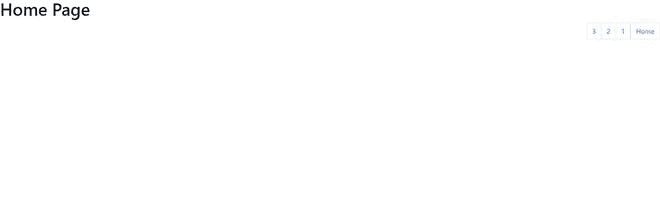
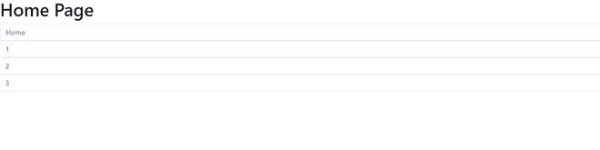
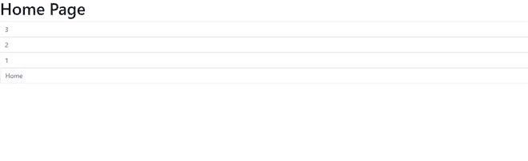
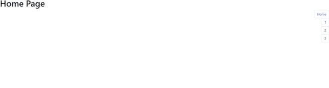

# 如何在 Bootstrap 4 中对齐分页？

> 原文：[https://www.geeksforgeeks.org/how-to-align-pagination-in-bootstrap-4/](https://www.geeksforgeeks.org/how-to-align-pagination-in-bootstrap-4/)

在本文中，我们将学习如何使用 Bootstrap 类在网站上对齐分页。分页是引导程序中非常有用的组件。分页用于在网站的页面之间导航，因为它将文档分成不同的页面，并为它们提供数字。这将创建一个大块的连接链接，有助于轻松导航到不同的页面。因此，有助于增强用户体验。

## 创建引导分页的步骤

### 第一步
从 bootstrap 的[官方](https://getbootstrap.com/docs/4.6/getting-started/introduction/)网站导入 `CDN` 的 CSS 和 JavaScript `T5` 的 Bootstrap 链接。

```html
<link rel="stylesheet" href="https://cdn.jsdelivr.net/npm/bootstrap@4.6.1/dist/css/bootstrap.min.css" integrity="sha384-zCbKRCUGaJDkqS1kPbPd7TveP5iyJE0EjAuZQTgFLD2ylzuqKfdKlfG/eSrtxUkn" crossorigin="anonymous"/>
<script src="https://cdn.jsdelivr.net/npm/jquery@3.5.1/dist/jquery.slim.min.js" integrity="sha384-DfXdz2htPH0lsSSs5nCTpuj/zy4C+OGpamoFVy38MVBnE+IbbVYUew+OrCXaRkfj" crossorigin="anonymous"></script>
```

### 第二步
现在在 `<body>` 标签内制作 `<ul>` 标签，类名为 `pagination`。

```html
<ul class="pagination"> </ul>
```

### 第三步
使用 `<li>` 标签将 `<ul>` 标签内的所有页码加上类名 `page-item`。

```html
<ul>
 <li class="page-item"></li>
 <li class="page-item"></li>
 <li class="page-item"></li>
</ul>
```

### 第四步
在每个 `<li>` 标签中，使用 `<a>` 标签添加页码，并为每个页面赋予 `href` 属性。

```html
<ul class="pagination">
 <li class="page-item">
    <a class="page-link" href="#">1</a>
 </li>
 <li class="page-item">
    <a class="page-link" href="#">2</a>
 </li>
 <li class="page-item">
    <a class="page-link" href="#">3</a>
 </li>
</ul>
```

在这个阶段，我们已经使用 Bootstrap 创建了一个基本的分页结构。

我们将通过示例了解分页的概念 & 各种可用的引导类。

**示例：** 该示例说明了使用内容均匀对齐 & 页面项目类的引导分页。

## HTML

```html
<!doctype html>
<html lang="en">

<head>
    <!-- Required meta tags -->
    <meta charset="utf-8">
    <meta name="viewport" content="width=device-width, initial-scale=1">
    <!-- Bootstrap CSS -->
    <link rel="stylesheet" href="https://cdn.jsdelivr.net/npm/bootstrap@4.6.1/dist/css/bootstrap.min.css" integrity="sha384-zCbKRCUGaJDkqS1kPbPd7TveP5iyJE0EjAuZQTgFLD2ylzuqKfdKlfG/eSrtxUkn" crossorigin="anonymous">
    <title>Pagination</title>
</head>

<body>
    <h1>Home Page</h1>
    <ul class="pagination justify-content-evenly">
        <li class="page-item">
            <a class="page-link" href="#">Home</a>
        </li>
        <li class="page-item">
            <a class="page-link" href="#">1</a>
        </li>
        <li class="page-item">
            <a class="page-link" href="#">2</a>
        </li>
        <li class="page-item">
            <a class="page-link" href="#">3</a>
        </li>
    </ul>
</body>

</html>
```

**输出：** 从输出中，我们可以看到我们已经创建的分页在页面的最左边。


使用引导进行分页

## 使用引导类对齐分页

可以使用引导程序中的 `flexbox-utilities` 类在网页上对齐分页。

### flex-row
这个类被添加到组件中，帮助对齐行中的分页。这是默认值。

**语法：**

```html
<ul class="pagination flex-row">
    <li class="page-item"></li>        
</ul>
```

**示例：** 此示例说明了使用灵活行类的引导分页。

## HTML

```html
<!doctype html>
<html lang="en">

<head>
    <!-- Required meta tags -->
    <meta charset="utf-8">
    <meta name="viewport" content="width=device-width, initial-scale=1">
    <!-- Bootstrap CSS -->
    <link rel="stylesheet" href="https://cdn.jsdelivr.net/npm/bootstrap@4.6.1/dist/css/bootstrap.min.css" integrity="sha384-zCbKRCUGaJDkqS1kPbPd7TveP5iyJE0EjAuZQTgFLD2ylzuqKfdKlfG/eSrtxUkn" crossorigin="anonymous">
    <title>Pagination</title>
</head>

<body>
    <h1>Home Page</h1>
    <ul class="pagination flex-row">
        <li class="page-item">
            <a class="page-link" href="#">Home</a>
        </li>
        <li class="page-item">
            <a class="page-link" href="#">1</a>
        </li>
        <li class="page-item">
            <a class="page-link" href="#">2</a>
        </li>
        <li class="page-item">
            <a class="page-link" href="#">3</a>
        </li>
    </ul>
</body>

</html>
```

**输出：**


### flex-row-reverse
该类在组件内部添加时，有助于以行格式对齐分页，但方向相反，并位于页面的最右侧。

**语法：**

```html
<ul class="pagination flex-row-reverse">
        <li class="page-item"></li>
</ul>
```

**示例：** 此示例说明了使用 `flex-row-reverse` 类的引导分页。

## HTML

```html
<!doctype html>
<html lang="en">

<head>
    <!-- Required meta tags -->
    <meta charset="utf-8">
    <meta name="viewport" content="width=device-width, initial-scale=1">
    <!-- Bootstrap CSS -->
    <link rel="stylesheet" href="https://cdn.jsdelivr.net/npm/bootstrap@4.6.1/dist/css/bootstrap.min.css" integrity="sha384-zCbKRCUGaJDkqS1kPbPd7TveP5iyJE0EjAuZQTgFLD2ylzuqKfdKlfG/eSrtxUkn" crossorigin="anonymous">
    <title>Pagination</title>
</head>

<body>
    <h1>Home Page</h1>
    <ul class="pagination flex-row-reverse">
        <li class="page-item">
            <a class="page-link" href="#">Home</a>
        </li>
        <li class="page-item">
            <a class="page-link" href="#">1</a>
        </li>
        <li class="page-item">
            <a class="page-link" href="#">2</a>
        </li>
        <li class="page-item">
            <a class="page-link" href="#">3</a>
        </li>
    </ul>
</body>

</html>
```

**输出：**



### flex-column
该类在组件内部添加时有助于对齐列中的分页。

**语法：**

```html
<ul class="pagination flex-column">
          <li class="page-item"></li>
</ul>
```

**示例：** 此示例说明了使用灵活列类的引导分页。

## HTML

```html
<!doctype html>
<html lang="en">

<head>
    <!-- Required meta tags -->
    <meta charset="utf-8">
    <meta name="viewport" content="width=device-width, initial-scale=1">
    <!-- Bootstrap CSS -->
    <link rel="stylesheet" href="https://cdn.jsdelivr.net/npm/bootstrap@4.6.1/dist/css/bootstrap.min.css" integrity="sha384-zCbKRCUGaJDkqS1kPbPd7TveP5iyJE0EjAuZQTgFLD2ylzuqKfdKlfG/eSrtxUkn" crossorigin="anonymous">
    <title>Pagination</title>
</head>

<body>
    <h1>Home Page</h1>
    <ul class="pagination flex-column">
        <li class="page-item">
            <a class="page-link" href="#">Home</a>
        </li>
        <li class="page-item">
            <a class="page-link" href="#">1</a>
        </li>
        <li class="page-item">
            <a class="page-link" href="#">2</a>
        </li>
        <li class="page-item">
            <a class="page-link" href="#">3</a>
        </li>
    </ul>
</body>

</html>
```

**输出：**



### flex-column-reverse
该类在组件内部添加时有助于对齐列中的分页，但方向相反。

**语法：**

```html
<ul class="pagination flex-column-reverse">
        <li class="page-item"></li>
 </ul>
```

**示例：** 此示例说明了使用 `flex-column-reverse` 类的引导分页。

## HTML

```html
<!doctype html>
<html lang="en">

<head>
    <!-- Required meta tags -->
    <meta charset="utf-8">
    <meta name="viewport" content="width=device-width, initial-scale=1">
    <!-- Bootstrap CSS -->
    <link rel="stylesheet" href="https://cdn.jsdelivr.net/npm/bootstrap@4.6.1/dist/css/bootstrap.min.css" integrity="sha384-zCbKRCUGaJDkqS1kPbPd7TveP5iyJE0EjAuZQTgFLD2ylzuqKfdKlfG/eSrtxUkn" crossorigin="anonymous">
    <title>Pagination</title>
</head>

<body>
    <h1>Home Page</h1>
    <ul class="pagination flex-column-reverse">
        <li class="page-item">
            <a class="page-link" href="#">Home</a>
        </li>
        <li class="page-item">
            <a class="page-link" href="#">1</a>
        </li>
        <li class="page-item">
            <a class="page-link" href="#">2</a>
        </li>
        <li class="page-item">
            <a class="page-link" href="#">3</a>
        </li>
    </ul>
</body>

</html>
```

**输出：**



### 内容中心对齐
该类在组件内部添加时，有助于以行的形式在中心对齐分页。

**语法：**

```html
<ul class="pagination justify-content-center">
         <li class="page-item"></li>
 </ul>
```

**示例：** 此示例说明了使用内容中心对齐类的引导分页。

# 超文本标记语言

```html
<!doctype html>
<html lang="en">

<head>

    <!-- Required meta tags -->
    <meta charset="utf-8">
    <meta name="viewport"
          content="width=device-width, initial-scale=1">

    <!-- Bootstrap CSS -->
    <link rel="stylesheet" 
          href=
"https://cdn.jsdelivr.net/npm/bootstrap@4.6.1/dist/css/bootstrap.min.css" 
          integrity=
"sha384-zCbKRCUGaJDkqS1kPbPd7TveP5iyJE0EjAuZQTgFLD2ylzuqKfdKlfG/eSrtxUkn" 
          crossorigin="anonymous">
    <title>Pagination</title>
</head>

<body>
    <h1>Home Page</h1>
    <ul class="pagination justify-content-center">
        <li class="page-item">
            <a class="page-link" href="#">Home</a>
        </li>
        <li class="page-item">
            <a class="page-link" href="#">1</a>
        </li>
        <li class="page-item">
            <a class="page-link" href="#">2</a>
        </li>
        <li class="page-item">
            <a class="page-link" href="#">3</a>
        </li>
    </ul>
</body>

</html>
```

**输出** :


**`justify-content-start`**: 当这个类被添加到组件中时，有助于在行方向上对齐开始处的分页。

**语法:**

```html
<ul class="pagination justify-content-start">
          <li class="page-item"></li>
 </ul>
```

**示例:** 该示例使用 `justify-content-start` 类说明了引导分页。

## `justify-content-start`

```html
<!doctype html>
<html lang="en">

<head>

    <!-- Required meta tags -->
    <meta charset="utf-8">
    <meta name="viewport"
          content="width=device-width, initial-scale=1">

    <!-- Bootstrap CSS -->
    <link rel="stylesheet" 
          href=
"https://cdn.jsdelivr.net/npm/bootstrap@4.6.1/dist/css/bootstrap.min.css" 
          integrity=
"sha384-zCbKRCUGaJDkqS1kPbPd7TveP5iyJE0EjAuZQTgFLD2ylzuqKfdKlfG/eSrtxUkn" 
          crossorigin="anonymous">
    <title>Pagination</title>
</head>

<body>
    <h1>Home Page</h1>
    <ul class="pagination justify-content-start">
        <li class="page-item">
            <a class="page-link" href="#">Home</a>
        </li>
        <li class="page-item">
            <a class="page-link" href="#">1</a>
        </li>
        <li class="page-item">
            <a class="page-link" href="#">2</a>
        </li>
        <li class="page-item">
            <a class="page-link" href="#">3</a>
        </li>
    </ul>
</body>

</html>
```

**输出:**


**`justify-content-end`**: 该类在组件中添加时，有助于在行方向上对齐页面末尾的分页。

**语法:**

```html
 <ul class="pagination justify-content-end">
       <li class="page-item"></li>
</ul>
```

**示例:** 此示例说明了使用 `justify-content-end` 类的引导分页。

## `justify-content-end`

```html
<!doctype html>
<html lang="en">

<head>

    <!-- Required meta tags -->
    <meta charset="utf-8">
    <meta name="viewport" 
          content="width=device-width, initial-scale=1">

    <!-- Bootstrap CSS -->
    <link rel="stylesheet" 
          href=
"https://cdn.jsdelivr.net/npm/bootstrap@4.6.1/dist/css/bootstrap.min.css" 
          integrity=
"sha384-zCbKRCUGaJDkqS1kPbPd7TveP5iyJE0EjAuZQTgFLD2ylzuqKfdKlfG/eSrtxUkn" 
          crossorigin="anonymous">
    <title>Pagination</title>
</head>

<body>
    <h1>Home Page</h1>
    <ul class="pagination justify-content-end">
        <li class="page-item">
            <a class="page-link" href="#">Home</a>
        </li>
        <li class="page-item">
            <a class="page-link" href="#">1</a>
        </li>
        <li class="page-item">
            <a class="page-link" href="#">2</a>
        </li>
        <li class="page-item">
            <a class="page-link" href="#">3</a>
        </li>
    </ul>
</body>

</html>
```

**输出:**


**`align-items-start`**: 这个类在组件内部添加时，有助于以列的形式在页面开始时对齐分页。

**语法:**

```html
<ul class="pagination align-items-start">
       <li class="page-item"></li>
 </ul>
```

**示例:** 此示例说明了使用 `align-items-start` 类的引导分页。

## `align-items-start`

```html
<!doctype html>
<html lang="en">

<head>

    <!-- Required meta tags -->
    <meta charset="utf-8">
    <meta name="viewport"
          content="width=device-width, initial-scale=1">

    <!-- Bootstrap CSS -->
    <link rel="stylesheet" 
          href=
"https://cdn.jsdelivr.net/npm/bootstrap@4.6.1/dist/css/bootstrap.min.css" 
          integrity=
"sha384-zCbKRCUGaJDkqS1kPbPd7TveP5iyJE0EjAuZQTgFLD2ylzuqKfdKlfG/eSrtxUkn" 
          crossorigin="anonymous">
    <title>Pagination</title>
</head>

<body>
    <h1>Home Page</h1>
    <ul class="pagination align-items-start">
        <li class="page-item">
            <a class="page-link" href="#">Home</a>
        </li>
        <li class="page-item">
            <a class="page-link" href="#">1</a>
        </li>
        <li class="page-item">
            <a class="page-link" href="#">2</a>
        </li>
        <li class="page-item">
            <a class="page-link" href="#">3</a>
        </li>
    </ul>
</body>

</html>
```

**输出:**


**`align-items-end`**: 该类在组件内部添加时，有助于以列方式对齐页面末尾的分页。

**语法:**

```html
<ul class="pagination align-items-end">
       <li class="page-item"></li>
 </ul>
```

**示例:** 此示例说明了使用 `align-items-end` 类的引导分页。

## `align-items-end`

```html
<!doctype html>
<html lang="en">

<head>

    <!-- Required meta tags -->
    <meta charset="utf-8">
    <meta name="viewport" 
          content="width=device-width, initial-scale=1">

    <!-- Bootstrap CSS -->
    <link rel="stylesheet" 
          href=
"https://cdn.jsdelivr.net/npm/bootstrap@4.6.1/dist/css/bootstrap.min.css" 
          integrity=
"sha384-zCbKRCUGaJDkqS1kPbPd7TveP5iyJE0EjAuZQTgFLD2ylzuqKfdKlfG/eSrtxUkn" 
          crossorigin="anonymous">
    <title>Pagination</title>
</head>

<body>
    <h1>Home Page</h1>
    <ul class="pagination flex-column align-items-end">
        <li class="page-item">
            <a class="page-link" href="#">Home</a>
        </li>
        <li class="page-item">
            <a class="page-link" href="#">1</a>
        </li>
        <li class="page-item">
            <a class="page-link" href="#">2</a>
        </li>
        <li class="page-item">
            <a class="page-link" href="#">3</a>
        </li>
    </ul>
</body>

</html>
```

**输出**:



**`align-items-center`**: 该类在组件内部添加时，有助于以列方式将分页与页面中心对齐。

**语法:**

```html
<ul class="pagination align-items-center">
     <li class="page-item"></li>
 </ul>
```

**示例:** 此示例说明了使用 `align-items-center` 类的引导分页。

## `align-items-center`

```html
<!doctype html>
<html lang="en">

<head>

    <!-- Required meta tags -->
    <meta charset="utf-8">
    <meta name="viewport"
          content="width=device-width, initial-scale=1">

    <!-- Bootstrap CSS -->
    <link rel="stylesheet" 
          href=
"https://cdn.jsdelivr.net/npm/bootstrap@4.6.1/dist/css/bootstrap.min.css" 
          integrity=
"sha384-zCbKRCUGaJDkqS1kPbPd7TveP5iyJE0EjAuZQTgFLD2ylzuqKfdKlfG/eSrtxUkn" 
          crossorigin="anonymous">
    <title>Pagination</title>
</head>

<body>
    <h1>Home Page</h1>
    <ul class="pagination flex-column align-items-center">
        <li class="page-item">
            <a class="page-link" href="#">Home</a>
        </li>
        <li class="page-item">
            <a class="page-link" href="#">1</a>
        </li>
        <li class="page-item">
            <a class="page-link" href="#">2</a>
        </li>
        <li class="page-item">
            <a class="page-link" href="#">3</a>
        </li>
    </ul>
</body>

</html>
```

**输出:**


**注:**

*   大部分分页都是以行的形式完成的。在极少数情况下，分页是按列格式给出的。
*   仅当分页以逐行格式完成时，`justify-content-*` 类才起作用。
*   仅当分页以列方式完成时，`align-items-*` 类才起作用。因此，我们必须添加 `flex-column`/`flex-column-reverse` 类。