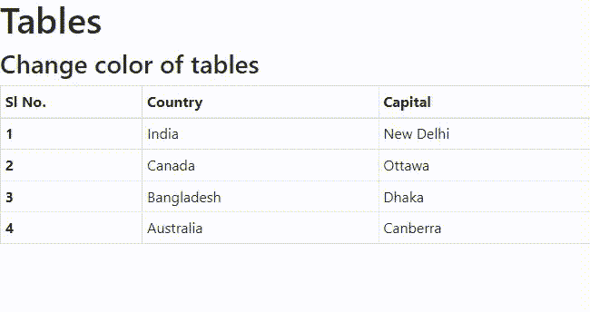
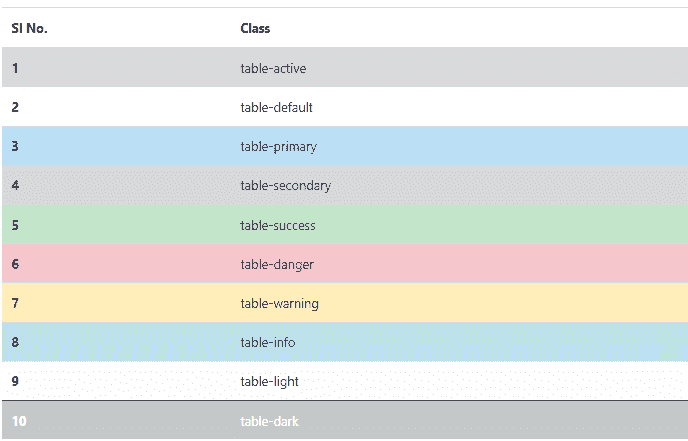
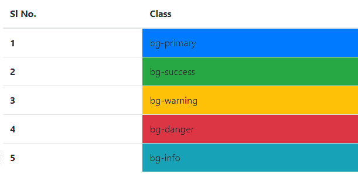
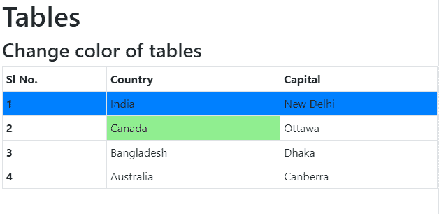

# 如何在 Bootstrap 中更改表格行或单个单元格的背景色？

> 原文：[https://www.geeksforgeeks.org/how-to-change-background-color-of-table-rows-or-individual-cells-in-bootstrap/](https://www.geeksforgeeks.org/how-to-change-background-color-of-table-rows-or-individual-cells-in-bootstrap/)

在本文中，我们将讨论如何设置表格行的背景色以及如何使用 Bootstrap 设置单个单元格的背景色。Bootstrap 提供了一系列类，可用于对表格应用各种样式，如更改标题外观、剥离行、添加或删除边框、使行可悬停等。Bootstrap 还提供了使表格响应的类。

创建表格的目的是以简单紧凑的结构化格式显示复杂的大数据，该格式在浏览时提供信息内容。这将节省读取和分析非结构化大数据的时间。Bootstrap 有助于以标准方式创建和修饰内容。我们将使用 Bootstrap 内置类来创建表格结构。可以使用以下语法创建一个简单的 HTML 表：

**语法：**

```html
<table class="table"> Table Contents... </table>
```

在我们继续主要讨论之前，使用 HTML 创建表格的知识将帮助您更好地理解文章。关于 Bootstrap 中表格的许多其他情况，请参考 [Bootstrap 4 | 表格](https://www.geeksforgeeks.org/bootstrap-4-tables/)。

**Bootstrap CDN 链接：** 我们举个例子来了解如何设置，并添加一个 [Bootstrap CDN](https://getbootstrap.com/docs/3.3/getting-started/) 链接来应用 Bootstrap 预定义的类来创建表。

```html
<script src="https://ajax.googleapis.com/ajax/libs/jquery/3.5.1/jquery.min.js"></script>
<script src="https://cdnjs.cloudflare.com/ajax/libs/popper.js/1.16.0/umd/popper.min.js"></script>
```

**示例：**

## 超文本标记语言

```html
<!DOCTYPE html>
<html>
  <head>
    <meta charset="utf-8" />
    <meta name="viewport" content="width=device-width" />
    <title>Geeks For Geeks</title>
    <link href="style.css" rel="stylesheet" type="text/css" />
    <link
      rel="stylesheet"
      href="https://stackpath.bootstrapcdn.com/bootstrap/4.1.3/css/bootstrap.min.css"
      integrity="sha384-MCw98/SFnGE8fJT3GXwEOngsV7Zt27NXFoaoApmYm81iuXoPkFOJwJ8ERdknLPMO"
      crossorigin="anonymous"/>
  </head>

  <body>
    <h1>Tables</h1>
    <h3>Change color of tables</h3>
    <table class="table table-bordered table-hover table-sm">
      <thread>
        <tr>
          <th scope="col">Sl No.</th>
          <th scope="col">Country</th>
          <th scope="col">Capital</th>
        </tr>
      </thread>
      <tbody>
        <tr>
          <th scope="row">1</th>
          <td>India</td>
          <td>New Delhi</td>
        </tr>
        <tr>
          <th scope="row">2</th>
          <td>Canada</td>
          <td>Ottawa</td>
        </tr>
        <tr>
          <th scope="row">3</th>
          <td>Bangladesh</td>
          <td>Dhaka</td>
        </tr>
        <tr>
          <th scope="row">4</th>
          <td>Australia</td>
          <td>Canberra</td>
        </tr>
      </tbody>
    </table>
  </body>
</html>
```

**输出：**



我们已经在代码中添加了 Bootstrap CDN 链接，它构成了一个标准且结构良好的内容表。使用预定义的类，我们可以更改表格单元格和表格行的颜色。为了改变表格行的颜色，我们需要在 `<tr>` 标签中指定所需的类。

## 预定义类

为了改变一行或整个表格的颜色，我们将使用以下任何一个类。

1.  `table-active`：此类适用于灰色表格行或单元格的悬停颜色。
2.  `table-default`：当选择默认行时，该类用于将颜色更改为白色。
3.  `table-primary`：此类表示重要动作。
4.  `table-secondary`：此类表示不太重要的活动。
5.  `table-success`：此类表示积极或成功的行动。
6.  `table-danger`：该等级表示潜在的负面或危险行为。
7.  `table-warning`：此类表示可能需要注意的警告。
8.  `table-info`：该类别表示中性的信息变化或动作。
9.  `table-light`：此类适用于表行背景或浅灰色表。
10. `table-dark`：此类适用于深灰色表格。

**示例：** 在这种情况下，我们已经使用了所有预定义的类来更改行的颜色。

## 超文本标记语言

```html
<!DOCTYPE html>
<html>
  <head>
    <meta charset="utf-8" />
    <meta name="viewport" content="width=device-width" />
    <title>Geeks For Geeks</title>
    <link href="style.css" rel="stylesheet" type="text/css" />
    <link
      rel="stylesheet"
      href="https://stackpath.bootstrapcdn.com/bootstrap/4.1.3/css/bootstrap.min.css"
      integrity="sha384-MCw98/SFnGE8fJT3GXwEOngsV7Zt27NXFoaoApmYm81iuXoPkFOJwJ8ERdknLPMO"
      crossorigin="anonymous"/>
  </head>

  <body>
    <h1>Tables</h1>
    <h3>Different colour of table rows</h3>

    <table class="table">
      <thread>
        <th scope="col">Sl No.</th>
        <th scope="col">Class</th>
      </thread>
      <tbody>
        <tr class="table-active">
          <th scope="row">1</th>
          <td>table-active</td>
        </tr>
        <tr class="table-default">
          <th scope="row">2</th>
          <td>table-default</td>
        </tr>
        <tr class="table-primary">
          <th scope="row">3</th>
          <td>table-primary</td>
        </tr>
        <tr class="table-secondary">
          <th scope="row">4</th>
          <td>table-secondary</td>
        </tr>
        <tr class="table-success">
          <th scope="row">5</th>
          <td>table-success</td>
        </tr>
        <tr class="table-danger">
          <th scope="row">6</th>
          <td>table-danger</td>
        </tr>
        <tr class="table-warning">
          <th scope="row">7</th>
          <td>table-warning</td>
        </tr>
        <tr class="table-info">
          <th scope="row">8</th>
          <td>table-info</td>
        </tr>
        <tr class="table-light">
          <th scope="row">9</th>
          <td>table-light</td>
        </tr>
        <tr class="table-dark">
          <th scope="row">10</th>
          <td>table-dark</td>
        </tr>
      </tbody>
    </table>
  </body>
</html>
```

**输出：**



要更改任何特定单元格的颜色，可以使用以下任一类：

1.  `bg-primary`：适用于表示积极或成功的行动。
2.  `bg-success`：适用于表示成功或积极的行动。
3.  `bg-warning`：适用于指示可能需要注意的警告。
4.  `bg-danger`：适用于指示潜在的负面或危险行为。
5.  `bg-info`：用于表示中性的信息变化或动作。

**示例：**

## 超文本标记语言

```html
<!DOCTYPE html>
<html>
  <head>
    <meta charset="utf-8" />
    <meta name="viewport" content="width=device-width" />
    <title>Geeks For Geeks</title>
    <link href="style.css" rel="stylesheet" type="text/css" />
    <link
      rel="stylesheet"
      href="https://stackpath.bootstrapcdn.com/bootstrap/4.1.3/css/bootstrap.min.css"
      integrity="sha384-MCw98/SFnGE8fJT3GXwEOngsV7Zt27NXFoaoApmYm81iuXoPkFOJwJ8ERdknLPMO"
      crossorigin="anonymous"/>
  </head>

  <body>
    <h1>Tables</h1>
    <h3>Change color of single cells</h3>
    <table class="table">
      <thread>
        <th scope="col">Sl No.</th>
        <th scope="col">Class</th>
      </thread>
      <tbody>
        <tr>
          <th scope="row">1</th>
          <td class="bg-primary">bg-primary</td>
        </tr>
        <tr>
          <th scope="row">2</th>
          <td class="bg-success">bg-success</td>
        </tr>
        <tr>
          <th scope="row">3</th>
          <td class="bg-warning">bg-warning</td>
        </tr>
        <tr>
          <th scope="row">4</th>
          <td class="bg-danger">bg-danger</td>
        </tr>
        <tr>
          <th scope="row">5</th>
          <td class="bg-info">bg-info</td>
        </tr>
      </tbody>
    </table>
  </body>
</html>
```

**输出：**



为了改变特定表格单元格的颜色，我们需要在特定单元格的 `<td>` 标签中指定它。以下示例显示了如何为特定单元格声明。

**示例：**

## 超文本标记语言

```html
<!DOCTYPE html>
<html>
  <head>
    <meta charset="utf-8" />
    <meta name="viewport" content="width=device-width" />
    <title>Geeks For Geeks</title>
    <link
      rel="stylesheet"
      href="https://stackpath.bootstrapcdn.com/bootstrap/4.1.3/css/bootstrap.min.css"
      integrity="sha384-MCw98/SFnGE8fJT3GXwEOngsV7Zt27NXFoaoApmYm81iuXoPkFOJwJ8ERdknLPMO"
      crossorigin="anonymous"
    />
  </head>

  <body>
    <h1>Tables</h1>
    <h3>Change color of tables</h3>
    <table class="table table-bordered table-hover table-sm">
      <thread>
        <tr>
          <th scope="col">Sl No.</th>
          <th scope="col">Country</th>
          <th scope="col">Capital</th>
        </tr>
      </thread>
      <tbody>
        <tr class="bg-primary">
          <th scope="row">1</th>
          <td>India</td>
          <td>New Delhi</td>
        </tr>
        <tr>
          <th scope="row">2</th>
          <td class="bg-success">Canada</td>
          <td>Ottawa</td>
        </tr>
        <tr>
          <th scope="row">3</th>
          <td>Bangladesh</td>
          <td>Dhaka</td>
        </tr>
        <tr>
          <th scope="row">4</th>
          <td>Australia</td>
          <td>Canberra</td>
        </tr>
      </tbody>
    </table>
  </body>
</html>
```

**输出：**



## 自定义颜色

（注：原文在此处结束，未提供关于自定义颜色的具体内容。）