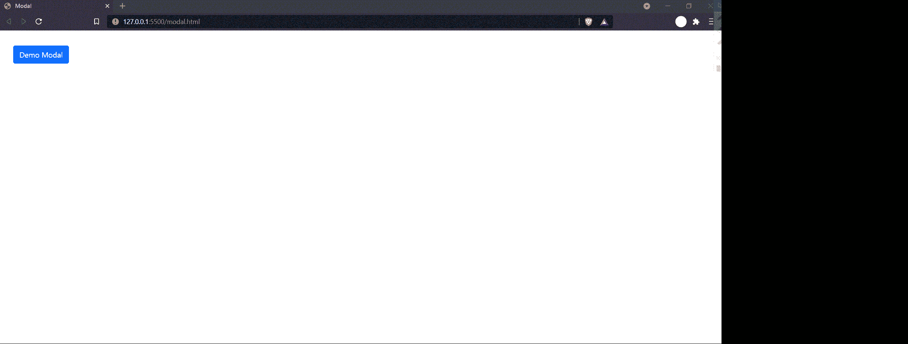

# 如何在 Bootstrap 中创建基本模态组件？

> 原文：[https://www.geeksforgeeks.org/how-to-create-a-basic-modal-component-in-bootstrap/](https://www.geeksforgeeks.org/how-to-create-a-basic-modal-component-in-bootstrap/)

`Modals` 是 `JavaScript` 弹出窗口，帮助我们在网站中传递非常有用的内容，例如在网站上显示保存、删除、下载或关闭确认。`Bootstrap` 模态是轻量级和多用途的 `JavaScript` 组件。它们也是可定制和响应的组件。在本文中，我们将学习如何使用 `Bootstrap` 框架创建一个基本的模态组件。

首先，我们必须在我们的 `HTML` 文件中导入以下 `Bootstrap` `CDN`。

```html
<link href="https://cdn.jsdelivr.net/npm/bootstrap@5.1.1/dist/css/bootstrap.min.css" rel="stylesheet" integrity="sha384-F3w7mX95PdgyTmZZMECAngseQB83DfGTowi0iMjiWaeVhAn4FJkqJByhZMI3AhiU" crossorigin="anonymous">

<script src="https://cdn.jsdelivr.net/npm/bootstrap@5.1.1/dist/js/bootstrap.bundle.min.js" integrity="sha384-/bQdsTh/da6pkI1MST/rWKFNjaCP5gBSY4sEBT38Q/9RBh9AH40zEOg7Hlq2THRZ" crossorigin="anonymous"></script>
```

**示例：** 在本例中，我们将看到如何使用 `Bootstrap` 模态组件创建基本模态。

## HTML

```html
<!doctype html>
<html lang="en">

<head>
    <!-- Required meta tags -->
    <meta charset="utf-8">
    <meta name="viewport" content="width=device-width, initial-scale=1">

    <!-- Bootstrap CSS -->
    <link href="https://cdn.jsdelivr.net/npm/bootstrap@5.1.1/dist/css/bootstrap.min.css" rel="stylesheet" integrity="sha384-F3w7mX95PdgyTmZZMECAngseQB83DfGTowi0iMjiWaeVhAn4FJkqJByhZMI3AhiU" crossorigin="anonymous">

    <script src="https://cdn.jsdelivr.net/npm/bootstrap@5.1.1/dist/js/bootstrap.bundle.min.js" integrity="sha384-/bQdsTh/da6pkI1MST/rWKFNjaCP5gBSY4sEBT38Q/9RBh9AH40zEOg7Hlq2THRZ" crossorigin="anonymous"></script>
</head>

<body>
    <!-- Button trigger modal -->
    <button type="button" class="btn btn-primary" data-bs-toggle="modal" data-bs-target="#exampleModal" style="margin: 2em;">
        Demo Modal
    </button>

    <!-- Modal -->
    <div class="modal fade" id="exampleModal" tabindex="-1" aria-labelledby="exampleModalLabel" aria-hidden="true">
        <div class="modal-dialog">
            <div class="modal-content">
                <div class="modal-header">
                    <h5 class="modal-title" id="exampleModalLabel">
                        This is sample title.
                    </h5>
                    <button type="button" class="btn-close" data-bs-dismiss="modal" aria-label="Close">
                    </button>
                </div>
                <div class="modal-body">
                    This is the body of the modal.
                </div>
                <div class="modal-footer">
                    <button type="button" class="btn btn-secondary" data-bs-dismiss="modal">
                        Close
                    </button>
                    <button type="button" class="btn btn-primary">
                        Save
                    </button>
                </div>
            </div>
        </div>
    </div>
</body>

</html>
```

**输出：**

