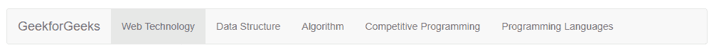
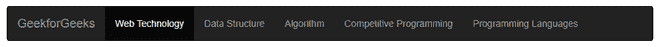
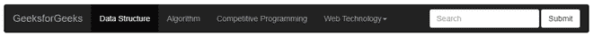

# 如何在 Bootstrap 中使用 navbar-inverse 创建菜单？

> 原文：[https://www.geeksforgeeks.org/how-to-create-a-menu-using-navbar-inverse-in-bootstrap/](https://www.geeksforgeeks.org/how-to-create-a-menu-using-navbar-inverse-in-bootstrap/)

在本文中，我们将学习如何使用 Bootstrap 中的 `navbar-inverse` 来创建菜单，还将通过示例了解它的实现。在为网站制作导航栏时，菜单栏是一个非常重要的部分。我们可以使用 Bootstrap `navbar-inverse` 类创建一个菜单栏，并反转菜单栏的颜色。

Bootstrap 中的导航栏包含许多类，例如：

*   `.navbar-brand` 类：此类用于您的公司、产品或项目名称，或任何品牌名称。
*   `.navbar-nav` 类：该类用于全高和轻量级导航（包括支持下拉）。
*   `.navbar-toggler` 类：该类用于折叠插件和其他导航切换行为。
*   `.navbar-text` 类：该类用于添加垂直居中的文本字符串。
*   `.collapse.navbar-collapse` 类：该类用于通过父断点对导航栏内容进行分组和隐藏。
*   flex 和 spacing 实用程序类可用于任何表单控件和操作。

我们将通过示例了解上述类及其用法。让我们看看如何使用 Bootstrap 实现导航栏。

**步骤 1：** 在我们的 HTML 文件中导入 Bootstrap CDN 链接。

```html
<link rel="stylesheet" href="https://stackpath.bootstrapcdn.com/bootstrap/3.4.1/css/bootstrap.min.css" integrity="sha384-HSMxcRTRxnN+Bdg0JdbxYKrThecOKuH5zCYotlSAcp1+c8xmyTe9GYg1l9a69psu" crossorigin="anonymous"/>
<script src="https://stackpath.bootstrapcdn.com/bootstrap/3.4.1/js/bootstrap.min.js" integrity="sha384-aJ21OjlMXNL5UyIl/XNwTMqvzeRMZH2w8c5cRVpzpU8Y5bApTppSuUkhZXN0VxHd" crossorigin="anonymous"></script>
```

**第二步：** 在你的 `<body>` 里面添加 `<nav>` 标签，里面有 `navbar` 和 `navbar-default` 类。

```html
<nav class="navbar navbar-default ">
    <!-- content  -->
</nav>
```

**第三步：** 创建一个 `<nav>` 标签，类名为 `navbar navbar-default`，并在 `<nav>` 标签内部，我们将创建一个 `<div>`，类名为 `container-fluid`。现在，为了使用品牌标志或名称，我们将添加一个类作为 `navbar-brand`，并在其中创建一个 `<ul>` 标签，该标签的类名为 `navbar-nav`，后面是使用 `<li>` 标签的项目列表。

```html
<nav class="navbar navbar-default">
  <div class="container-fluid">
    <a class="navbar-brand" href="#">GeekforGeeks</a>
    <ul class="nav navbar-nav">
      <li class="active"><a href="#">Web Technology </a></li>
      <li><a href="#">Data Structure</a></li>
      <li><a href="#">Algorithm</a></li>
      <li><a href="#">Competitive Programming</a></li>
      <li><a href="#">Programming Languages</a></li>
    </ul>
  </div>
</nav>
```

在这个阶段，我们已经使用 Bootstrap 创建了一个基本的导航栏。下面的代码示例说明了 Bootstrap 中的基本导航栏。

**完整代码：**

## HTML

```html
<!DOCTYPE html>
<html lang="en">
  <head>
    <meta charset="UTF-8" />
    <meta http-equiv="X-UA-Compatible" content="IE=edge" />
    <meta name="viewport" content="width=device-width, initial-scale=1.0" />
    <link rel="stylesheet" href="https://stackpath.bootstrapcdn.com/bootstrap/3.4.1/css/bootstrap.min.css" integrity="sha384-HSMxcRTRxnN+Bdg0JdbxYKrThecOKuH5zCYotlSAcp1+c8xmyTe9GYg1l9a69psu" crossorigin="anonymous" />
    <title>GeeksforGeeks Bootstrap Tutorial</title>
  </head>
  <body>
    <nav class="navbar navbar-default">
      <div class="container-fluid">
        <a class="navbar-brand" href="#">GeekforGeeks</a>
        <ul class="nav navbar-nav">
          <li class="active"><a href="#">Web Technology </a></li>
          <li><a href="#">Data Structure</a></li>
          <li><a href="#">Algorithm</a></li>
          <li><a href="#">Competitive Programming</a></li>
          <li><a href="#">Programming Languages</a></li>
        </ul>
      </div>
    </nav>
  </body>
</html>
```

**输出：**



Bootstrap 中的简单导航栏

从上面的输出中，我们可以看到菜单栏有一个白色背景，如果我们需要将背景更改为黑色，并将其他文本内容更改为白色，我们可以简单地在 `<nav>` 标签中添加 `navbar-inverse` 类，如下所示。

```html
<nav class="navbar navbar-default navbar-inverse">
   <!-- Content  -->
</nav>
```

**例子：** 这个例子说明了 `navbar-inverse` 类的用法，用于在 Bootstrap 中将背景更改为黑色。

## HTML

```html
<!DOCTYPE html>
<html lang="en">
  <head>
    <meta charset="UTF-8" />
    <meta http-equiv="X-UA-Compatible" content="IE=edge" />
    <meta name="viewport" content="width=device-width, initial-scale=1.0" />
    <link rel="stylesheet" href="https://stackpath.bootstrapcdn.com/bootstrap/3.4.1/css/bootstrap.min.css" integrity="sha384-HSMxcRTRxnN+Bdg0JdbxYKrThecOKuH5zCYotlSAcp1+c8xmyTe9GYg1l9a69psu" crossorigin="anonymous" />
    <title>GeeksforGeeks Bootstrap Tutorial</title>
  </head>
  <body>
    <nav class="navbar navbar-default navbar-inverse">
      <div class="container-fluid">
        <a class="navbar-brand" href="#">GeekforGeeks</a>
        <ul class="nav navbar-nav">
          <li class="active"><a href="#">Web Technology </a></li>
          <li><a href="#">Data Structure</a></li>
          <li><a href="#">Algorithm</a></li>
          <li><a href="#">Competitive Programming</a></li>
          <li><a href="#">Programming Languages</a></li>
        </ul>
      </div>
    </nav>
  </body>
</html>
```

**输出：**



添加 `navbar-inverse` 后，导航栏变为黑色

从上面的输出可以清楚地看到，颜色变成了黑色，字体变成了白色。因此，我们已经使用 Bootstrap 使用 `navbar-inverse` 类成功地创建了一个基本导航栏。现在，我们还可以在导航栏中添加一些功能，如下拉菜单和搜索选项。

为了制作一个下拉菜单，我们将使用下面的代码：

```html
<div class="dropdown">
 <button
   class="btn btn-default dropdown-toggle"
   type="button"
   id="dropdownMenu1"
   data-toggle="dropdown"
   aria-haspopup="true"
   aria-expanded="true">
   Dropdown
   <span class="caret"></span>
 </button>
 <ul class="dropdown-menu" aria-labelledby="dropdownMenu1">
   <li><a href="#">Link1</a></li>
   <li><a href="#">Link2</a></li>
   <li><a href="#">Link3</a></li>
 </ul>
</div>
```

为了将搜索选项放在导航栏的右侧，我们将使用下面的代码片段：

```html
<form class="navbar-form navbar-right" role="search">
  <div class="form-group">
    <input type="text" class="form-control" placeholder="Search" />
  </div>
  <button type="submit" class="btn btn-default">Submit</button>
</form>
```

在这一点上，我们已经做出了更新后的导航栏代码，增加了更多的功能，如下拉和搜索栏。

**完整代码：**

## HTML

```html
<!DOCTYPE html>
<html lang="en">
  <head>
    <meta charset="UTF-8" />
    <meta http-equiv="X-UA-Compatible" content="IE=edge" />
    <meta name="viewport" content="width=device-width, initial-scale=1.0" />
    <link rel="stylesheet" href="https://stackpath.bootstrapcdn.com/bootstrap/3.4.1/css/bootstrap.min.css" integrity="sha384-HSMxcRTRxnN+Bdg0JdbxYKrThecOKuH5zCYotlSAcp1+c8xmyTe9GYg1l9a69psu" crossorigin="anonymous" />
    <title>GeeksforGeeks Bootstrap Navbar Tutorial</title>
  </head>
  <body>
    <nav class="navbar navbar-default navbar-inverse">
      <div class="container-fluid">
        <a class="navbar-brand" href="#">GeeksforGeeks</a>
        <ul class="nav navbar-nav">
          <li class="active"><a href="#">Data Structure</a></li>
          <li><a href="#">Algorithm</a></li>
          <li><a href="#">Competitive Programming</a></li>
          <li class="dropdown">
            <a href="#" class="dropdown-toggle" data-toggle="dropdown" role="button" aria-haspopup="true" aria-expanded="false">
              Web Technology<span class="caret"></span>
            </a>
            <ul class="dropdown-menu">
              <li><a href="#">HTML</a></li>
              <li><a href="#">CSS</a></li>
              <li><a href="#">JavaScript</a></li>
            </ul>
          </li>
        </ul>
        <form class="navbar-form navbar-right">
          <div class="form-group">
            <input type="text" class="form-control" placeholder="Search" />
          </div>
          <button type="submit" class="btn btn-default">Submit</button>
        </form>
      </div>
    </nav>
  </body>
</html>
```

**输出：**



添加下拉菜单和搜索选项等功能后的导航栏

**注意：** 类 `navbar-inverse` 现已过时。它在 Bootstrap 中用于使导航栏变暗，直到 3.3.7 版本。现在，在当前版本 5.0.0 及更高版本中，使用 `bg-dark` 类来使组件变暗，而不是在之前的 4.6.1 版本中。