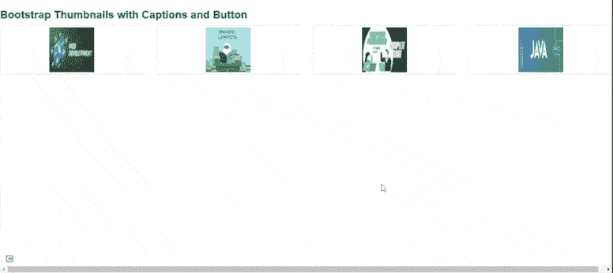
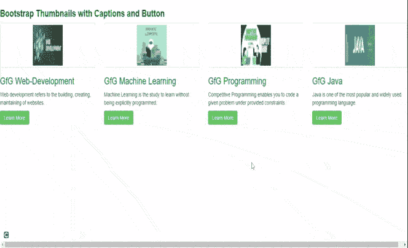

# 如何使用 Bootstrap 生成缩略图并自定义？

> 原文: [https://www.geeksforgeeks.org/how-to-generate-thumbnails-and-customize-using-bootstrap/](https://www.geeksforgeeks.org/how-to-generate-thumbnails-and-customize-using-bootstrap/)

[Bootstrap](https://www.geeksforgeeks.org/bootstrap-tutorials/) 帮助网络开发人员创建缩略图，用于在网格中显示链接的图像，这些网格具有预定义的类，有助于减少代码长度。创建缩略图是为了快速预览带有小图像的图像。

**缩略图:** 缩略图是代表较大图像的小图像。Bootstrap 有一个简单的方法来处理缩略图。`.thumbnail` 类用于在网格中显示链接的图像（[网格系统](https://www.geeksforgeeks.org/bootstrap-4-grid-system/)），使用 `.thumbnail` 内的 `<a>` 元素。`.col-sm-**` 和 `.col-md-**`（其中 `**` 代表数字）类用于创建图像的网格。

## 分步实施指南

### 步骤 1
将 Bootstrap 和 jQuery CDN 包含到所有其他样式表之前的 `<head>` 标签中，以加载我们的 CSS。

```html
<script src="https://ajax.googleapis.com/ajax/libs/jquery/1.12.0/jquery.min.js"></script>
<script src="http://maxcdn.bootstrapcdn.com/bootstrap/3.3.6/js/bootstrap.min.js"></script>
```

### 步骤 2
在 HTML 正文中添加 `<div>` 标签，并带有类 `row`。其中 `<div>` 创建四个 `<div>` 分区来创建四个图像。

### 步骤 3
在创建网页响应的四个 `<div>` 中添加 `col-sm-6` 和 `col-md-3`。

### 步骤 4
添加 `<a>` 标签加上类值 `thumbnail` 来定义下一行图像的链接。

```html
<a href="#" class="thumbnail">
```

### 示例 1
以下示例显示了缩略图图像的创建。

```html
<!DOCTYPE html>
<html lang="en">
  <head>
    <title>Thumbnail images</title>
    <link
      rel="stylesheet"
      href="http://maxcdn.bootstrapcdn.com/bootstrap/3.3.6/css/bootstrap.min.css"/>
    <script src="https://ajax.googleapis.com/ajax/libs/jquery/1.12.0/jquery.min.js">
    </script>
    <script src="http://maxcdn.bootstrapcdn.com/bootstrap/3.3.6/js/bootstrap.min.js">
    </script>
  </head>
  <body>
    <h3 style="color: green">Bootstrap thumbnails</h3>
    <div class="row">
      <div class="col-sm-6 col-md-3">
        <a href="#" class="thumbnail">
          
        </a>
      </div>
      <div class="col-sm-6 col-md-3">
        <a href="#" class="thumbnail">
          
        </a>
      </div>
      <div class="col-sm-6 col-md-3">
        <a href="#" class="thumbnail">
          
        </a>
      </div>
      <div class="col-sm-6 col-md-3">
        <a href="#" class="thumbnail">
          
        </a>
      </div>
    </div>
  </body>
</html>
```

**输出:** 如下图所示，我们可以看到缩略图。这些也响应不同的屏幕尺寸。



响应式缩略图

## 给缩略图添加标题和按钮

### 步骤 1
我们创建了 `div`，类值为 `thumbnail` 并插入图像，之后添加 `div` 类 `caption` 定义图像的描述 `<p>`。

### 步骤 2
使用带有类 `btn btn-success` 的 `<a>` 标签创建按钮。

### 示例
以下示例演示了向缩略图添加标题和按钮。

```html
<!DOCTYPE html>
<html lang="en">
  <head>
    <link
      rel="stylesheet"
      href="http://maxcdn.bootstrapcdn.com/bootstrap/3.3.6/css/bootstrap.min.css"/>
    <script src="https://ajax.googleapis.com/ajax/libs/jquery/1.12.0/jquery.min.js">
    </script>
    <script src="http://maxcdn.bootstrapcdn.com/bootstrap/3.3.6/js/bootstrap.min.js">
    </script>
  </head>
  <body>
    <h3 style="color: green">
      <b>Bootstrap Thumbnails with Captions and Button</b>
    </h3>
    <div class="row">
      <div class="col-sm-6 col-md-3">
        <a href="#" class="thumbnail">
          
        </a>
        <div class="caption">
          <h3 style="color: green">GfG Web-Development</h3>
          <p>
            Web development refers to the building,
            creating, maintaining of
            websites.
          </p>
          <p>
            <a href="#" class="btn btn-success">
              Learn More
            </a>
          </p>
        </div>
      </div>
      <div class="col-sm-6 col-md-3">
        <a href="#" class="thumbnail">
          
        </a>
        <div class="caption">
          <h3 style="color: green">GfG Machine Learning</h3>
          <p>
            Machine Learning is the study to
            learn without being explicitly
            programmed.
          </p>
          <p>
            <a href="#" class="btn btn-success">
              Learn More
            </a>
          </p>
        </div>
      </div>
      <div class="col-sm-6 col-md-3">
        <a href="#" class="thumbnail">
          
        </a>
        <div class="caption">
          <h3 style="color: green">GfG Programming</h3>
          <p>
            Competitive Programming enables you
            to code a given problem under
            provided constraints.
          </p>
          <p>
            <a href="#" class="btn btn-success">
              Learn More
            </a>
          </p>
        </div>
      </div>
      <div class="col-sm-6 col-md-3">
        <a href="#" class="thumbnail">
          
        </a>
        <div class="caption">
          <h3 style="color: green">GfG Java</h3>
          <p>
            Java is one of the most popular
            and widely used programming
            language.
          </p>
          <p>
            <a href="#" class="btn btn-success">
              Learn More
            </a>
          </p>
        </div>
      </div>
    </div>
  </body>
</html>
```

**输出:** 如下图输出图像，我们可以看到带有字幕和按钮的图像。这些也响应不同的屏幕尺寸。



## 支持的浏览器

*   谷歌 Chrome
*   火狐浏览器
*   微软公司出品的 web 浏览器
*   旅行队
*   歌剧