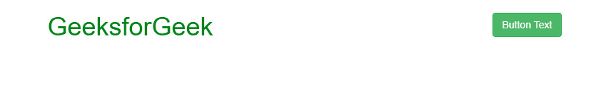
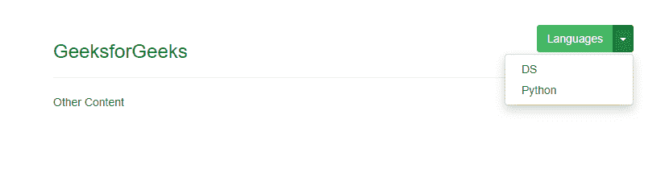

# 如何使用 Bootstrap 将按钮放置在右上角？

> 原文: [https://www.geeksforgeeks.org/how-to-place-button-in-top-right-corner-using-bootstrap/](https://www.geeksforgeeks.org/how-to-place-button-in-top-right-corner-using-bootstrap/)

要将按钮放在右上角，有几种方法可以做到这一点。

## 方法一：使用 `pull-right` 类

最简单的方法是在按钮的 `class` 属性中设置 `pull-right`。

**示例:**

```html
<!DOCTYPE html>
<html lang="en">
<head>
    <title>place button in top right corner</title>
    <meta charset="utf-8">
    <meta name="viewport" content="width=device-width, initial-scale=1">
    <link rel="stylesheet" href="https://maxcdn.bootstrapcdn.com/bootstrap/3.4.0/css/bootstrap.min.css">
    <script src="https://ajax.googleapis.com/ajax/libs/jquery/3.4.1/jquery.min.js"></script>
    <script src="https://maxcdn.bootstrapcdn.com/bootstrap/3.4.0/js/bootstrap.min.js"></script>
</head>
<body>
    <div class="container">
        <h1>
            <span style="color:green">GeeksforGeek</span>
            <button class='btn btn-success pull-right'>Button Text</button>
        </h1>
    </div>
</body>
</html>
```

**输出:**


## 方法二：使用按钮组 (`button group`)

当需要放置多个按钮时，可以使用 `button group`。如果只使用单个按钮，`button group` 是可选的。

**示例:**

```html
<!DOCTYPE html>
<html lang="en">
<head>
    <title>place button in top right corner</title>
    <meta charset="utf-8">
    <meta name="viewport" content="width=device-width, initial-scale=1">
    <link rel="stylesheet" href="https://maxcdn.bootstrapcdn.com/bootstrap/3.4.0/css/bootstrap.min.css">
    <script src="https://ajax.googleapis.com/ajax/libs/jquery/3.4.1/jquery.min.js"></script>
    <script src="https://maxcdn.bootstrapcdn.com/bootstrap/3.4.0/js/bootstrap.min.js"></script>
</head>
<body>
    <div class="container">
        <section>
            <div class="page-header">
                <h3 style="color:green" class="pull-left">GeeksforGeeks</h3>
                <div class="pull-right">
                    <div class="btn-group">
                        <button class="btn btn-success">Languages</button>
                        <button class="btn btn-success dropdown-toggle" data-toggle="dropdown">
                            <span class="caret"></span>
                        </button>
                        <ul class="dropdown-menu pull-right">
                            <li><a href="#">DS</a></li>
                            <li><a href="#">Python</a></li>
                        </ul>
                    </div>
                </div>
                <div class="clearfix"></div>
            </div>
            Other Content
        </section>
    </div>
</body>
</html>
```

