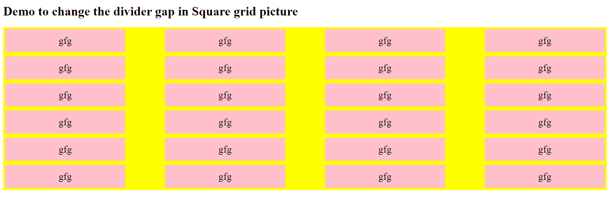
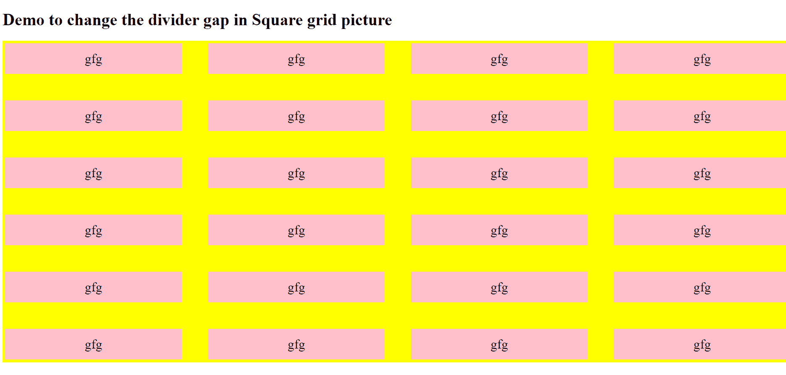

# 如何使用 Bootstrap 指定正方形网格中的分割线间隙？

> 原文: [https://www.geeksforgeeks.org/how-to-specify-divider-gap-in-square-grid-using-bootstrap/](https://www.geeksforgeeks.org/how-to-specify-divider-gap-in-square-grid-using-bootstrap/)

[CSS 网格行间隙属性](https://www.geeksforgeeks.org/css-grid-row-gap-property/)用于设置网格行元素之间的间隙大小。类似地，[CSS 网格列间隙属性](https://www.geeksforgeeks.org/css-grid-column-gap-property/)用于设置列元素之间的间隙（檐槽）的大小。

## 语法

*   `grid-column-gap` 属性

```html
grid-column-gap: none|length|percentage|initial|inherit;
```

*   `grid-row-gap` 属性

```html
grid-row-gap: length|percentage|global-values;
```

## 方法

指定网格线的大小。你可以把它想象成设置列/行之间的檐槽宽度。

1.  选择包含网格布局的类。
2.  指定该类的网格间距属性值。
3.  例如：

```css
.container {
    grid-column-gap: <line-size>;
    grid-row-gap: <line-size>;
}
```

## 示例

```html
<!DOCTYPE html>
<html>
<head>
    <style>
        /* 使用 grid-row-gap 和 grid-column-gap
           来指定方形网格之间的间隙。
           行之间的间隙指定为 10px，
           列之间的间隙指定为 100px */
        .grid-box {
            display: grid;
            grid-template-columns: auto auto auto auto;
            /* 在网格中指定分割线间隙的尺寸 */
            grid-row-gap: 10px;
            grid-column-gap: 100px;
            background-color: yellow;
            padding: 5px;
        }

        .grid-box div {
            background-color: pink;
            text-align: center;
            padding: 15px 0;
            font-size: 25px;
        }
    </style>
</head>
<body>
    <h1>
        演示如何更改方形网格图片中的分割线间隙
    </h1>
    <div class="grid-box">
        <div class="item1">gfg</div>
        <div class="item2">gfg</div>
        <div class="item3">gfg</div>
        <div class="item4">gfg</div>
        <div class="item5">gfg</div>
        <div class="item6">gfg</div>
        <div class="item7">gfg</div>
        <div class="item8">gfg</div>
        <div class="item9">gfg</div>
        <div class="item10">gfg</div>
        <div class="item11">gfg</div>
        <div class="item12">gfg</div>
        <div class="item13">gfg</div>
        <div class="item14">gfg</div>
        <div class="item15">gfg</div>
        <div class="item16">gfg</div>
        <div class="item17">gfg</div>
        <div class="item18">gfg</div>
        <div class="item19">gfg</div>
        <div class="item20">gfg</div>
        <div class="item21">gfg</div>
        <div class="item22">gfg</div>
        <div class="item23">gfg</div>
        <div class="item24">gfg</div>
    </div>
</body>
</html>
```

## 输出



行间距为 50px，列间距为 50px 的网格示例。


## 浏览器兼容性

*   Chrome: 是 (66.0)
*   Firefox: 是 (61.0)
*   Edge: 是 (16.0)
*   Internet Explorer: 否
*   Opera: 是 (53.0)
*   Safari: 是 (10.1)