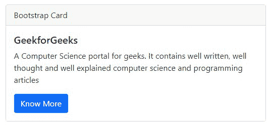

# Bootstrap v3 和 v4 有什么区别？

> 原文：[https://www.geeksforgeeks.org/what-is-the-difference-between-bootstrap-v3-and-v4/](https://www.geeksforgeeks.org/what-is-the-difference-between-bootstrap-v3-and-v4/)

在本文中，我们将看到 Bootstrap v3 和 v4 及其实现的差异。Bootstrap 是一个免费的开源前端框架，用于创建响应性网站和网络应用程序。它是最流行的 `HTML`、`CSS` 和 `JavaScript` 框架，用于开发响应迅速、移动优先的网站。它为用户提供预定义的 `类` 和 `id`，帮助用户在开发过程中节省时间，使代码整洁，增强可读性。Bootstrap 版本 3 于 2013 年推出，而 Bootstrap 版本 4 于 2017 年 8 月首次投入使用。您可以通过将官网中的 `CDN` 链接复制到您的 `HTML` 文档中来获得 `Bootstrap CDN` 链接。我们还可以从网站下载引导程序，然后将其放在工作目录中。详情请参考[引导教程](https://www.geeksforgeeks.org/bootstrap-tutorials/)一文。

## 不同版本的 Bootstrap：

*   **版本 2.x:** 支持响应性设计。
*   **3.x 版本:** 支持移动优先设计。
*   **4.x 版本:** 引入了 `SASS` 和 `Flexbox` 支持。
*   **5.x 版本:** 最新更新。

我们将通过示例了解 `bootstrap v3` 和 `v4`。

## Bootstrap v3

它通过引入 `Bootstrap` 网格系统的概念为开发人员引入了`移动优先设计`，该系统最多可扩展 12 列以增加设备视口。它允许我们通过使用 4 层网格类–`手机`、`平板电脑`、`台式机`和`大型台式机`，轻松创建复杂的自适应布局。在 `Bootstrap v3` 中，引入了排版概念，用于添加已经存在的基于 `HTML` 文本的控件功能，以及添加新的文本控件来增强呈现文本的方式。引导 `v3` 的 `CSS` 源文件是 `LESS`。

### Bootstrap v3 CDN 链接为 Bootstrap 的 CSS 和 JavaScript

```html
<!--最新编译和缩小的 CSS-->
<link rel="stylesheet" href="https://maxcdn.bootstrapcdn.com/bootstrap/3.3.7/css/bootstrap.min.css" integrity="sha384-BVYiiSIFeK1dGmJRAkycuHAHRg32OmUcww7on3RYdg4Va+PmSTsz/K68vbdEjh4u" crossorigin="anonymous" />

<link rel="stylesheet" href="https://maxcdn.bootstrapcdn.com/bootstrap/3.3.7/css/bootstrap-theme.min.css" integrity="sha384-rHyoN1iRsVXV4nD0JutlnGaslCJuC7uwjduW9SVrLvRYooPp2bWYgmgJQIXwl/Sp" crossorigin="anonymous">

<script src="https://maxcdn.bootstrapcdn.com/bootstrap/3.3.7/js/bootstrap.min.js" integrity="sha384-Tc5IQib027qvyjSMfHjOMaLkfuWVxZxUPnCJA7l2mCWNIpG9mGCD8wGNIcPD7Txa" crossorigin="anonymous"></script>
```

### 示例 1

在本例中，我们使用了 `Bootstrap v3 CDN` 链接。

## HTML

```html
<!DOCTYPE html>
<html>

<head>
    <!-- Latest compiled and minified CSS -->
    <link rel="stylesheet" href=
"https://maxcdn.bootstrapcdn.com/bootstrap/3.3.7/css/bootstrap.min.css"
        integrity=
"sha384-BVYiiSIFeK1dGmJRAkycuHAHRg32OmUcww7on3RYdg4Va+PmSTsz/K68vbdEjh4u"
        crossorigin="anonymous" />

    <!-- Optional theme -->
    <link rel="stylesheet" href=
"https://maxcdn.bootstrapcdn.com/bootstrap/3.3.7/css/bootstrap-theme.min.css"
        integrity=
"sha384-rHyoN1iRsVXV4nD0JutlnGaslCJuC7uwjduW9SVrLvRYooPp2bWYgmgJQIXwl/Sp"
        crossorigin="anonymous">
</head>

<body>
    <div class="container">
        <h2>Welcome To GFG</h2>
        <div class="row">
            <div class="col-sm">Data Structure</div>
            <div class="col-sm">Web Development</div>
            <div class="col-sm">Placement course</div>
        </div>
    </div>
    <script src=
"https://maxcdn.bootstrapcdn.com/bootstrap/3.3.7/js/bootstrap.min.js"
        integrity=
"sha384-Tc5IQib027qvyjSMfHjOMaLkfuWVxZxUPnCJA7l2mCWNIpG9mGCD8wGNIcPD7Txa"
        crossorigin="anonymous">
    </script>
</body>

</html>
```

### 输出


## Bootstrap 4.0 版本

包含 `Bootstrap 3` 功能，并增加了一些新功能，喜欢 `SASS` 文件和 `Flexbox`。`SASS` 是引导 `v4` 的 `CSS` 源文件。随着网格布局和表单支持的改进，主要浏览器都支持 `Bootstrap v4`。它还引入了卡组件的概念，该组件提供了一个具有多个选项的灵活且可扩展的内容容器。

### Bootstrap v4 CDN 链接为 Bootstrap 的 CSS 和 JavaScript

```html
<link rel="stylesheet" href="https://maxcdn.bootstrapcdn.com/bootstrap/4.0.0/css/bootstrap.min.css" integrity="sha384-Gn5384xqQ1aoWXA+058RXPxPg6fy4IWvTNh0E263XmFcJlSAwiGgFAW/dAiS6JXm" crossorigin="anonymous" />
```

### 示例 2

在本例中，我们使用了 `Bootstrap v4 CDN` 链接来制作 `Bootstrap` 卡。

## HTML

```html
<!DOCTYPE html>
<html>

<head>
    <link rel="stylesheet" href=
"https://maxcdn.bootstrapcdn.com/bootstrap/4.0.0/css/bootstrap.min.css"
        integrity=
"sha384-Gn5384xqQ1aoWXA+058RXPxPg6fy4IWvTNh0E263XmFcJlSAwiGgFAW/dAiS6JXm"
        crossorigin="anonymous" />
</head>

<body>
    <div class="container">
        <div class="card">
            <div class="card-header">Bootstrap Card</div>
            <div class="card-body">
                <h5 class="card-title">GeekforGeeks</h5>
                <p class="card-text">
                    A Computer Science portal for geeks.
                    It contains well written, well
                    thought and well explained computer
                    science and programming articles
                </p>

                <a href="#" class="btn btn-primary">
                    Know More
                </a>
            </div>
        </div>
    </div>

    <script src="https://code.jquery.com/jquery-3.2.1.slim.min.js"
        integrity=
"sha384-KJ3o2DKtIkvYIK3UENzmM7KCkRr/rE9/Qpg6aAZGJwFDMVNA/GpGFF93hXpG5KkN"
        crossorigin="anonymous">
    </script>

    <script src=
"https://cdnjs.cloudflare.com/ajax/libs/popper.js/1.12.9/umd/popper.min.js"
        integrity=
"sha384-ApNbgh9B+Y1QKtv3Rn7W3mgPxhU9K/ScQsAP7hUibX39j7fakFPskvXusvfa0b4Q"
        crossorigin="anonymous">
    </script>

    <script src=
"https://maxcdn.bootstrapcdn.com/bootstrap/4.0.0/js/bootstrap.min.js"
        integrity=
"sha384-JZR6Spejh4U02d8jOt6vLEHfe/JQGiRRSQQxSfFWpi1MquVdAyjUar5+76PVCmYl"
        crossorigin="anonymous">
    </script>
</body>

</html>
```

### 输出



## Bootstrap v3 与 Bootstrap v4 的区别

| Component | Bootstrap v3 | Bootstrap v4 |
| :--- | :--- | :--- |
| CSS 源文件 | LESS | SASS |
| 默认字体大小 | 14px | 16px |
| 网格系统 | 它是基于 4 层网格系统(`xs`、`sm`、`md`、`lg`) | 它是基于 5 层网格系统(`xs`、`sm`、`md`、`lg`、`xl`) |
| 图片 | `.img-responsive` | `.img-fluid` |
| 表格 | 使用`.table-responsive`类在`<div>`中标记 | 使用`.table-responsive`类在`<table>`中标记 |
| 偏移列 | `.col-md-offset-4` | `.offset-md-4` |
| 表单控制大小 | `.input-lg`增加尺寸，`.input-sm`减小尺寸 | `.form-control-lg`增加尺寸，`.form-control-sm`缩小尺寸 |
| 按钮尺寸 | `.btn-xs`类可用 | `.btn-sm`和`.btn-lg`类在那里。`.btn-xs`类不是 |
| Jumbotron 全宽 | `.jumbotron-fluid`类不用于全幅 jumbotrons | `.jumbotron-fluid`类为全幅 jumbotrons 使用 |
| 轮播项 | 轮播项的排列使用`.item`类 | 它使用`.carousel-item`用于排列轮播项目的类 |
| 内联 Navs | 不具备`.nav-inline`类 | 内联导航通过使用`.nav-inline`类 |
| 样式 | 它有`.btn-default`和`.btn-info`按钮的可用类别 | 按钮有不同的类别，如：`.btn-secondary`、`.btn-light`和`.btn-dark` |
| 复选框和单选按钮 | `.radio`、`.radio-inline`、`.checkbox`或者`.checkbox-inline`类可用于单选和复选框 | `.form-check`、`.form-check-label`、`.form-check-input`或`.form-check-inline`是用于显示单选和复选框的类 |