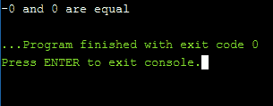
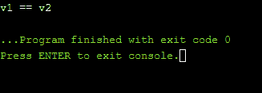

# C++20 中的三向比较运算符（航天飞船运算符）

> 原文：[https://www.geeksforgeeks.org/3-way-comparison-operator-space-ship-operator-in-c-20/](https://www.geeksforgeeks.org/3-way-comparison-operator-space-ship-operator-in-c-20/)

三向比较运算符`<=>`称为飞船运算符。飞船运算符确定两个对象`A`和`B`是`A < B`、`A = B`，还是`A > B`。飞船运算符可以由编译器自动为我们生成。此外，三向比较是在一个查询中给出整个关系的函数。传统上，`strcmp()`就是这样的功能。给定两个字符串，它将返回一个整数：

*   `< 0` 表示第一个字符串较小
*   `== 0` 如果两者相等
*   `> 0` 如果第一个字符串较大

它可以给出三个结果中的一个，因此这是一个三向比较。

|      | **相等性** | **排序** |
| :--- | :--------- | :------- |
| **初级** | `=`        | `<=>`    |
| **次级** | `!=`       | `<`、`<=`、`>`、`>=` |

从上表可以看出，飞船运算符是一个初级运算符，即可以用它来写出相应的次级运算符。

> `(A <=> B) < 0` 为真，如果 `A < B`
> `(A <=> B) > 0` 为真，如果 `A > B`
> `(A <=> B) == 0` 为真，如果 `A` 和 `B` 相等/等价。

**程序 1：**

下面是两个浮点变量的三向比较运算符的实现：

### C++

```cpp
// C++ 20 program to illustrate the
// 3 way comparison operator
#include <bits/stdc++.h>
using namespace std;

// Driver Code
int main()
{
    float A = -0.0;
    float B = 0.0;

    // Find the value of 3 way comparison
    auto ans = A <=> B;

    // If ans is less than zero
    if (ans < 0)
        cout << "-0 is less than 0";

    // If ans is equal to zero
    else if (ans == 0)
        cout << "-0 and 0 are equal";

    // If ans is greater than zero
    else if (ans > 0)
        cout << "-0 is greater than 0";

    return 0;
}
```

**输出：**
[](https://media.geeksforgeeks.org/wp-content/cdn-uploads/20201123151437/Screenshot-787.png)

**程序 2：**

下面是两个向量的三向比较运算符的实现：

### C++

```cpp
// C++ 20 program for the illustration of the
// 3-way comparison operator for 2 vectors
#include <bits/stdc++.h>
using namespace std;

// Driver Code
int main()
{
    // Given vectors
    vector<int> v1{ 3, 6, 9 };
    vector<int> v2{ 3, 6, 9 };

    auto ans2 = v1 <=> v2;

    // If ans is less than zero
    if (ans2 < 0) {
        cout << "v1 < v2" << endl;
    }

    // If ans is equal to zero
    else if (ans2 == 0) {
        cout << "v1 == v2" << endl;
    }

    // If ans is greater than zero
    else if (ans2 > 0) {
        cout << "v1 > v2" << endl;
    }

    return 0;
}
```

**输出：**
[](https://media.geeksforgeeks.org/wp-content/cdn-uploads/20201123151440/Screenshot-786.png)

**注意：** 你应该下载足够新的编译器来运行 C++20。

**飞船运算符的需求：**

*   这是所有其他比较运算符（对于全序域）的通用概括：`>`、`>=`、`==`、`<=`、`<`。使用`<=>`，在用户定义数据类型的情况下，每个操作都可以以完全通用的方式实现，就像结构体一样，而不需要逐个定义其他 6 个比较运算符。
*   对于字符串，它相当于 C 标准库的老的`strcmp()`函数。因此它对于字典顺序检查很有用，例如向量或列表中的数据，或其他有序容器中的数据。