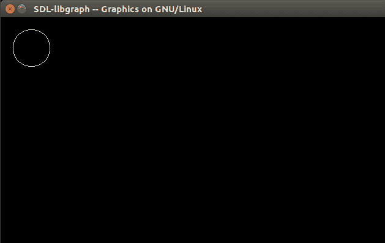

# 如何在 Linux 中为 GCC 编译器添加 graphics.h C/C++ 库

> 原文：[https://www.geeksforgeeks.org/add-graphics-h-c-library-gcc-compiler-linux/](https://www.geeksforgeeks.org/add-graphics-h-c-library-gcc-compiler-linux/)

在 Ubuntu 上尝试 C 图形编程时，我发现 `graphics.h` 不是标准的 C 库，也不受 GCC 编译器的支持。所以我写这篇文章来解释这个过程。

## 介绍

如果想在 Ubuntu 平台上使用 `graphics.h`，需要编译安装 `libgraph`。它是使用 SDL 在 Linux 上实现 Turbo C 图形应用编程接口。
可以从这里下载 [`libgraph`](http://download.savannah.gnu.org/releases/libgraph/libgraph-1.0.2.tar.gz)。

## 分步说明

*   **步骤 1:** 首先通过键入以下命令安装构建必备组件：
    ```
    sudo apt-get install build-essential
    ```

*   **步骤 2:** 通过键入以下命令安装一些附加包：
    ```
    sudo apt-get install libsdl-image1.2 libsdl-image1.2-dev guile-2.0 \
    guile-2.0-dev libsdl1.2debian libart-2.0-dev libaudiofile-dev \
    libesd0-dev libdirectfb-dev libdirectfb-extra libfreetype6-dev \
    libxext-dev x11proto-xext-dev libfreetype6 libaa1 libaa1-dev \
    libslang2-dev libasound2 libasound2-dev
    ```

*   **步骤 3:** 现在提取下载的 `libgraph-1.0.2.tar.gz` 文件。
*   **步骤 4:** 转到提取的文件夹并运行以下命令：
    ```
    ./configure
    make
    sudo make install
    sudo cp /usr/local/lib/libgraph.* /usr/lib
    ```

现在您可以使用 `graphics.h` 库，使用以下几行：
```
int gd = DETECT, gm;
initgraph(&gd, &gm, NULL);
```

## 示例代码

### C

```cpp
// C code to illustrate using
// graphics in linux environment
#include<stdio.h>
#include<stdlib.h>
#include<graphics.h>
int main()
{
    int gd = DETECT, gm;
    initgraph(&gd, &gm, NULL);

    circle(50, 50, 30);

    delay(500000);
    closegraph();
    return 0;
}
```

**输出：**



## 参考

*   [Ask Ubuntu](https://askubuntu.com/questions/525051/how-do-i-use-graphics-h-in-ubuntu)

本文由 **Aakash Tiwari** 供稿。如果你喜欢 GeeksforGeeks 并想投稿，你也可以使用 [write.geeksforgeeks.org](https://write.geeksforgeeks.org) 写一篇文章或者把你的文章邮寄到 `review-team@geeksforgeeks.org`。看到你的文章出现在极客博客主页上，帮助其他极客。

**重要注意事项（用户添加）：** 上述链接中的文件对我无效。我从 [https://github.com/SagarGaniga/Graphics-Library](https://github.com/SagarGaniga/Graphics-Library) 下载的文件有效。有问题，如果你发现任何不正确的地方，或者你想分享更多关于上面讨论的话题的信息，请写评论。