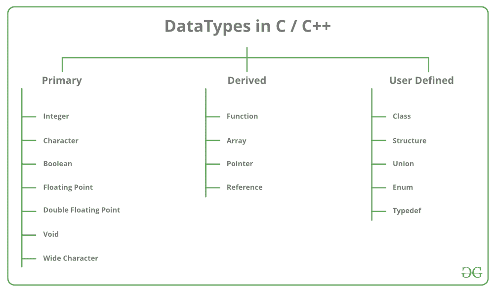
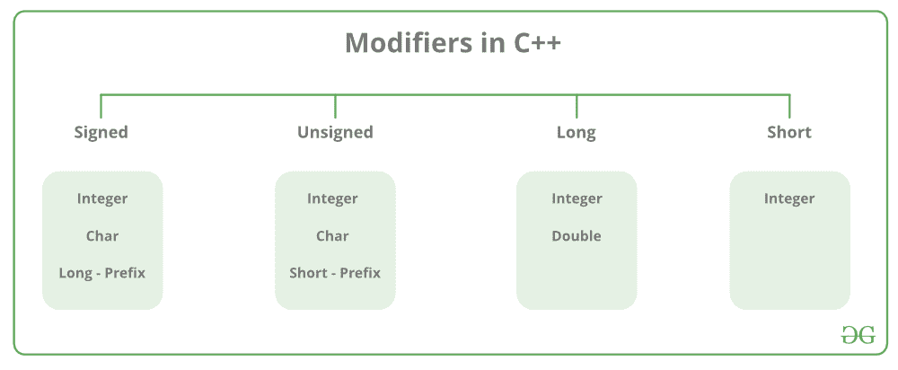

# C++ 数据类型

> 原文：[https://www.geeksforgeeks.org/c-data-types/](https://www.geeksforgeeks.org/c-data-types/)

所有[变量](https://www.geeksforgeeks.org/variables-and-keywords-in-c/)在声明时使用数据类型来限制要存储的数据类型。因此，我们可以说数据类型用于告诉变量它可以存储的数据类型。每当在 C++ 中定义一个变量时，编译器都会根据声明该变量的数据类型为该变量分配一些内存。每种数据类型都需要不同的内存量。



C++ 中的数据类型主要分为三种：

1.  **原始数据类型**：这些数据类型是内置或者预定义的数据类型，用户可以直接使用来声明变量。例如：`int`、`char`、`float`、`bool` 等。C++ 中可用的基本数据类型有：
    *   整数
    *   字符
    *   布尔
    *   浮点
    *   双浮点
    *   无类型
    *   宽字符
2.  [**派生数据类型**](https://www.geeksforgeeks.org/derived-data-types-in-c/)：从原语或内置数据类型派生的数据类型称为派生数据类型。这些可以是四种类型，即：
    *   函数
    *   数组
    *   指针
    *   引用
3.  [**抽象或用户自定义数据类型**](https://www.geeksforgeeks.org/user-defined-derived-data-types-in-c/)：这些数据类型由用户自己定义。比如，用 C++ 定义一个类或者一个结构。C++ 提供了以下用户定义的数据类型：
    *   类
    *   结构
    *   联合
    *   枚举
    *   `typedef` 定义的数据类型

本文讨论 C++ 中可用的**原始数据类型**。

*   **整数**：整数数据类型使用的关键字是 `int`。整数通常需要 4 字节的内存空间，范围从 -2147483648 到 2147483647。
*   **字符**：字符数据类型用于存储字符。用于字符数据类型的关键字是 `char`。字符通常需要 1 字节的内存空间，范围从 -128 到 127 或 0 到 255。
*   **布尔**：布尔数据类型用于存储布尔值或逻辑值。一个布尔变量可以存储 `true` 或 `false`。用于布尔数据类型的关键字是 `bool`。
*   **浮点**：浮点数据类型用于存储单精度浮点值或十进制值。用于浮点数据类型的关键字是 `float`。浮点变量通常需要 4 字节的内存空间。
*   **双浮点**：双浮点数据类型用于存储双精度浮点值或十进制值。双浮点数据类型使用的关键字是 `double`。双变量通常需要 8 字节的内存空间。
*   **void**：`void` 表示没有任何值。`void` 数据类型表示无值实体。`void` 数据类型用于那些不返回值的函数。
*   [**宽字符**](https://www.geeksforgeeks.org/wide-char-and-library-functions-in-c/)：宽字符数据类型也是一种字符数据类型，但该数据类型的大小大于正常的 8 位数据类型。以 `wchar_t` 为代表。一般为 2 或 4 字节长。

## 数据类型修饰符

顾名思义，数据类型修饰符与内置数据类型一起使用，以修改特定数据类型可以容纳的数据长度。



C++ 中可用的数据类型修饰符有：

*   `signed`
*   `unsigned`
*   `short`
*   `long`

下表总结了与类型修饰符组合时内置数据类型的修改大小和范围：

| 数据类型 | 大小（字节） | 范围 |
| :--- | :--- | :--- |
| `short int` | 2 | -32,768 到 32,767 |
| `unsigned short int` | 2 | 0 到 65,535 |
| `unsigned int` | 4 | 0 到 4,294,967,295 |
| `int` | 4 | -2,147,483,648 到 2,147,483,647 |
| `long int` | 8 | -(2^63) 到 (2^63)-1 |
| `unsigned long int` | 8 | 0 到 18,446,744,073,709,551,615 |
| `signed char` | 1 | -128 到 127 |

**注**：以上数值可能因编译器而异。在上面的例子中，我们考虑了 GCC 32 位。

我们可以使用 `sizeof()` 运算符显示所有数据类型的大小，并将数据类型的关键字作为参数传递给该函数，如下所示：

## CPP

```cpp
// C++ program to sizes of data types
#include<iostream>
using namespace std;

int main()
{
    cout << "Size of char : " << sizeof(char)
      << " byte" << endl;
    cout << "Size of int : " << sizeof(int)
      << " bytes" << endl;
    cout << "Size of short int : " << sizeof(short int)
      << " bytes" << endl;
    cout << "Size of long int : " << sizeof(long int)
       << " bytes" << endl;
    cout << "Size of signed long int : " << sizeof(signed long int)
       << " bytes" << endl;
    cout << "Size of unsigned long int : " << sizeof(unsigned long int)
       << " bytes" << endl;
    cout << "Size of float : " << sizeof(float)
       << " bytes" <<endl;
    cout << "Size of double : " << sizeof(double)
       << " bytes" << endl;
    cout << "Size of wchar_t : " << sizeof(wchar_t)
       << " bytes" <<endl;

return 0;
}
```

输出：

```cpp
Size of char : 1 byte
Size of int : 4 bytes
Size of short int : 2 bytes
Size of long int : 8 bytes
Size of signed long int : 8 bytes
Size of unsigned long int : 8 bytes
Size of float : 4 bytes
Size of double : 8 bytes
Size of wchar_t : 4 bytes
```

本文由 [**哈什·阿加瓦尔**](https://www.facebook.com/harsh.agarwal.16752) 供稿。如果你喜欢 GeeksforGeeks 并想投稿，你也可以使用 [contribute.geeksforgeeks.org](http://www.contribute.geeksforgeeks.org) 写一篇文章或者把你的文章邮寄到 `contribute@geeksforgeeks.org`。看到你的文章出现在极客博客主页上，帮助其他极客。
如果发现有不正确的地方，或者想分享更多关于上述话题的信息，请写评论。