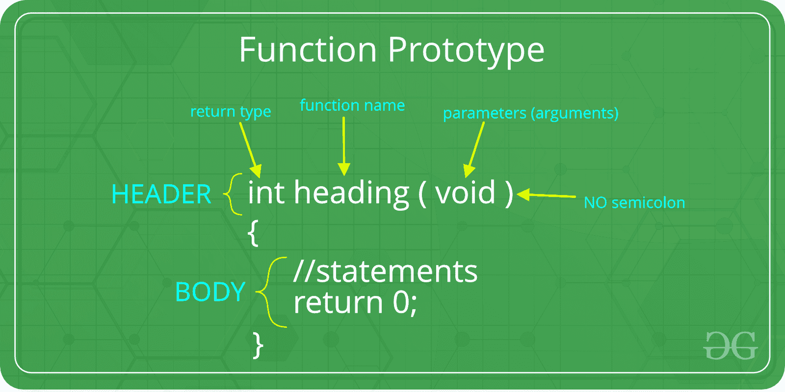
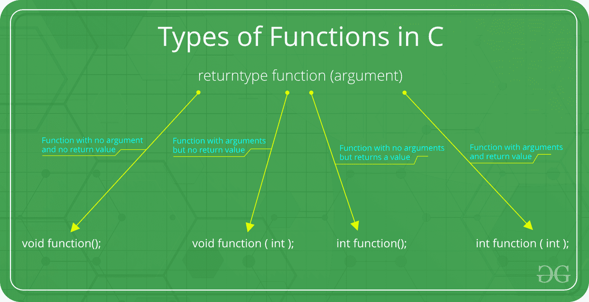

# C 函数参数和返回值

> 原文: [https://www.geeksforgeeks.org/c-function-argument-return-values/](https://www.geeksforgeeks.org/c-function-argument-return-values/)

**先决条件:** [C/c++](https://www.geeksforgeeks.org/functions-in-c/) 中的函数

C 中的函数可以用参数调用，也可以不用参数调用。这些函数可以向调用函数返回值，也可以不返回值。在 C 程序中，所有的 C 函数都可以用参数或者不用参数来调用。此外，它们可能会也可能不会返回值。因此，C 语言中函数的函数原型如下:



## 有以下几类:



### 1. Function with no argument and no return value
当一个函数没有参数时，它不会从调用函数接收任何数据。同样，当它不返回值时，调用函数也不会从被调用函数接收任何数据。
语法:

```cpp
Function declaration : void function();
Function call : function();
Function definition :
                      void function()
                      {
                        statements;
                      }
```

```cpp
// C code for function with no
// arguments and no return value
#include <stdio.h>
void value(void);
void main()
{
    value();
}
void value(void)
{
    int year = 1, period = 5, amount = 5000, inrate = 0.12;
    float sum;
    sum = amount;
    while (year <= period) {
        sum = sum * (1 + inrate);
        year = year + 1;
    }
    printf(" The total amount is %f:", sum);
}
```

**输出:**

```cpp
The total amount is 5000.000000
```

### 2. Function with arguments but no return value
当一个函数有参数时，它会从调用函数接收数据，但它不返回值。

语法:

```cpp
Function declaration : void function ( int );
Function call : function( x );
Function definition:
             void function( int x )
             {
               statements;
             }
```

```cpp
// C code for function
// with argument but no return value
#include <stdio.h>
void function(int, int[], char[]);
int main()
{
    int a = 20;
    int ar[5] = { 10, 20, 30, 40, 50 };
    char str[30] = "geeksforgeeks";
    function(a, &ar[0], &str[0]);
    return 0;
}
void function(int a, int* ar, char* str)
{
    int i;
    printf("value of a is %d\n\n", a);
    for (i = 0; i < 5; i++) {
        printf("value of ar[%d] is %d\n", i, ar[i]);
    }
    printf("\nvalue of str is %s\n", str);
}
```

**输出:**

```cpp
value of a is 20
value of ar[0] is 10
value of ar[1] is 20
value of ar[2] is 30
value of ar[3] is 40
value of ar[4] is 50
The given string is : geeksforgeeks
```

### 3. Function with no arguments but returns a value
有时我们可能需要设计不接受任何参数但向调用函数返回一个值的函数。`getchar`函数就是一个例子，它没有参数，但返回一个表示字符的整数类型数据。
语法:

```cpp
Function declaration : int function();
Function call : function();
Function definition :
                 int function()
                 {
                     statements;
                      return x;
                  }
```

```cpp
// C code for function with no arguments
// but have return value
#include <math.h>
#include <stdio.h>
int sum();
int main()
{
    int num;
    num = sum();
    printf("\nSum of two given values = %d", num);
    return 0;
}
int sum()
{
    int a = 50, b = 80, sum;
    sum = sqrt(a) + sqrt(b);
    return sum;
}
```

**输出:**

```cpp
Sum of two given values = 16
```

### 4. Function with arguments and return value
语法:

```cpp
Function declaration : int function ( int );
Function call : function( x );
Function definition:
             int function( int x )
             {
               statements;
               return x;
             }
```

```cpp
// C code for function with arguments
// and with return value
#include <stdio.h>
#include <string.h>
int function(int, int[]);
int main()
{
    int i, a = 20;
    int arr[5] = { 10, 20, 30, 40, 50 };
    a = function(a, &arr[0]);
    printf("value of a is %d\n", a);
    for (i = 0; i < 5; i++) {
        printf("value of arr[%d] is %d\n", i, arr[i]);
    }
    return 0;
}
int function(int a, int* arr)
{
    int i;
    a = a + 20;
    arr[0] = arr[0] + 50;
    arr[1] = arr[1] + 50;
    arr[2] = arr[2] + 50;
    arr[3] = arr[3] + 50;
    arr[4] = arr[4] + 50;
    return a;
}
```

**输出:**

```cpp
value of a is 40
value of arr[0] is 60
value of arr[1] is 70
value of arr[2] is 80
value of arr[3] is 90
value of arr[4] is 100
```