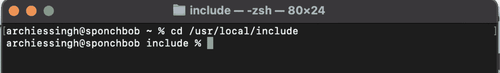
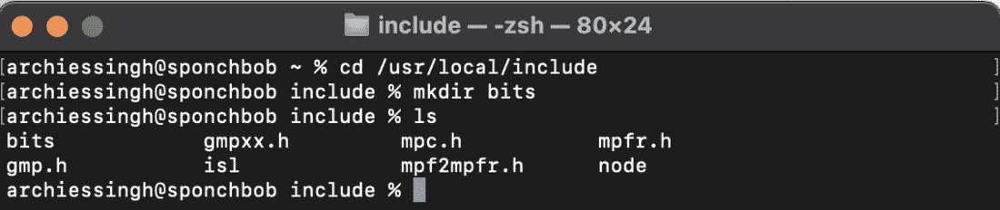
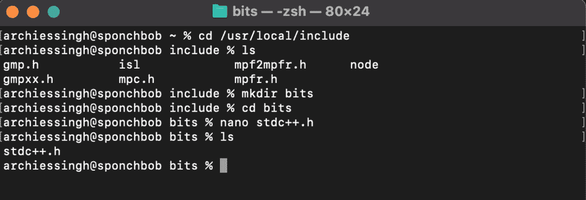

# 在 MacBook M1 上为 VS Code 安装 C++

> 原文：[https://www.geeksforgeeks.org/c-installation-on-macbook-m1-for-vs-code/](https://www.geeksforgeeks.org/c-installation-on-macbook-m1-for-vs-code/)

本文介绍如何在最新款 MacBook M1 处理器上为 Visual Studio Code 安装 C++ 环境。并非不能在新款 MacBook 上进行 C++ 编程，Xcode 等其他代码编辑器也是可行的替代方案。但仍有许多开发者偏爱在 Visual Studio Code 中编写代码。

让我们开始在 Visual Studio Code 上安装 C++ 环境。

*   首先，在你的设备上[下载 VS Code](https://code.visualstudio.com)。
*   你也可以[下载专为 M1 优化的 Visual Studio Code](https://code.visualstudio.com/insiders/)（即 Visual Studio Code - Insiders 版本）。

下载 Visual Studio Code 或 Visual Studio Code Insiders 后，打开它并转到扩展视图。在搜索选项卡中，键入 `c++`，然后点击第一个推荐项进行安装。另一个你需要安装的扩展是 `Code Runner`。

在此过程中，用户可能会遇到两种不同类型的问题。因此，让我们讨论它们是什么以及如何解决它们。

## 问题 1：在 VS Code 上下载完所有扩展后，无法在 C++ 上工作。

按照以下步骤解决此问题：

*   **第一步：** 打开终端，运行以下命令：
    ```bash
    arch -x86_64 /bin/bash -c "$(curl -fsSL https://raw.githubusercontent.com/Homebrew/install/master/install.sh)"
    ```

*   **步骤 2：** 在上一条命令完成后，输入以下命令：
    ```bash
    arch -x86_64 brew install mingw-w64
    ```

## 问题 2：`#include <bits/stdc++.h>` 未找到。

如果想了解更多关于系统头文件的信息，[请点击这里](https://www.geeksforgeeks.org/c-c-include-directive-with-examples/#:~:text=%23include%20is%20a%20way%20of,file%20into%20the%20following%20program.)。按照以下步骤解决问题：

*   **第一步：** 使用 `Command + 空格` 打开聚焦搜索，键入 `终端` 并打开它。
*   **步骤 2：** 现在移动到下面给定的路径：
    ```bash
    cd /usr/local/include
    ```
    

*   **步骤 3：** 在当前位置创建 `bits` 目录：
    ```bash
    mkdir bits
    ```
    

*   **第 4 步：** 进入 `bits` 目录，创建一个名为 `stdc++.h` 的文件：
    ```bash
    nano stdc++.h
    ```

*   **第五步：** 创建文件后，只需从 [GitHub 存储库](https://github.com/Archies13Singh/cpp-important-packages-file/blob/main/stdc++.h) 复制代码，并将该代码粘贴到 `stdc++.h` 文件中，然后按 `Control + X`，接着按 `Y`，最后按 `Return`。
    

现在只需尝试编译运行任何 C++ 代码，以确保您在 MacBook M1 上完成了 C++ 环境设置。

## 示例 C++ 代码

```cpp
#include <bits/stdc++.h>
using namespace std;

int main()
{
    int a= 2, b=4;
    cout<<a+b<<endl;
    return 0;
}
```

就这样。您已经成功地将 C++ 开发环境安装到您的 Mac M1 中。