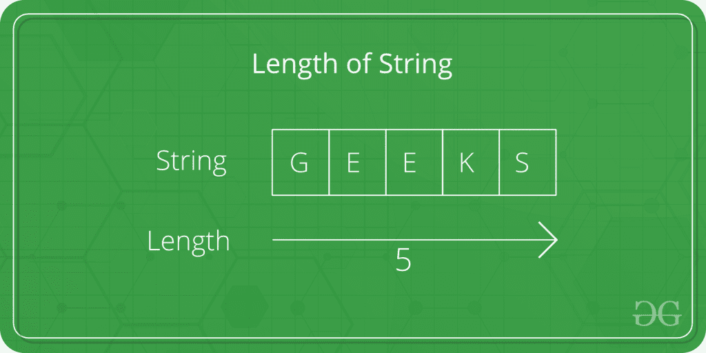

# C 程序求一个字符串的长度

> 原文：[https://www.geeksforgeeks.org/c-program-to-find-the-length-of-a-string/](https://www.geeksforgeeks.org/c-program-to-find-the-length-of-a-string/)

给定一个字符串 `str`。任务是找到字符串的长度。



## 示例

```cpp
Input: str = "Geeks"
Output: Length of Str is : 4

Input: str = "GeeksforGeeks"
Output: Length of Str is : 13
```

在下面的程序中，要找到字符串 `str` 的长度，首先使用 `scanf` 将字符串作为用户的输入，然后使用循环和 `strlen()` 方法计算 `str` 的长度。

下面是寻找字符串长度的 C 程序。

## 例 1：用循环计算字符串长度

```cpp
// C program to find the length of string
#include <stdio.h>
#include <string.h>

int main()
{
    char Str[1000];
    int i;

    printf("Enter the String: ");
    scanf("%s", Str);

    for (i = 0; Str[i] != '\0'; ++ i);

    printf("Length of Str is %d", i);

    return 0;
}
```

**输出：**

```cpp
Enter the String: Geeks
Length of Str is 5
```

## 例 2：用 `strlen()` 求字符串的长度

```cpp
// C program to find the length of 
// string using strlen function
#include <stdio.h>
#include <string.h>

int main()
{
    char Str[1000];
    int i;

    printf("Enter the String: ");
    scanf("%s", Str);

    printf("Length of Str is %ld", strlen(Str));

    return 0;
}
```

**输出：**

```cpp
Enter the String: Geeks
Length of Str is 5
```