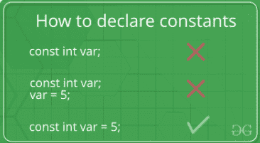
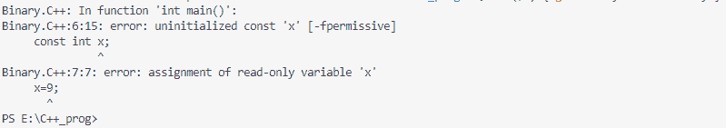

# C++ 中的 Const 关键字

> 原文: [https://www.geeksforgeeks.org/const-keyword-in-cpp/](https://www.geeksforgeeks.org/const-keyword-in-cpp/)

本文讨论了 `C++` 中 `const` 关键字的各种功能。每当 `const` 关键字被附加到任何方法、变量、指针变量，并且带有一个类的对象时，它阻止特定的对象/方法/变量修改它的数据项值。

## 常量变量

常量变量的声明和初始化有一套特定的规则：

*   常量变量不能在赋值时保持未初始化状态。
*   它不能在程序中的任何地方赋值。
*   在声明常量变量时，需要向常量变量提供显式值。



下面是演示上述概念的 C++ 程序：

```cpp
// C++ program to demonstrate the
// the above concept
#include <iostream>
using namespace std;

// Driver Code
int main()
{

    // const int x;  CTE error
    // x = 9;   CTE error
    const int y = 10;
    cout << y;

    return 0;
}
```

**Output:**

```cpp

```

**错误声明所面临的错误：** 如果您试图初始化常量变量而没有分配显式值，则会生成编译时错误(CTE)。



## 带指针变量的常量关键字

指针可以用 `const` 关键字声明。因此，有三种可能的方法将 `const` 关键字与指针一起使用，如下所示：

### 当指针变量指向常数值

**语法：**

```cpp
const data_type* var_name;
```

下面是实现上述概念的 C++ 程序：

```cpp
// C++ program to demonstrate the
// above concept
#include <iostream>
using namespace std;

// Driver Code
int main()
{
    int x{ 10 };
    char y{ 'M' };

    const int* i = &x;
    const char* j = &y;

    // Value of x and y can be altered,
    // they are not constant variables
    x = 9;
    y = 'A';

    // Change of constant values because,
    // i and j are pointing to const-int
    // & const-char type value
    // *i = 6;
    // *j = 7;

    cout << *i << " " << *j;
}
```

**Output:**

```cpp
9 A
```