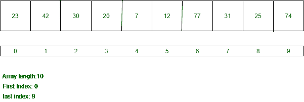
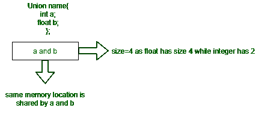

# C 中数组和联合的区别

> 原文: [https://www.geeksforgeeks.org/difference-between-array-and-union-in-c/](https://www.geeksforgeeks.org/difference-between-array-and-union-in-c/)

## 1. C 中的数组
数组是通过存储在连续内存位置的公共名称访问的相似数据项的集合。数组的元素可以使用索引来访问。它们可以用来存储基本数据类型，如 `int`、`float`、`double`、`char` 等。但是所有元素必须是相同的数据类型。下面是一个数组的图示。



**数组声明:**

```cpp
datatype array_name[size]
```

## 2. C 中的联合
联合是一种用户定义的数据类型，允许将异构元素存储在同一内存位置。联合的大小是联合中最大元素的大小。下面是一个联合的生动形象。



**联合声明:**

```cpp
union name
{
  datatype element;
  datatype element;
};
```

## 数组与联合的区别

| 数组 | 联合 |
| :--- | :--- |
| 相同数据类型元素的集合。 | 异构数据类型元素的集合。 |
| 数组可以是一维的，也可以是二维的。 | 联合没有类型。 |
| 每个元素都被分配了一个特定的内存位置。 | 这些元素共享内存位置，其大小等于联合中最大大小元素的大小。 |
| 所有成员在给定时间都可以包含值。 | 在给定时间内，只有一个成员可以包含值。 |
| 没有有效利用内存，因为所有成员都被分配了不同的内存位置。 | 高效使用内存，因为所有成员都不需要单独的内存位置。 |
| 可以使用索引访问数组元素。 | 不能使用索引访问联合的元素。 |
| 语法: `数据类型 数组名称[大小]` | 语法: `union user_defined_name { 数据类型 变量1; 数据类型 变量2; };` |