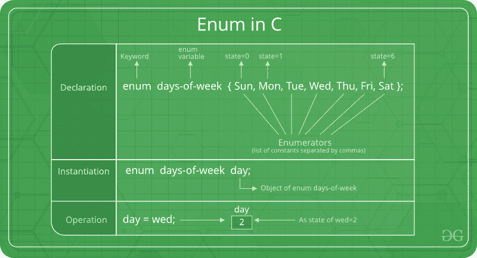

# C中的枚举(或枚举)

> 原文:[https://www.geeksforgeeks.org/enumeration-enum-c/](https://www.geeksforgeeks.org/enumeration-enum-c/)

枚举(或 `enum`)是 C 语言中用户定义的数据类型，主要用于给整型常量赋值，这些名字使程序易于阅读和维护。



```cpp
enum State {Working = 1, Failed = 0}; 
```

关键字`enum`用于在 C 和 C++ 中声明新的枚举类型。下面是枚举声明的一个示例。

```cpp
// The name of enumeration is "flag" and the constant
// are the values of the flag. By default, the values
// of the constants are as follows:
// constant1 = 0, constant2 = 1, constant3 = 2 and 
// so on.
enum flag{constant1, constant2, constant3, ....... };

```

也可以定义枚举类型的变量。它们可以用两种方式定义:

```cpp
// In both of the below cases, "day" is 
// defined as the variable of type week.

enum week{Mon, Tue, Wed};
enum week day;

// Or

enum week{Mon, Tue, Wed}day;

```

```cpp
// An example program to demonstrate working
// of enum in C
#include<stdio.h>

enum week{Mon, Tue, Wed, Thur, Fri, Sat, Sun};

int main()
{
    enum week day;
    day = Wed;
    printf("%d",day);
    return 0;
} 
```

输出:

```cpp

```

在上面的例子中，我们将`day`声明为变量，并将`Wed`的值分配给`day`，即 2。因此，打印了 2。

枚举的另一个例子是:

```cpp
// Another example program to demonstrate working
// of enum in C
#include<stdio.h>

enum year{Jan, Feb, Mar, Apr, May, Jun, Jul, 
          Aug, Sep, Oct, Nov, Dec};

int main()
{
   int i;
   for (i=Jan; i<=Dec; i++)      
      printf("%d ", i);

return 0;
}
```

输出:

```cpp
0 1 2 3 4 5 6 7 8 9 10 11

```

在本例中，`for`循环将从`i = 0`运行到`i = 11`，因为最初`i`的值是`Jan`的 0，`Dec`的值是 11。

关于枚举初始化的有趣事实。

1. 两个枚举名称可以具有相同的值。例如，在下面的 C 程序中，`Failed`和`Freezed`具有相同的值 0。

```cpp
#include <stdio.h>
enum State {Working = 1, Failed = 0, Freezed = 0};

int main()
{
   printf("%d, %d, %d", Working, Failed, Freezed);
   return 0;
}
```

输出:

```cpp
1, 0, 0
```

2. 如果我们没有为枚举名称显式赋值，编译器默认会从 0 开始赋值。例如，在下面的 C 程序中，`sunday`得到值 0，`monday`得到 1，依此类推。

```cpp
#include <stdio.h>
enum day {sunday, monday, tuesday, wednesday, thursday, friday, saturday};

int main()
{
    enum day d = thursday;
    printf("The day number stored in d is %d", d);
    return 0;
}
```

输出:

```cpp
The day number stored in d is 4
```

3. 我们可以按任意顺序给某个名称赋值。所有未分配的名称的值都是前一个名称加 1 的值。

```cpp
#include <stdio.h>
enum day {sunday = 1, monday, tuesday = 5,
          wednesday, thursday = 10, friday, saturday};

int main()
{
    printf("%d %d %d %d %d %d %d", sunday, monday, tuesday,
            wednesday, thursday, friday, saturday);
    return 0;
}
```

输出:

```cpp
1 2 5 6 10 11 12
```

4. 分配给枚举名称的值必须是某个整数常量，即该值必须在最小可能整数值到最大可能整数值的范围内。

5. 所有枚举常量在其范围内必须是唯一的。例如，以下程序编译失败。

```cpp
enum state  {working, failed};
enum result {failed, passed};

int main()  { return 0; }
```

输出:

```cpp
Compile Error: 'failed' has a previous declaration as 'state failed'
```

练习:

预测以下 C 程序的输出

程序 1:

```cpp
#include <stdio.h>
enum day {sunday = 1, tuesday, wednesday, thursday, friday, saturday};

int main()
{
    enum day d = thursday;
    printf("The day number stored in d is %d", d);
    return 0;
}
```

程序 2:

```cpp
#include <stdio.h>
enum State {WORKING = 0, FAILED, FREEZED};
enum State currState = 2;

enum State FindState() {
    return currState;
}

int main() {
   (FindState() == WORKING)? printf("WORKING"): printf("NOT WORKING");
   return 0;
}
```

Enum vs Macro

我们也可以用宏来定义名字常量。例如，我们可以使用以下宏定义`Working`和`Failed`。

```cpp
#define Working 0
#define Failed 1
#define Freezed 2
```

当许多相关的命名常量具有整数值时，使用枚举比使用宏有多种优势。
a) 枚举遵循范围规则。
b) 枚举变量被自动赋值。下面更简单

```cpp
enum state  {Working, Failed, Freezed};
```

请发表评论，如果您发现任何不正确之处，或者您想分享更多关于上述讨论主题的信息。

本文引言部分由 **Piyush Vashistha** 供稿。如果您喜欢 GeeksforGeeks 并想投稿，您也可以使用[write.geeksforgeeks.org](https://write.geeksforgeeks.org)写一篇文章或者把您的文章邮寄到 `review-team@geeksforgeeks.org`。看到您的文章出现在极客博客主页上，帮助其他极客。