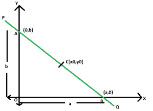

# 通过给定点的直线方程，该给定点将直线分为两条相等的线段

> 原文: [https://www.geeksforgeeks.org/equation-of-straight-line-passing-through-a-given-point-which-bisects-it-into-two-equal-line-segments/](https://www.geeksforgeeks.org/equation-of-straight-line-passing-through-a-given-point-which-bisects-it-into-two-equal-line-segments/)

给定一条通过给定点 `(x0, y0)` 的直线，使得该点将线段一分为二。任务是找到这条直线的方程式。

## 举例:

> **输入:** `x0 = 4`, `y0 = 3`
> **输出:** `3x + 4y = 24`
> **输入:** `x0 = 7`, `y0 = 12`
> **输出:** `12x + 7y = 168`

## 进场:



设 `PQ` 为直线，`AB` 为轴间线段。x 截距和 y 截距分别为 `a` 和 `b`。
现在，由于 `C(x0, y0)` 平分 `AB` 所以，
`x0 = (a + 0) / 2` 即 `a = 2x0`
同理，`y0 = (0 + b) / 2` 即 `b = 2y0`

> `x / a + y / b = 1`
> 在这里，`a = 2x0` 且 `b = 2y0`，代入得到 `x * y0 + y * x0 = 2 * x0 * y0`

## 以下是上述方法的实现:

### C++

```cpp
// C++ implementation of the approach
#include <iostream>
using namespace std;

// Function to print the equation
// of the required line
void line(double x0, double y0)
{
    double c = 2 * y0 * x0;
    cout << y0 << "x"
         << " + " << x0 << "y = " << c;
}

// Driver code
int main()
{
    double x0 = 4, y0 = 3;
    line(x0, y0);

    return 0;
}
```

### Java

```java
// Java implementation of the approach
class GFG
{

// Function to print the equation
// of the required line
static void line(double x0, double y0)
{
    double c = (int)(2 * y0 * x0);
    System.out.println(y0 + "x" + " + " +
                       x0 + "y = " + c);
}

// Driver code
public static void main(String[] args)
{
    double x0 = 4, y0 = 3;
    line(x0, y0);
}
}

// This code is contributed
// by Code_Mech
```

### Python 3

```python
# Python 3 implementation of the approach

# Function to print the equation
# of the required line
def line(x0, y0):
    c = 2 * y0 * x0
    print(y0, "x", "+", x0, "y=", c)

# Driver code
if __name__ == '__main__':
    x0 = 4
    y0 = 3
    line(x0, y0)

# This code is contributed by
# Surendra_Gangwar
```

### C#

```csharp
// C# implementation of the approach
using System;

class GFG
{

// Function to print the equation
// of the required line
static void line(double x0, double y0)
{
    double c = (int)(2 * y0 * x0);
    Console.WriteLine(y0 + "x" + " + " +
                    x0 + "y = " + c);
}

// Driver code
public static void Main(String[] args)
{
    double x0 = 4, y0 = 3;
    line(x0, y0);
}
}

/* This code contributed by PrinciRaj1992 */
```

### PHP

```php
<?php
// PHP implementation of the approach

// Function to print the equation
// of the required line
function line($x0, $y0)
{
    $c = 2 * $y0 * $x0;
    echo $y0 , "x"," + ",
         $x0 , "y = " , $c;
}

// Driver code
$x0 = 4; $y0 = 3;
line($x0, $y0);

// This code is contributed by Ryuga
?>
```

### JavaScript

```javascript
<script>

// javascript implementation of the approach

// Function to print the equation
// of the required line
function line(x0 , y0)
{
    var c = parseInt(2 * y0 * x0);
    document.write(y0 + "x" + " + " +
                       x0 + "y = " + c);
}

// Driver code
var x0 = 4, y0 = 3;
line(x0, y0);

// This code is contributed by Amit Katiyar

</script>
```

**Output:**

```
3x + 4y = 24
```