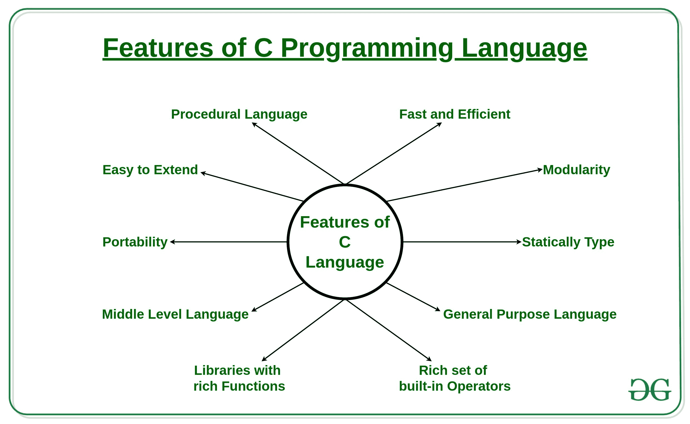

# C 编程语言的特点

> 原文: [https://www.geeksforgeeks.org/features-of-c-programming-language/](https://www.geeksforgeeks.org/features-of-c-programming-language/)

[`C`](https://www.geeksforgeeks.org/c-language-set-1-introduction/) 是一种过程编程语言。它最初是由丹尼斯·里奇在 1972 年开发的。它主要是作为编写操作系统的系统编程语言开发的。C 语言的主要特点包括对内存的低级访问、一组简单的关键字和简洁的风格，这些特点使 C 语言适合像操作系统或编译器开发这样的系统编程。

## C 编程语言特点

1.  过程语言
2.  快速高效
3.  模块性
4.  静态类型
5.  通用语言
6.  丰富的内置运算符集
7.  功能丰富的图书馆
8.  中级语言
9.  轻便
10. 易于扩展



让我们一个一个来看特点:

## 1. 过程语言
在像 `C` 这样的过程语言中，会逐步执行预定义的指令。`C` 程序可能包含多个函数来执行特定任务。编程新手可能会认为这是特定编程语言的唯一工作方式。编程世界中还有其他的编程范式。最常用的范式是面向对象编程语言。

## 2. 快速高效
像 `Java`、`Python` 这样的较新语言提供了比 `C` 编程语言更多的功能，但由于这些语言中的额外处理，它们的性能率会有效降低。`C` 编程语言作为中级语言，为程序员提供了直接操作计算机硬件的权限，而高级语言则不允许这样做。这就是为什么 `C` 语言被认为是开始学习编程语言的首选原因之一。它速度快是因为静态类型语言比动态类型语言更快。

## 3. 模块性
将 `C` 编程语言代码以库的形式存储以供将来使用的概念称为模块性。这种编程语言本身功能很少，其大部分功能由其库提供。`C` 语言有自己的库来解决常见问题，例如我们可以使用存储在其库中的头文件来使用特定函数。

## 4. 静态类型
`C` 编程语言是一种静态类型语言。这意味着变量的类型在编译时检查，而不是在运行时检查。这意味着程序员每次编写程序时都必须提及所用变量的类型。

## 5. 通用语言
从系统编程到照片编辑软件，各种应用都使用 `C` 编程语言。使用它的一些常见应用如下:
*   操作系统: `Windows`、 [`Linux`](https://www.geeksforgeeks.org/linux-vs-unix/) 、`iOS`、[`Android`](https://www.geeksforgeeks.org/android-app-development-fundamentals-for-beginners/)、`OXS`
*   数据库: `PostgreSQL`、`Oracle`、 [`MySQL`](https://www.geeksforgeeks.org/sql-tutorial/) 、`MS SQL Server` 等。

## 6. 丰富的内置运算符集
它是一种多样化的语言，具有丰富的内置[运算符](https://www.geeksforgeeks.org/operators-c-c/)，用于编写复杂或简化的 `C` 程序。

## 7. 功能丰富的库
强大的库和 [`C` 语言中的函数](https://www.geeksforgeeks.org/functions-in-c/) 帮助即使是初学者也能轻松编码。

## 8. 中级语言
由于它是一种中级语言，因此它结合了汇编语言的能力和[高级语言](https://www.geeksforgeeks.org/difference-between-high-level-and-low-level-languages/)的特性。

## 9. 可移植性
`C` 语言具有极强的可移植性，因为用 `C` 语言编写的程序可以在任何系统上运行和编译，只需很少或不需要更改。

## 10. 易于扩展
用 `C` 语言编写的程序可以扩展，这意味着当程序已经用它编写后，可以向其添加更多功能和操作。

```
if (condVar > someVal) {console.log("xxx")}
```