# GDB 分步介绍

> 原文: [https://www.geeksforgeeks.org/gdb-step-by-step-introduction/](https://www.geeksforgeeks.org/gdb-step-by-step-introduction/)

GDB 代表 GNU 项目调试器，是 C 语言（以及 C++ 等其他语言）的强大调试工具。它可以帮助你在 C 程序执行的时候在里面闲逛，还可以让你看到当你的程序崩溃的时候会发生什么。GDB 操作的可执行文件是由编译过程产生的二进制文件。

出于演示的目的，下面的例子是在一台规格如下的 Linux 机器上执行的。

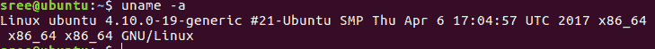

让我们边做边学：

## 启动 GDB

1.  转到您的 Linux 命令提示符并键入 `gdb`。

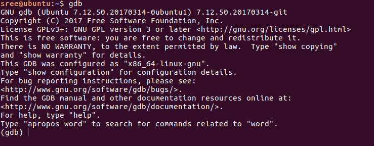

GDB 打开提示让你知道它已经准备好接受命令了。要退出 GDB，请键入 `quit` 或 `q`。

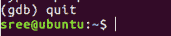

## 准备示例程序

2.  下面是一个使用 C99 编译时显示未定义行为的程序。

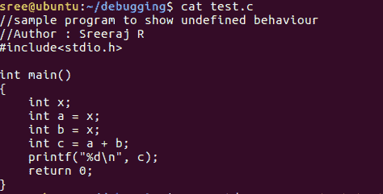

**注意：** 如果具有自动存储持续时间的对象没有被显式初始化，则它的值是不确定的，其中不确定的值是未指定的值或陷阱表示。

## 编译代码

3.  现在编译代码。（这里是 `test.c`）。
    *   `-g` 标志意味着你可以在你的堆栈框架中看到变量和函数的专有名称，获取行号，并在可执行文件中查看源代码。
    *   `-std=C99` 标志暗示使用标准 C99 来编译代码。
    *   `-o` 标志将构建输出写入输出文件。

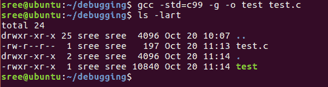

## 运行 GDB

4.  用生成的可执行文件运行 GDB。

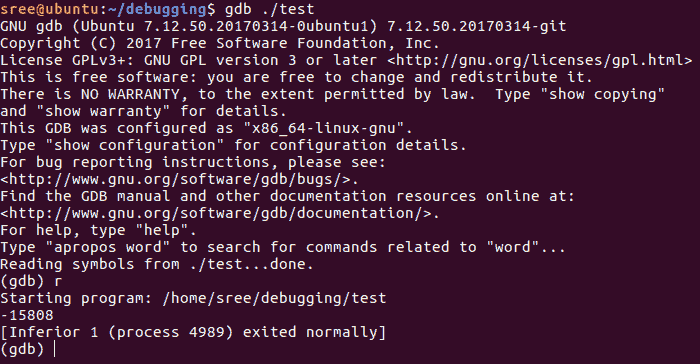

对于上面的例子，有几个有用的命令可以开始使用 GDB：
*   `run` 或 `r` – 从头到尾执行程序。
*   `break` 或 `b` – 在特定行设置断点。
*   `disable` – 禁用断点。
*   `enable` – 启用禁用的断点。
*   `next` 或 `n` – 执行下一行代码，但不要深入函数。
*   `step` – 进入下一个指令，进入函数。
*   `list` 或 `l` – 显示代码。
*   `print` 或 `p` – 用于显示存储值。
*   `quit` 或 `q` – 退出 GDB。
*   `clear` – 清除所有断点。
*   `continue` – 继续正常执行。

## 查看代码

5.  现在，在 GDB 提示符下键入 `l` 来显示代码。

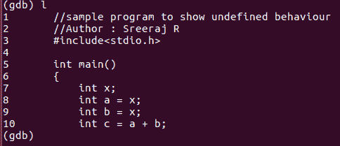

## 设置断点

6.  让我们引入一个断点，比如第 5 行。

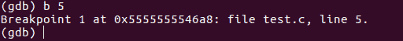

如果要在不同的行放断点，可以输入 `b 行号`。默认情况下，`list` 或 `l` 仅显示前 10 行。

## 查看断点

7.  要查看断点，请键入 `info b`。

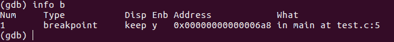

## 禁用断点

8.  完成以上工作后，假设您改变了主意，并且想要恢复原状。输入 `disable b`。

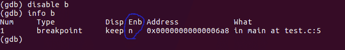

如蓝色圆圈所示，`Enb` 变为 `n` 表示禁用。

## 启用断点

9.  重新启用最近禁用的断点。键入 `enable b`。

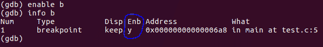

## 运行程序

10. 通过键入 `run` 或 `r` 运行代码。如果您没有设置任何断点，`run` 命令将简单地执行整个程序。

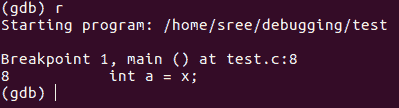

## 查看变量值

11. 要查看变量值，请键入 `print 变量名` 或 `p 变量名`。

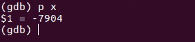

上面显示了执行时存储在 `x` 处的值。

## 修改变量值

12. 要更改 GDB 中变量的值并使用更改后的值继续执行，请键入 `set 变量名称`。

13. 下面的截图显示了变量的值，从中可以很好地理解为什么我们得到一个垃圾值作为输出。每次执行 `./test` 我们将收到不同的输出。

**练习：** 第一次运行时尝试在 GDB 中使用 `set x = 0`，查看 `c` 的输出。

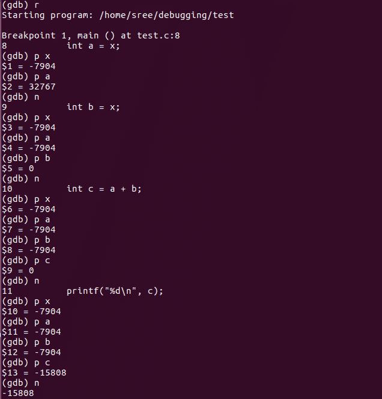

GDB 提供了更多调试和理解代码的方法，比如检查堆栈、内存、线程、操作程序等。我希望上面的例子能帮助你开始使用 GDB。