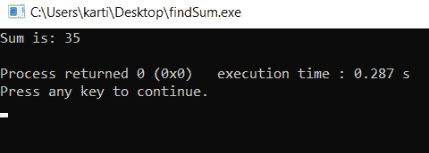

# C/C++ 头文件，带示例

> 原文：[https://www.geeksforgeeks.org/header-files-in-c-c-with-examples/](https://www.geeksforgeeks.org/header-files-in-c-c-with-examples/)

[C++](https://www.geeksforgeeks.org/c-plus-plus/) 为其用户提供了多种功能，其中一种包含在头文件中。在 C++ 中，所有的头文件可能以`.h`结尾，也可能不以`.h`结尾。但是在 C 语言中，所有的头文件都必须以`.h`结尾。

头文件包含：
1.  [功能定义](https://www.geeksforgeeks.org/functions-in-c/)
2.  [数据类型定义](https://www.geeksforgeeks.org/c-data-types/)
3.  [宏](https://www.geeksforgeeks.org/cc-preprocessors/)

它在预处理器指令`#include`的帮助下将上述特性导入程序，从而提供上述特性。这些预处理器指令用于指示编译器在编译之前需要处理这些文件。

在 [C](https://www.geeksforgeeks.org/c/) 程序中应该必然包含头文件，该头文件代表标准输入和输出，分别用于借助 [`scanf()`](https://www.geeksforgeeks.org/scanf-and-fscanf-in-c-simple-yet-poweful/) 和 [`printf()`](https://www.geeksforgeeks.org/return-values-of-printf-and-scanf-in-c-cpp/) 功能进行输入。

在 [C++](https://www.geeksforgeeks.org/c-plus-plus/) 程序中有头文件，代表输入和输出流，分别用于借助 `cin` 和 `cout` 进行输入。

头文件有两种类型：
1.  **预先存在的头文件：** 已经在 C/C++ 编译器中可用的文件，我们只需要导入它们。
2.  **自定义头文件：** 这些文件由用户定义，可以使用`#include`导入。

**语法：**
```cpp
#include <filename.h>
or
#include "filename.h"
```

无论头文件是预定义的还是用户定义的，我们都可以通过使用上述两种语法之一在程序中包含头文件。`#include`预处理器负责指导编译器在编译前需要处理头文件，并包括所有必要的数据类型和函数定义。

**注意：** 我们不能在任何程序中两次包含同一个头文件。

## 创建自己的头文件

我们可以创建自己的头文件，并将其包含在我们的程序中，以便随时使用，而不是编写庞大而复杂的代码。它增强了代码的功能和可读性。下面是创建我们自己的头文件的步骤：

*   自己写 C/C++ 代码，用`.h`扩展名保存那个文件。下图是头文件：

```cpp
// Function to find the sum of two
// numbers passed
int sumOfTwoNumbers(int a, int b)
{
    return (a + b);
}
```

*   在 C/C++ 程序中包含带有`#include`的头文件，如下所示：

```cpp
// C++ program to find the sum of two
// numbers using function declared in
// header file
#include "iostream"

// Including header file
#include "sum.h"
using namespace std;

// Driver Code
int main()
{

// Given two numbers
    int a = 13, b = 22;

// Function declared in header
    // file to find the sum
    cout << "Sum is: "
         << sumOfTwoNumbers(a, b)
         << endl;
}
```

*   以下是上述程序的输出：



下面是 C/C++ 中的一些内置头文件：
1.  **`#include <stdio.h>`：** 用于使用功能 `scanf()` 和 `printf()` 执行输入输出操作。
2.  **`#include <iostream>`：** 使用 `cin` 和 `cout` 作为输入输出流。
3.  **`#include <string.h>`：** 用于执行各种与字符串操作相关的功能，如 [`strlen()`](https://www.geeksforgeeks.org/strlen-function-in-c/) 、 [`strcmp()`](https://www.geeksforgeeks.org/strcmp-in-c-cpp/) 、 [`strcpy()`](https://www.geeksforgeeks.org/strcpy-in-c-cpp/) 、`size()`等。
4.  **`#include <math.h>`：** 用于进行 [`sqrt()`](https://www.geeksforgeeks.org/sqrt-sqrtl-sqrtf-cpp/) 、 [`log2()`](https://www.geeksforgeeks.org/log2-function-in-c-with-examples/) 、 [`pow()`](https://www.geeksforgeeks.org/power-function-cc/) 等数学运算。
5.  **`#include <iomanip.h>`：** 用于访问 `set()` 和 `setprecision()` 函数，限制变量的小数位数。
6.  **`#include <signal.h>`：** 用于执行 `signal()` 和 `raise()` 等信号处理功能。
7.  **`#include <stdarg.h>`：** 用于执行标准参数函数，如 `va_start()` 和 `va_arg()`。它还用于指示可变长度参数列表的开始，并分别从程序中的可变长度参数列表中获取参数。
8.  **`#include <errno.h>`：** 用于执行 `errno()` 、 `strerror()` 、 `perror()` 等[错误处理](https://www.geeksforgeeks.org/error-handling-c-programs/)操作。
9.  **`#include <fstream.h>`：** 用于控制从文件中读取的数据作为输入，写入文件的数据作为输出。
10. **`#include <time.h>`：** 用于执行与 `date()` 和 [`time()`](https://www.geeksforgeeks.org/time-function-in-c/) 相关的功能，如 [`setdate()` 和 `getdate()`](https://www.geeksforgeeks.org/getdate-and-setdate-function-in-c-with-examples/)。它还用于分别修改系统日期和获取 CPU 时间。