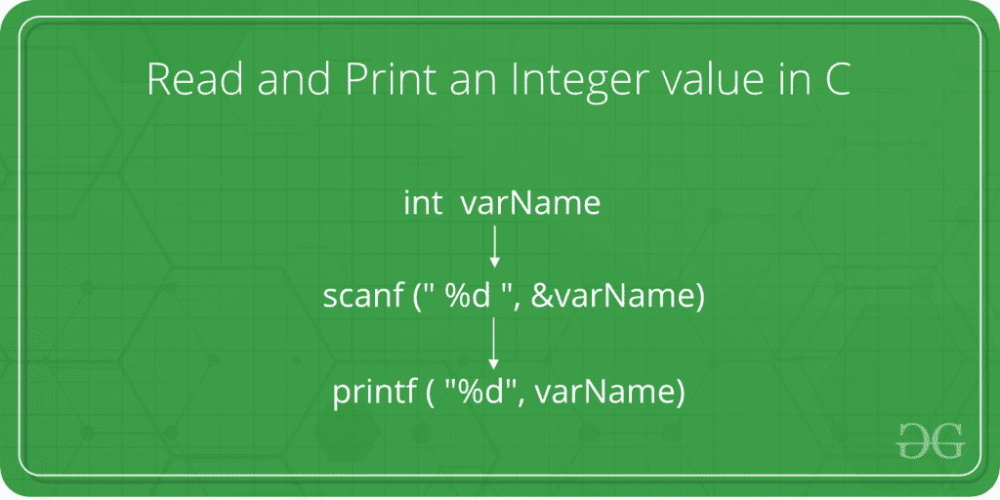

# 如何读取和打印 C 中的整数值

> 原文：[https://www.geeksforgeeks.org/how-to-read-and-print-an-integer-value-in-c-2/](https://www.geeksforgeeks.org/how-to-read-and-print-an-integer-value-in-c-2/)

给定的任务是从用户那里获取一个整数作为输入，并用 C 语言打印该整数。



在下面的程序中，用 C 语言显示了从用户输入整数的语法和过程。

## 步骤

1.  当被询问时，用户输入整数值。
2.  该值通过 `scanf()` 方法从用户处获取。`scanf()` 方法在 C 中根据指定的类型从控制台读取值。

## 语法

```cpp
    scanf("%X", &variableOfXType);

where %X is the format specifier in C
    It is a way to tell the compiler 
what type of data is in a variable

and

& is the address operator in C,
    which tells the compiler to change the 
    real value of this variable, stored at this 
    address in the memory.
```

3.  对于整数值，`X` 被替换为 `int` 类型。`scanf()` 方法的语法变为如下：

```cpp
    scanf("%d", &variableOfIntType);
```

4.  该输入值现在存储在 `variableOfIntType` 中。
5.  现在要打印这个值，使用 `printf()` 方法。`printf()` 方法在 C 中将作为参数传递的值打印到控制台屏幕上。

```cpp
    printf("%X", variableOfXType);
```

6.  对于整数值，`X` 被替换为 `int` 类型。`printf()` 方法的语法变为如下：

```cpp
    printf("%d", variableOfIntType);
```

7.  因此，整数值被成功读取和打印。

## 程序

```cpp
// C program to take an integer
// as input and print it

#include <stdio.h>

int main()
{

// Declare the variables
    int num;

// Input the integer
    printf("Enter the integer: ");
    scanf("%d", &num);

// Display the integer
    printf("Entered integer is: %d", num);

return 0;
}
```

## 输出

```cpp
Enter the integer: 10
Entered integer is: 10
```