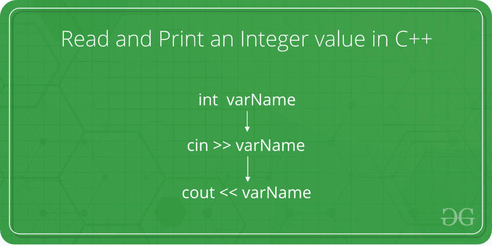

# 如何在 C++ 中读取和打印整数值

> 原文: [https://www.geeksforgeeks.org/how-to-read-and-print-an-integer-value-in-c/](https://www.geeksforgeeks.org/how-to-read-and-print-an-integer-value-in-c/)

给定的任务是从用户那里获取一个整数作为输入，并用 C++ 语言打印该整数。



在下面的程序中，以 C++ 语言显示了从用户那里获取整数作为输入的语法和过程。

## 步骤

1.  当被询问时，用户输入整数值。
2.  该值通过 `cin` 方法从用户处获取。在 C++ 中，`cin` 方法将值从控制台读取到指定的变量中。

## 语法

```cpp
cin >> variableOfXType;
```

其中 `>>` 是提取运算符，与 `cin` 对象一起用于读取输入。提取运算符从 `cin` 对象中提取通过键盘输入的数据。

3.  对于整数值，`X` 被替换为 `int` 类型。此时 `cin` 方法的语法如下：

## 语法

```cpp
cin >> variableOfIntType;
```

4.  该输入值现在存储在 `变量类型` 中。
5.  现在要打印这个值，使用 `cout` 方法。在 C++ 中，`cout` 方法将其作为参数传递的值打印到控制台屏幕上。

## 语法

```cpp
cout << variableOfXType;
```

其中 `<<` 是插入运算符。需要显示在屏幕上的数据使用插入运算符 (`<<`) 插入到标准输出流 (`cout`) 中。

6.  对于整数值，`X` 被替换为 `int` 类型。此时 `cout()` 方法的语法如下：

## 语法

```cpp
cout << variableOfIntType;
```

7.  因此，整数值被成功读取和打印。

## 程序

## C++

```cpp
// C++ program to take an integer
// as input and print it

#include <iostream>
using namespace std;

int main()
{
    // Declare the variables
    int num;

    // Input the integer
    cout << "Enter the integer: ";
    cin >> num;

    // Display the integer
    cout << "Entered integer is: " << num;

    return 0;
}
```

## 输出

```cpp
Enter the integer: 10
Entered integer is: 10
```