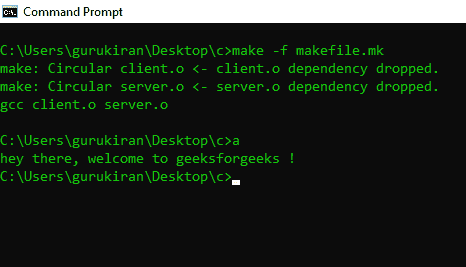

# 如何用 make 工具构建 C 项目？

> 原文：[https://www.geeksforgeeks.org/how-to-use-make-utility-to-build-c-projects/](https://www.geeksforgeeks.org/how-to-use-make-utility-to-build-c-projects/)

当我们用 C/C++ 构建项目时，文件之间存在依赖关系。例如，可能有一个文件 `a.c` 调用了文件 `b.c` 中的函数。所以我们必须在编译 `a.c` 之前编译 `b.c`。一个项目中可能有许多依赖项，手动遵循这些依赖项并逐个编译文件变得困难。在本文中，我们将看到 `make` 工具如何帮助我们简化这一过程。首先，我们需要创建 4 个文件，其中两个是 `.c` 文件，1 个头文件 (`.h`) 和 1 个 make 文件 (`.mk`)。

让我们将这些文件命名为 `client.c`、`server.c`、`server.h` 和 `makefile.mk`。

**Makefile** 是一组带有变量名和目标的命令（类似于终端命令），用于创建和删除对象文件。在一个 make 文件中，我们可以创建多个目标来编译和删除对象二进制文件。您可以使用 `Makefile` 编译您的项目（程序）任意多次。这个文件的主要思想是指定依赖关系。

**make 工具：** 这是一个命令行工具，用于处理 `Makefile` 中编写的指令。

让我们举一个简单的例子。`client.c` 文件包含主函数，`server.c` 文件包含用户自定义函数，第三个文件是 `server.h` 头文件，它声明了 `server.c` 文件中的用户自定义函数，第四个文件是 `makefile.mk`，包含一组所有命令及其变量名。

**这里我们编写 `client.c` 文件**

## client.c 文件内容

```cpp
// This is client.c file
#include "stdio.h"

// This is header file that we have created
// in the beginning.
#include "server.h"
int main()
{
    printf("hey there, welcome to ");
    greetings();
    return 0;
}
```

这是 `client.c` 文件，它包含两个头文件：一个是 `#include "stdio.h"`，另一个是 `#include "server.h"` 文件（请记住这是我们在开始时创建的同一个文件）。它包含 `printf` 语句，该语句打印为“hey there, welcome to”（不带引号），并且 `main` 函数还调用了另一个用户定义的函数，即 `greetings()`。

**现在我们编写 `server.c` 文件**

## server.c 文件内容

```cpp
// This is server.c file
#include "server.h"
#include "stdio.h"
void greetings()
{
    printf("geeksforgeeks !");
}
```

在这个 `server.c` 中，包含两个头文件：一个是 `#include "stdio.h"`，另一个是 `#include "server.h"` 文件（请记住，这是我们在开始时创建的同一个文件）。其中包含用户定义的 `greetings` 函数，该函数包含 `printf` 语句，该语句打印为“geeksforgeeks !”（不带引号）。

**现在我们编写 `server.h` 文件**

## server.h 文件内容

```cpp
// This is server.h file
void greetings();
```

这个 `server.h` 文件非常简单，它声明了写在那个文件中的函数。当我们把这个头文件包含到其他 C 程序中时，我们就可以使用这个头文件中定义的函数。在这里，这个 `server.h` 文件包含了所有的函数声明。

**现在我们编写 `makefile.mk` 文件**

## makefile.mk 文件内容

```makefile
# This is makefile.mk file
a : client.o server.o
	gcc client.o server.o -o a
client.o : client.c server.h
	gcc -c client.c
server.o : server.c server.h
	gcc -c server.c
```

现在仔细阅读这个，我会告诉你如何写 `makefile`。

**这是在 Windows 中，所以目标文件是“a”。如果您使用的是 Linux，您可以用“a.out”**（不带引号）。

请参见代码的第一行，其中“a”代表包含我们到目前为止编写的所有代码的目标文件。在“a”之后还有两个目标文件，它们是 `client.o` 和 `server.o`，这些是生成目标文件“a”所需的文件。在下一行中有 `gcc` 命令。记住这一点：在编写 `gcc` 命令之前应该有 1 个 tab 空间（如果忘记放 tab，这个程序将不会运行）。`gcc` 命令编译给它的文件并存储在其目标文件的名称中。

这个很容易理解，就像这里：
**目标文件名：先决条件**
**命令（带 tab 空间）**

其他要记住的格式是：
**目标:依赖项**
**命令**

现在让我们移到第三行，这里需要 `client.o`（因为它用在第一行代码中），所以该文件的前提是 `client.c` 和 `server.h` 文件。`gcc` 命令将编译 `client.c` 以获得 `client.o` 文件。
我们最后需要的是 `server.o` 文件。获取那个文件我们需要 `server.c` 源文件和 `server.h` 头文件。`gcc` 编译器会编译 `server.c` 文件获取 `server.o` 文件。
现在我们需要的东西都准备好了，`makefile` 代码现在完成了。

现在看看如何运行 make 文件。

```bash
# 这个用来运行 makefile
make -f makefile.mk
```

这是运行 `makefile` 的语法。在键入该命令后，按 Enter 键，代码将编译并创建一个名为“a”（在 Windows 中）或“a.out”（在 Linux 中）的可执行文件。

现在执行文件，它在这里：

```bash
# 请记住，只有在执行 makefile 命令之后，才能执行这个操作。
# Windows 中的这个
a
# Linux 中的这个
./a.out
```

**示例：**

```cpp
Output : hey there, welcome to geeksforgeeks
```



**工具如何在内部发挥作用？** 它创建任务的依赖图，并使用[拓扑排序](https://www.geeksforgeeks.org/topological-sorting/)算法找到遵循所有给定依赖的有效序列。