# 如何在 CodeBlocks 中包含 graphics.h？

> 原文: [https://www.geeksforgeeks.org/include-graphics-h-codeblocks/](https://www.geeksforgeeks.org/include-graphics-h-codeblocks/)

在`CodeBlocks` IDE 上编译图形代码时出现错误：`“找不到 graphics.h”`。这是因为 `graphics.h` 在 `CodeBlocks` 的库文件夹中不可用。要在 `CodeBlocks` 上成功编译图形代码，请设置 `winBGIm` 库。

## 如何在 CodeBlocks 中包含 graphics.h？

请按照以下步骤顺序将 `graphics.h` 包含在 `CodeBlocks` 中，以便在 `CodeBlocks` 上成功编译图形代码。

### 第一步
要在 `CodeBlocks` 中设置 `graphics.h`，首先要设置 `winBGIm` 图形库。从 [http://winbgim.codecutter.org/](http://winbgim.codecutter.org/) 下载 `WinBGIm` 或使用此[链接](http://www.codewithc.com/wp-content/uploads/2014/04/WinBGIm_Library6_0_Nov2005.zip)。

更新：`http://winbgim.codecutter.org/` 的库年代久远，最后一次构建是在 2006 年左右。使用 64 位编译器工具链进行链接时，会导致链接错误。在 [https://github.com/ki9gpin/WinBGIm-64](https://github.com/ki9gpin/WinBGIm-64) 这里是库的最新版本，带来了 64 位兼容性。为了精确起见，一些 `win32` 系统调用也更新为 `MSDN` 推荐的 64 位替代。

### 第二步
提取下载的文件。将有三个文件：
* `graphics.h`
* `winbgim.h`
* `libbgi.a`

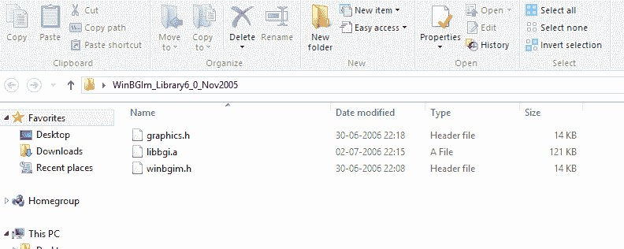

### 第三步
将 `graphics.h` 和 `winbgim.h` 文件复制粘贴到编译器目录的 `include` 文件夹中。（如果你的电脑 `C` 盘里安装了 `Code::Blocks`，请通过：`Disk C` >> `Program Files` >> `Code Blocks` >> `MinGW` >> `include`。把这两个文件粘贴在那里。）

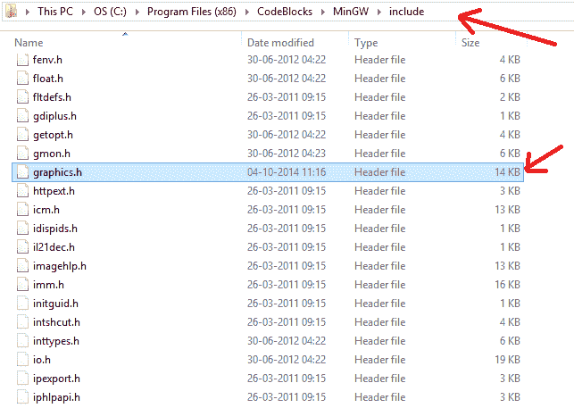
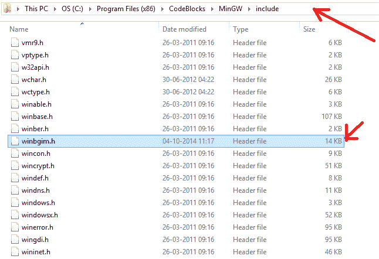

### 第四步
复制并粘贴 `libbgi.a` 到编译器目录的 `lib` 文件夹。

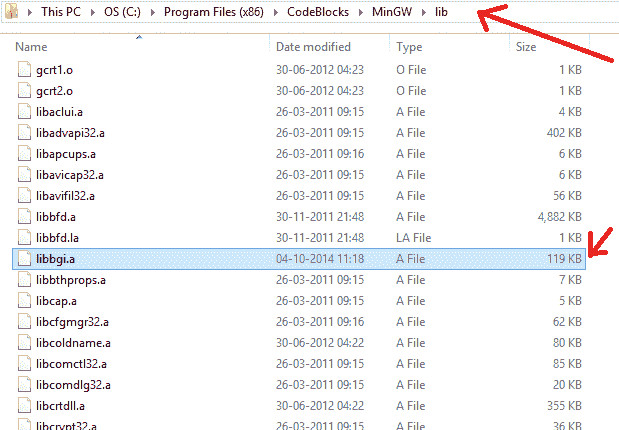

### 第五步
打开 `Code::Blocks`。转到 `Settings` >> `Compiler` >> `Linker settings`。

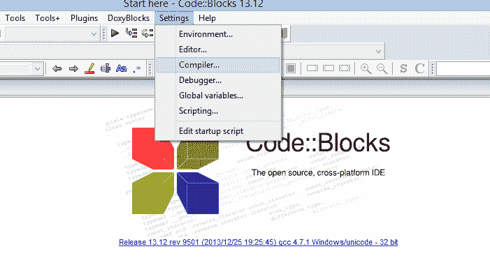
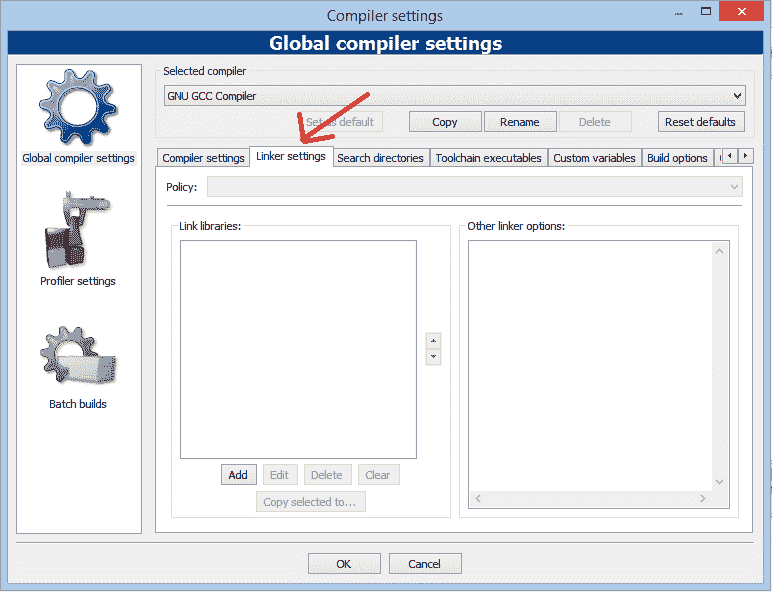

### 第六步
在该窗口中，单击“`Link libraries`”部分下的“`Add`”按钮，然后“`Browse`”。

选择步骤 4 中复制到 `lib` 文件夹的 `libbgi.a` 文件。

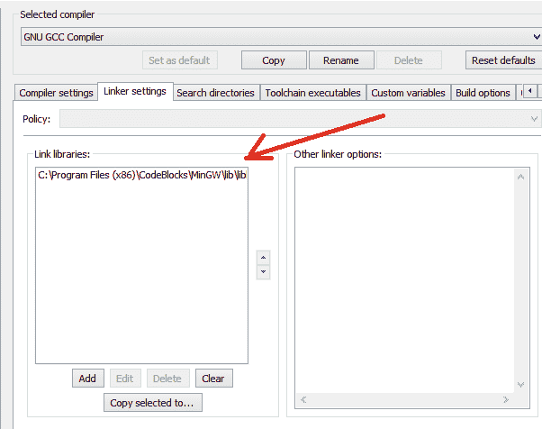

### 第七步
在右边部分（即 “`Other linker options`”）粘贴命令：
`-lbgi -lgdi32 -lcomdlg32 -luuid -loleaut32 -lole32`

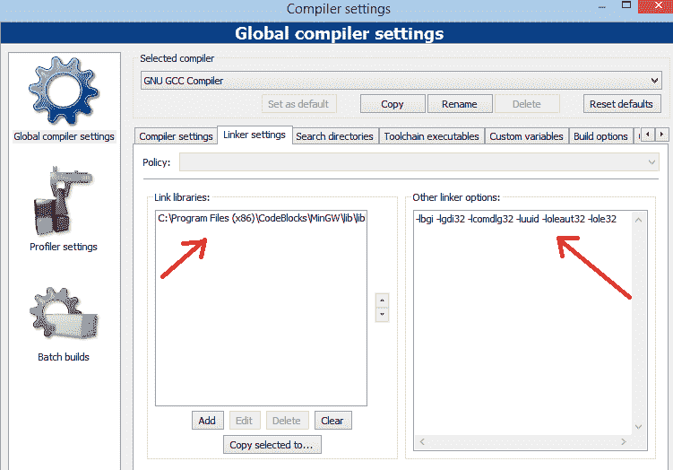

### 第八步
点击“`OK`”。

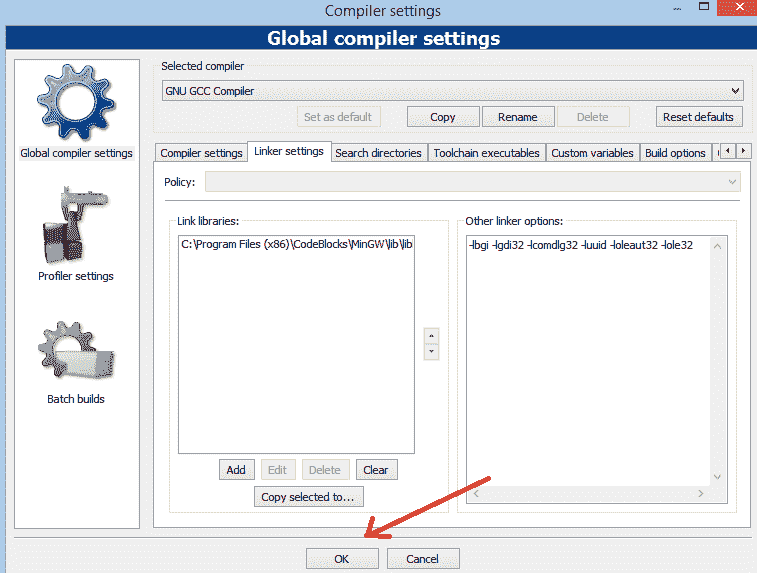

### 第九步
尝试用 `C` 或 `C++` 编译 `graphics.h` 程序，还是会有错误。要解决这个问题，用 `Notepad++` 打开 `graphics.h` 文件（在步骤 3 中粘贴到 `include` 文件夹中）。转到**第 302 行**，将该行替换为：
`int left=0, int top=0, int right=INT_MAX, int bottom=INT_MAX,`

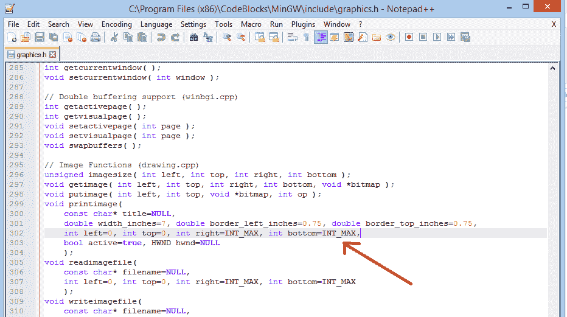

### 第十步
保存文件。搞定了。

**注意：** 现在，你可以编译任何包含 `graphics.h` 头文件的 `C` 或 `C++` 程序。如果你编译 `C` 代码，你仍然会得到一个错误说：`“fatal error: sstream: No such file or directory”`。

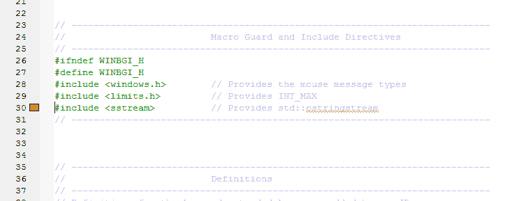

#### 对于此问题，请将您的文件扩展名更改为 `.cpp`。如果是 `.c`。