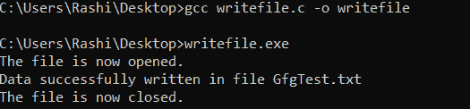
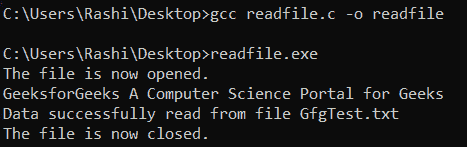
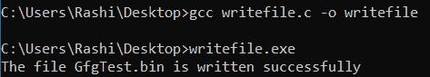
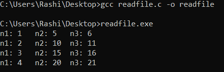
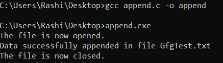
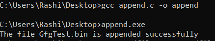
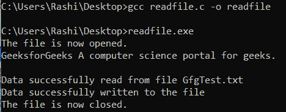
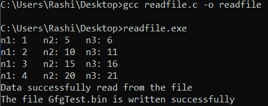

# C/C++ 标准 I/O 中的打开模式，示例

> 原文：[https://www.geeksforgeeks.org/opening-modes-in-standard-i-o-in-c-c-with-examples/](https://www.geeksforgeeks.org/opening-modes-in-standard-i-o-in-c-c-with-examples/)

先决条件：[C++ 中的文件处理](https://www.geeksforgeeks.org/file-handling-c-classes/)

到目前为止，使用 C 程序的操作是在没有存储在任何地方的提示符/终端上完成的。但是在软件行业，大多数程序都是为了存储从程序中获取的信息而编写的。一种方法是将提取的信息存储在文件中。可以对文件执行的不同操作有：

1.  **创建新文件**（属性为`"a"`或`"a+"`或`"w"`或`"w+"`的`fopen`）。
2.  **打开现有文件**（`fopen`）。
3.  **从文件读取**（`fscanf`或`fgets`）。
4.  **写入文件**（`fprintf`或`fputs`）。
5.  **移动到文件中的特定位置**（`fseek`，`rewind`）。
6.  **关闭文件**（`fclose`）。

括号中的文本表示用于执行这些操作的函数。

**为什么需要文件？**

*   **数据保存：** 将数据存储在文件中有助于保存数据，即使程序终止。
*   **轻松访问数据：** 当数据量很大并且存储在文件中时，访问数据变得很容易，然后可以使用 C 命令访问这些数据。
*   **可移植性：** 将数据从一台计算机移动到另一台计算机变得更加容易，无需任何更改。

## 文件类型

每个人都应该知道这两种文件：

1.  **文本文件：** 文本文件是有`.txt`扩展名的普通文件。这些可以简单地用记事本这样的编辑器创建。打开文件后，文本将是可见的简单纯文本，内容可以很容易地编辑或删除。这些是最低的维护文件，易于阅读。但是文本文件有一些缺点，比如它们是最不安全的文件，并且占用更大的存储空间。
2.  **二进制文件：** 二进制文件为`.bin`扩展名文件。这些文件中的数据以二进制形式存储，即 0 和 1。这些文件可以保存大量数据，并提供比文本文件更高的安全级别，但这些文件不容易读取。

## 文件操作

可以对文件执行四种基本操作：

1.  **创建新文件。**
2.  **打开现有文件。**
3.  **从文件中读取信息或向文件中写入信息。**
4.  **关闭文件。**

## 处理文件

使用文件时，需要声明类型`FILE`的指针。文件和程序之间的通信需要这个文件类型指针。

```c
FILE* fptr;
```

## 打开文件

打开文件是使用头文件`stdio.h`中的`fopen()`函数完成的。

**语法：**

```c
fptr = fopen("file_name", "mode");
```

**示例：**

```c
fopen("D:\\geeksforgeeks\\newprogramgfg.txt", "w");
fopen("D:\\geeksforgeeks\\oldprogramgfg.bin", "rb");
```

*   假设文件`newprogramgfg.txt`不存在于位置`D:\geeksforgeeks`中。第一个函数创建一个名为`newprogramgfg.txt`的新文件，并按照`"w"`模式打开它进行写入。写入模式允许您创建和编辑（覆盖）文件内容。
*   假设第二个二进制文件`oldprogramgfg.bin`存在于位置`D:\geeksforgeeks`。第二个函数打开现有文件，以二进制模式`"rb"`读取。读取模式只允许读取文件，不能写入文件。

## C 中的文件打开模式

| 模式 | 含义 |
| :--- | :--- |
| `r` | 以读取方式打开。如果文件不存在，`fopen()`返回`NULL`。 |
| `rb` | 以二进制模式打开用于读取。如果文件不存在，`fopen()`返回`NULL`。 |
| `w` | 以写入方式打开。如果文件存在，其内容将被覆盖。如果文件不存在，则创建它。 |
| `wb` | 以二进制模式打开用于写入。如果文件存在，其内容将被覆盖。如果文件不存在，则创建它。 |
| `a` | 以追加方式打开。数据被添加到文件的末尾。如果文件不存在，则创建它。 |
| `ab` | 以二进制模式打开用于追加。数据被添加到文件的末尾。如果文件不存在，则创建它。 |
| `r+` | 以读写方式打开。如果文件不存在，`fopen()`返回`NULL`。 |
| `rb+` | 以二进制模式打开用于读写。如果文件不存在，`fopen()`返回`NULL`。 |
| `w+` | 以读写方式打开。如果文件存在，其内容将被覆盖。如果文件不存在，则创建它。 |
| `wb+` | 以二进制模式打开用于读写。如果文件存在，其内容将被覆盖。如果文件不存在，则创建它。 |
| `a+` | 以读取和追加方式打开。如果文件不存在，则创建它。 |
| `ab+` | 以二进制模式打开用于读取和追加。如果文件不存在，则创建它。 |

## 关闭文件

文件应该在读取或写入后关闭。关闭文件是使用`fclose()`函数执行的。

**语法：**

```c
fclose(fptr);
```

这里，`fptr`是与要关闭的文件相关联的`FILE`类型指针。

## 读写文本文件

为了读写文本文件，使用了函数`fprintf()`和`fscanf()`。它们是`printf()`和`scanf()`函数的文件版本。唯一的区别是`fprintf()`和`fscanf()`期望指向结构`FILE`的指针。

### 写入文本文件

**语法：**

```c
FILE* filePointer;
filePointer = fopen("filename.txt", "w");
```

下面是 C 程序写的一个文本文件。

```c
// C program to implement
// the above approach
#include <stdio.h>
#include <string.h>

// Driver code
int main()
{
    // Declare the file pointer
    FILE* filePointer;

    // Get the data to be written in file
    char dataToBeWritten[50]
        = "GeeksforGeeks-A Computer"
          + " Science Portal for Geeks";

    // Open the existing file GfgTest.c using fopen()
    // in write mode using "w" attribute
    filePointer = fopen("GfgTest.txt", "w");

    // Check if this filePointer is null
    // which maybe if the file does not exist
    if (filePointer == NULL) {
        printf("GfgTest.txt file failed to open.");
    }
    else {
        printf("The file is now opened.\n");

        // Write the dataToBeWritten into the file
        if (strlen(dataToBeWritten) > 0) {
            // writing in the file using fputs()
            fprintf(filePointer, dataToBeWritten);
            fprintf(filePointer, "\n");
        }

        // Closing the file using fclose()
        fclose(filePointer);

        printf("Data successfully written"
               + " in file GfgTest.txt\n");
        printf("The file is now closed.");
    }
    return 0;
}
```

**输出：**



### 从文件中读取

**语法：**

```c
FILE* filePointer;
filePointer = fopen("filename.txt", "r");
```

下面是 C 程序读取的文本文件。

```c
// C program to implement
// the above approach
#include <stdio.h>
#include <string.h>

// Driver code
int main()
{
    // Declare the file pointer
    FILE* filePointer;

    // Declare the variable for the data
    // to be read from file
    char dataToBeRead[50];

    // Open the existing file GfgTest.txt
    // using fopen() in read mode using
    // "r" attribute
    filePointer = fopen("GfgTest.txt", "r");

    // Check if this filePointer is null
    // which maybe if the file does not exist
    if (filePointer == NULL) {
        printf("GfgTest.txt file failed to open.");
    }
    else {
        printf("The file is now opened.\n");

        // Read the dataToBeRead from the file
        // using fgets() method
        while (fgets(dataToBeRead, 50,
                     filePointer)
               != NULL) {
            // Print the dataToBeRead
            printf("%s", dataToBeRead);
        }

        // Closing the file using fclose()
        fclose(filePointer);

        printf("Data successfully read"
               + " from file GfgTest.txt\n");
        printf("The file is now closed.");
    }
    return 0;
}
```

**输出：**



## 二进制文件读写

### 写二进制文件

**语法：**

```c
FILE* filePointer;
filePointer = fopen("filename.bin", "wb");
```

要将数据写入二进制文件，需要`fwrite()`函数。这个函数有四个参数：

1.  要写入磁盘的数据地址。
2.  要写入磁盘的数据大小。
3.  这类数据的数量。
4.  指向要写入的文件的指针。

**语法：**

```c
fwrite(addressData, sizeofData, numbersData, pointerToFile);
```

下面是实现上述方法的 C 程序：

```c
// C program to implement
// the above approach
#include <stdio.h>
#include <stdlib.h>

struct threeNum {
    int n1, n2, n3;
};

// Driver code
int main()
{
    int n;
    struct threeNum num;

    // Declaring the file pointer
    FILE* fptr;

    if ((fptr = fopen("C:\\GfgTest.bin",
                      "wb"))
        == NULL) {
        printf("Error! opening file");

        // Program exits if the file pointer
        // returns NULL.
        exit(1);
    }

    for (n = 1; n < 5; ++ n) {
        num.n1 = n;
        num.n2 = 5 * n;
        num.n3 = 5 * n + 1;
        fwrite(&num, sizeof(struct threeNum),
               1, fptr);
    }

    printf("The file GfgTest.bin is"
           + " written successfully");
    fclose(fptr);
    return 0;
}
```



### 从二进制文件中读取

**语法：**

```c
FILE* filePointer;
filePointer = fopen("filename.bin", "rb");
```

要从二进制文件中读取数据，使用`fread()`函数。与`fwrite()`函数类似，该函数也接受四个参数。

**语法：**

```c
fread(addressData, sizeofData, numbersData, pointerToFile);
```

下面是实现上述方法的 C 程序：

### 读取二进制文件

```cpp
// C program to implement
// the above approach
#include <stdio.h>
#include <stdlib.h>

struct threeNum {
    int n1, n2, n3;
};

// Driver code
int main()
{
    int n;
    struct threeNum num;

    // Declaring the file pointer
    FILE* fptr;

    if ((fptr = fopen("C:\\GfgTest.bin",
                      "rb"))
        == NULL) {
        printf("Error! opening file");

        // Program exits if the file pointer
        // returns NULL.
        exit(1);
    }

    for (n = 1; n < 5; ++ n) {
        fread(&num, sizeof(struct threeNum),
              1, fptr);
        printf("n1: %d\tn2: %d\tn3: %d",
               num.n1, num.n2, num.n3);
        printf("\n");
    }
    fclose(fptr);

    return 0;
}
```

#### 输出



## 在文本文件中追加内容

#### 语法

> `FILE* filePointer`;
> `filePointer = fopen("filename.txt", "a")`;

在追加模式下打开文件后，任务的其余部分与在文本文件中写入内容相同。

下面是向文件追加字符串的示例:

### C++

```cpp
// C program to implement
// the above approach
#include <stdio.h>
#include <string.h>

// Driver code
int main()
{
    // Declare the file pointer
    FILE* filePointer;

    // Get the data to be appended in file
    char dataToBeWritten[100]
        = "It is a platform for"
          + " learning language"
          + " tech related topics";

    // Open the existing file GfgTest.txt using
    // fopen() in append mode using "a" attribute
    filePointer = fopen("GfgTest.txt", "a");

    // Check if this filePointer is null
    // which maybe if the file does not exist
    if (filePointer == NULL) {
        printf("GfgTest.txt file failed to open.");
    }
    else {
        printf("The file is now opened.\n");

        // Append the dataToBeWritten into the file
        if (strlen(dataToBeWritten) > 0) {
            // writing in the file using fputs()
            fprintf(filePointer, dataToBeWritten);
            fprintf(filePointer, "\n");
        }

        // Closing the file using fclose()
        fclose(filePointer);

        printf("Data successfully appended"
               + " in file GfgTest.txt\n");
        printf("The file is now closed.");
    }
    return 0;
}
```

#### 输出



## 在二进制文件中追加内容

#### 语法

> `FILE* filePointer`;
> `filePointer = fopen("filename.bin", "ab")`;

一旦文件以追加模式打开，任务的其余部分与在二进制文件中写入内容相同。

### C++

```cpp
// C program to implement
// the above approach
#include <stdio.h>
#include <stdlib.h>

struct threeNum {
    int n1, n2, n3;
};

// Driver code
int main()
{
    int n;
    struct threeNum num;

    // Declaring the file pointer
    FILE* fptr;

    // Opening the file in
    // append mode
    if ((fptr = fopen("C:\\GfgTest.bin",
                      "ab"))
        == NULL) {
        printf("Error! opening file");

        // Program exits if the file pointer
        // returns NULL.
        exit(1);
    }

    for (n = 1; n < 10; ++ n) {
        num.n1 = n;
        num.n2 = 5 * n;
        num.n3 = 5 * n + 1;
        fwrite(&num, sizeof(struct threeNum),
               1, fptr);
    }

    printf("The file GfgTest.bin"
           + " is appended successfully");
    fclose(fptr);
    return 0;
}
```

#### 输出



## 打开文件进行读写

#### 语法

> `FILE* filePointer`;
> `filePointer = fopen("filename.txt", "r+")`;

文件是使用“r+”模式打开的，并且文件是以读写模式打开的。

### C++

```cpp
// C program to implement
// the above approach
#include <stdio.h>
#include <string.h>

// Driver code
int main()
{
    // Declare the file pointer
    FILE* filePointer;
    char dataToBeWritten[100]
        = "It is a platform for"
          + " learning language"
          + " tech related topics.";

    // Declare the variable for the data
    // to be read from file
    char dataToBeRead[50];

    // Open the existing file GfgTest.txt
    // using fopen() in read mode using
    // "r+" attribute
    filePointer = fopen("GfgTest.txt", "r+");

    // Check if this filePointer is null
    // which maybe if the file does not exist
    if (filePointer == NULL) {
        printf("GfgTest.txt file failed to open.");
    }
    else {
        printf("The file is now opened.\n");

        // Read the dataToBeRead from the file
        // using fgets() method
        while (fgets(dataToBeRead, 50,
                     filePointer)
               != NULL) {
            // Print the dataToBeRead
            printf("%s", dataToBeRead);
        }
        printf(
            "\nData successfully read"
            + " from file GfgTest.txt");

        if (strlen(dataToBeWritten) > 0) {
            // writing in the file using fprintf()
            fprintf(filePointer, dataToBeWritten);
            fprintf(filePointer, "\n");
        }

        printf("\nData successfully"
               + " written to the file");

        // Closing the file using fclose()
        fclose(filePointer);

        printf("\nThe file is now closed.");
    }
    return 0;
}
```

#### 输出



## 以二进制模式打开文件进行读写

#### 语法

> `FILE* filePointer`;
> `filePointer = fopen("filename.bin", "rb+")`;

### C++

```cpp
// C program to implement
// the above approach
#include <stdio.h>
#include <stdlib.h>

struct threeNum {
    int n1, n2, n3;
};

// Driver code
int main()
{
    int n;
    struct threeNum num;

    // Declaring the file pointer
    FILE* fptr;

    if ((fptr = fopen("C:\\GfgTest.bin",
                      "rb"))
        == NULL) {
        printf("Error! opening file");

        // Program exits if the file pointer
        // returns NULL.
        exit(1);
    }

    for (n = 1; n < 5; ++ n) {
        fread(&num, sizeof(struct threeNum),
              1, fptr);
        printf("n1: %d\tn2: %d\tn3: %d",
               num.n1, num.n2, num.n3);
        printf("\n");
    }
    printf("Data successfully read from the file");

    for (n = 1; n < 7; ++ n) {
        num.n1 = n;
        num.n2 = 5 * n;
        num.n3 = 5 * n + 1;
        fwrite(&num, sizeof(struct threeNum),
               1, fptr);
    }

    printf("The file GfgTest.bin"
           + " is written successfully");
    fclose(fptr);

    return 0;
}
```

#### 输出



## 以文本模式打开文件进行读写

在这种模式下，文件以文本模式打开进行读取和写入。如果文件存在，则文件中的内容将被覆盖，如果文件不存在，则创建一个新文件。

#### 语法

> `FILE* filePointer`;
> `filePointer = fopen("filename.txt", "w+")`;

### C++

```cpp
// C program to implement
// the above approach
#include <stdio.h>
#include <string.h>

// Driver code
int main()
{
    // Declare the file pointer
    FILE* filePointer;
    char dataToBeWritten[100]
        = "It is a platform"
          + " for learning language"
          + " tech related topics.";

    // Declare the variable for the data
    // to be read from file
    char dataToBeRead[50];

    // Open the existing file GfgTest.txt
    // using fopen() in read mode using
    // "r+" attribute
    filePointer = fopen("GfgTest.txt", "w+");

    // Check if this filePointer is null
    // which maybe if the file does not exist
    if (filePointer == NULL) {
        printf("GfgTest.txt file failed to open.");
    }
    else {
        printf("The file is now opened.\n");

        if (strlen(dataToBeWritten) > 0) {
            // writing in the file using fprintf()
            fprintf(filePointer, dataToBeWritten);
            fprintf(filePointer, "\n");
        }

        printf("Data successfully"
               + " written to the file\n");

        // Read the dataToBeRead from the file
        // using fgets() method
        while (fgets(dataToBeRead, 50,
                     filePointer)
               != NULL) {
            // Print the dataToBeRead
            printf("%s", dataToBeRead);
        }
        printf("\nData successfully read"
               + " from file GfgTest.txt");

        // Closing the file using fclose()
        fclose(filePointer);

        printf("\nThe file is now closed.");
    }
    return 0;
}
```