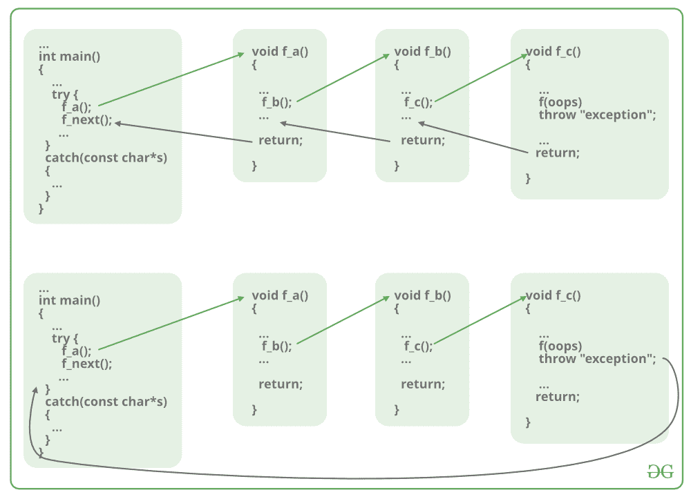

# C/C++ 中的返回语句，示例

> 原文: [https://www.geeksforgeeks.org/return-statement-in-c-cpp-with-examples/](https://www.geeksforgeeks.org/return-statement-in-c-cpp-with-examples/)

**先决条件:** [C/C++ 中的函数](https://www.geeksforgeeks.org/functions-in-c/)

**返回语句**将执行流程返回到[函数](https://www.geeksforgeeks.org/functions-in-c/)，从这里调用它。这个语句不一定需要任何条件语句。语句一执行，程序的**流程立即停止**并从调用它的地方返回控制。`return`语句可以为`void`函数返回任何东西，也可以不返回任何东西，但是对于非`void`函数，必须返回一个返回值。

## 语法:

```cpp
return [expression];
```

[](https://media.geeksforgeeks.org/wp-content/cdn-uploads/20191128194949/CPP-return-statement.png)

使用返回语句的方式有多种。下面提到的很少:

### 1. 不返回值的方法

在 C/C++ 中，当方法属于返回类型时，不能跳过返回语句。仅对于`void`类型，可以跳过`return`语句。

#### 不使用返回语句的`void`返回类型函数

当函数不返回任何东西时，使用`void`返回类型。所以如果函数定义中有`void`返回类型，那么该函数内部通常不会有`return`语句。

**语法:**

```cpp
void func()
{
    .
    .
    .
}
```

**例:**

##### C

```cpp
// C code to show not using return
// statement in void return type function

#include <stdio.h>

// void method
void Print()
{
    printf("Welcome to GeeksforGeeks");
}

// Driver method
int main()
{
    // Calling print
    Print();

    return 0;
}
```

##### C++

```cpp
// C++ code to show not using return
// statement in void return type function

#include <iostream>
using namespace std;

// void method
void Print()
{
    printf("Welcome to GeeksforGeeks");
}

// Driver method
int main()
{
    // Calling print
    Print();

    return 0;
}
```

**Output:**

```cpp
Welcome to GeeksforGeeks
```

#### 在`void`返回类型函数中使用`return`语句

现在问题来了，如果在`void`返回类型函数内部有`return`语句会怎样？我们知道，如果函数定义中有`void`返回类型，那么该函数内部通常不会有`return`语句。但如果里面有`return`语句，只要语法正确，也没有问题。

**正确语法:**

```cpp
void func()
{
    return;
}
```

该语法在函数中用作跳转语句，目的是中断函数的流程并跳出它。人们可以把它看作是在函数中使用的“[break 语句](https://www.geeksforgeeks.org/break-statement-cc/)”的替代。

**例:**

##### C

```cpp
// C code to show using return
// statement in void return type function

#include <stdio.h>

// void method
void Print()
{
    printf("Welcome to GeeksforGeeks");

    // void method using the return statement
    return;
}

// Driver method
int main()
{
    // Calling print
    Print();
    return 0;
}
```

##### C++

```cpp
// C++ code to show using return
// statement in void return type function

#include <iostream>
using namespace std;

// void method
void Print()
{
    printf("Welcome to GeeksforGeeks");

    // void method using the return statement
    return;
}

// Driver method
int main()
{
    // Calling print
    Print();
    return 0;
}
```

**Output:**

```cpp
Welcome to GeeksforGeeks
```

但是如果`return`语句试图在`void`返回类型函数中返回一个值，这将导致错误。

**语法错误:**

```cpp
void func()
{
    return value;
}
```

**警告:**

```cpp
warning: 'return' with a value, in function returning void
```

**例:**

##### C

```cpp
// C code to show using return statement
// with a value in void return type function

#include <stdio.h>

// void method
void Print()
{
    printf("Welcome to GeeksforGeeks");

    // void method using the return
    // statement to return a value
    return 10;
}

// Driver method
int main()
{
    // Calling print
    Print();
    return 0;
}
```

##### C++

```cpp
// C++ code to show using return statement
// with a value in void return type function

#include <iostream>
using namespace std;

// void method
void Print()
{
    printf("Welcome to GeeksforGeeks");

    // void method using the return
    // statement to return a value
    return 10;
}

// Driver method
int main()
{
    // Calling print
    Print();

    return 0;
}
```

**Warnings:**

```cpp
prog.c: In function 'Print':
prog.c:12:9: warning: 'return' with a value, in function returning void
  return 10;
         ^
```

### 2. 返回值的方法

对于定义了返回类型的方法，`return`语句后面必须紧跟该指定返回类型的返回值。

**语法:**

```cpp
return-type func()
{
    return value;
}
```

**例:**

##### C

```cpp
// C code to illustrate Methods returning
// a value using return statement

#include <stdio.h>

// non-void return type
// function to calculate sum
int SUM(int a, int b)
{
    int s1 = a + b;

    // method using the return
    // statement to return a value
    return s1;
}

// Driver method
int main()
{
    int num1 = 10;
    int num2 = 10;
    int sum_of = SUM(num1, num2);
    printf("The sum is %d", sum_of);
    return 0;
}
```

##### C++

```cpp
// C++ code to illustrate Methods returning
// a value using return statement

#include <iostream>
using namespace std;

// non-void return type
// function to calculate sum
int SUM(int a, int b)
{
    int s1 = a + b;

    // method using the return
    // statement to return a value
    return s1;
}

// Driver method
int main()
{
    int num1 = 10;
    int num2 = 10;
    int sum_of = SUM(num1, num2);
    cout << "The sum is " << sum_of;
    return 0;
}
```

**Output:**

```cpp
The sum is 20
```