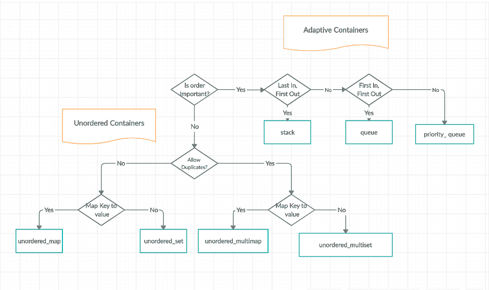
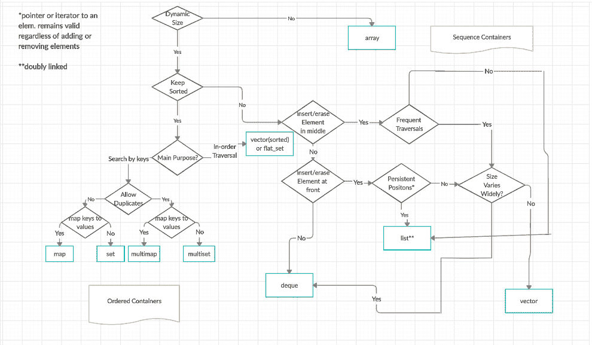

# C++ 标准模板库 (STL)

> 原文: [https://www.geeksforgeeks.org/the-c-standard-template-library-stl/](https://www.geeksforgeeks.org/the-c-standard-template-library-stl/)

标准模板库 (`STL`) 是一组 `C++` 模板类，用于提供常见的编程数据结构和功能，如 `list`、`stack`、`array` 等。它是容器类、算法和迭代器的库。它是一个通用库，因此，它的组件是参数化的。对[模板类](https://www.geeksforgeeks.org/templates-cpp/)的工作知识是使用 `STL` 的先决条件。

## STL 有四个组件

*   算法
*   容器
*   功能
*   迭代器

## 算法

`<algorithm>` 头文件定义了一组函数，这些函数是专门设计用于元素范围的。它们作用于容器，并为容器内容物的各种操作提供手段。

*   算法
    *   [排序](https://www.geeksforgeeks.org/sort-algorithms-the-c-standard-template-library-stl/)
    *   [搜索](https://www.geeksforgeeks.org/binary-search-algorithms-the-c-standard-template-library-stl/)
    *   [重要的 `STL` 算法](https://www.geeksforgeeks.org/c-magicians-stl-algorithms/)
    *   [有用的数组算法](https://www.geeksforgeeks.org/useful-array-algorithms-in-c-stl/)
    *   [分区操作](https://www.geeksforgeeks.org/stdpartition-in-c-stl/)
*   数值
    *   [`valarray` 类](https://www.geeksforgeeks.org/std-valarray-class-c/)

## 容器

容器或容器类存储对象和数据。总共有七个标准的“一级”容器类和三个容器适配器类，只有七个头文件提供对这些容器或容器适配器的访问。

*   序列容器: 实现可以以顺序方式访问的数据结构。
    *   [`vector`](https://www.geeksforgeeks.org/vector-in-cpp-stl/)
    *   [`list`](https://www.geeksforgeeks.org/list-cpp-stl/)
    *   `deque`
    *   [`array`](https://www.geeksforgeeks.org/array-class-c/)
    *   [`forward_list`](https://www.geeksforgeeks.org/forward-list-c-set-1-introduction-important-functions/) (`C++11` 引入)
*   容器适配器: 为顺序容器提供不同的接口。
    *   `queue`
    *   [`priority_queue`](https://www.geeksforgeeks.org/priority-queue-in-cpp-stl/)
    *   [`stack`](https://www.geeksforgeeks.org/stack-in-cpp-stl/)
*   关联容器: 实现可快速搜索的排序数据结构 ( `O(log n)` 复杂度)。
    *   [`set`](https://www.geeksforgeeks.org/set-in-cpp-stl/)
    *   [`multiset`](https://www.geeksforgeeks.org/multiset-in-cpp-stl/)
    *   [`map`](https://www.geeksforgeeks.org/map-associative-containers-the-c-standard-template-library-stl/)
    *   [`multimap`](https://www.geeksforgeeks.org/multimap-associative-containers-the-c-standard-template-library-stl/)
*   无序关联容器: 实现可快速搜索的无序数据结构。
    *   [`unordered_set`](https://www.geeksforgeeks.org/unordered_set-in-cpp-stl/) (`C++11` 中引入)
    *   [`unordered_multiset`](https://www.geeksforgeeks.org/unordered_multiset-and-its-uses/) (`C++11` 引入)
    *   [`unordered_map`](https://www.geeksforgeeks.org/unordered_map-in-cpp-stl/) (`C++11` 引入)
    *   [`unordered_multimap`](https://www.geeksforgeeks.org/unordered_multimap-and-its-application/) (`C++11` 中引入)

### 关联容器和无序容器流程图

### 序列容器和关联容器的流程图

## 功能

`STL` 包含重载函数调用运算符的类。这种类的实例称为函数对象或函子。函子允许在要传递的参数的帮助下定制相关函数的工作。

*   [函子](https://www.geeksforgeeks.org/functors-in-cpp/)

## 迭代器

顾名思义，迭代器用于处理一系列值。它们是 `STL` 中允许通用性的主要特性。

*   [迭代器](https://www.geeksforgeeks.org/iterators-c-stl/)

## 实用程序库

在头文件 `<utility>` 中定义。

*   [`pair`](https://www.geeksforgeeks.org/pair-in-cpp-stl/)

> 要以最高效最有效的方式掌握 **C++ 标准模板库 (STL)** ，请务必通过 GeeksforGeeks 查看本 [**C++ STL 在线课程**](https://practice.geeksforgeeks.org/courses/cpp-stl) 。本课程涵盖了 `C++` 的基础知识和对所有 `C++ STL` 容器、迭代器等的深入解释，以及一些问题的视频解释。此外，您将学习使用 `STL` 内置的类和函数来实现一些复杂的数据结构，并方便地对它们执行操作。

## 参考文献

*   [http://en.cppreference.com/w/cpp/](http://en.cppreference.com/w/cpp/)
*   [http://cs.stmarys.ca/~porter/csc/ref/stl/headers.html](http://cs.stmarys.ca/~porter/csc/ref/stl/headers.html)
*   [http://www.cplusplus.com/reference/stl/](http://www.cplusplus.com/reference/stl/)

[最近关于 STL 的文章！](https://www.geeksforgeeks.org/tag/stl/)

如果您发现任何不正确的地方，或者您想分享更多关于上面讨论的主题的信息，请写评论。