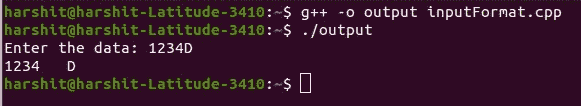
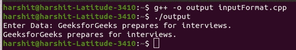
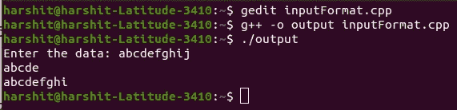

# C++ 中的无格式输入/输出操作

> 原文: [https://www.geeksforgeeks.org/unformatted-input-output-operations-in-cpp/](https://www.geeksforgeeks.org/unformatted-input-output-operations-in-cpp/)

在本文中，我们将讨论在 [C++](https://www.geeksforgeeks.org/c-plus-plus/) 中的[无格式输入/输出操作](https://www.geeksforgeeks.org/basic-input-output-c/)。由于运算符 [`>>`](https://www.geeksforgeeks.org/overloading-stream-insertion-operators-c/) 和 [`<<`](https://www.geeksforgeeks.org/overloading-stream-insertion-operators-c/) 重载识别所有基本的 C++ 类型，因此可以使用对象 [`cin`](https://www.geeksforgeeks.org/cin-in-c/) 和 [`cout`](https://www.geeksforgeeks.org/basic-input-output-c/) 进行各种类型数据的输入和输出。运算符 `>>` 在 [`istream`](https://www.geeksforgeeks.org/c-stream-classes-structure/) 中重载，运算符 `<<` 在 [`ostream`](https://www.geeksforgeeks.org/c-stream-classes-structure/) 中重载。

从键盘读取数据的一般格式:

> 语法:
> *   这里， `var1`、`var2`、……、`varn` 是已经声明的变量名。
> *   输入数据必须用空白字符分隔，用户输入的数据类型必须与程序中声明的变量的数据类型相似。
> *   运算符 `>>` 逐字符读取数据，并将其分配到指定位置。
> *   当出现空格或出现与目标类型不匹配的字符类型时，变量读取终止。

**程序 1:**

## C++

```cpp
// C++ program to illustrate the
// input and output of the data
// entered by user
#include <iostream>
using namespace std;

// Driver Code
int main()
{
    int data;
    char val;

    // Input the data
    cin >> data;
    cin >> val;

    // Print the data
    cout << data << "   " << val;

    return 0;
}
```

**输出:**



**说明:** 在上述程序中，`123` 存储在整数的变量 `data` 中，`B` 传递给下一个 [`cin` 对象](https://www.geeksforgeeks.org/cin-in-c/) 并存储在字符的数据变量 `val` 中。

### `put()` 和 `get()` 函数:

[`istream`](https://www.geeksforgeeks.org/c-stream-classes-structure/) 和 [`ostream`](https://www.geeksforgeeks.org/c-stream-classes-structure/) 类具有预定义的函数 [`get()`](https://www.geeksforgeeks.org/gets-is-risky-to-use/) 和 [`put()`](https://www.geeksforgeeks.org/puts-vs-printf-for-printing-a-string/)，用于处理单个字符的输入和输出操作。函数 `get()` 有两种使用方式，如 `get(char*)` 和 `get(void)` 获取字符，包括空格、换行符和制表符。函数 `get(char*)` 将该值赋给一个变量，`get(void)` 返回该字符的值。

**语法:**

> char data;
> // get()返回字符值，赋给data变量
> data = cin.get();
> //显示存储在data变量中的值
> cout.put(data);

**示例:**

> char c;
> //直接赋值给c
> cin.get(c);
> //显示存储在c变量中的值
> cout.put(c);

**程序 2:**

## C++

```cpp
// C++ program to illustrate the
// input and output of data using
// get() and puts()
#include <iostream>
using namespace std;

// Driver Code
int main()
{
    char data;
    int count = 0;

    cout << "Enter Data: ";

    // Get the data
    cin.get(data);

    while (data != '\n') {
        // Print the data
        cout.put(data);
        count++ ;

        // Get the data again
        cin.get(data);
    }

    return 0;
}
```

**输出:**

[](https://media.geeksforgeeks.org/wp-content/cdn-uploads/20210401113733/Program2InputOutput.jpg)

### [`getline()` 和 `write()` 函数](https://www.geeksforgeeks.org/getline-function-character-array/):

在 [C++](https://www.geeksforgeeks.org/c-plus-plus/) 中，函数 [`getline()`](https://www.geeksforgeeks.org/getline-string-c/) 和 [`write()`](https://www.geeksforgeeks.org/fine-write-void-main-cc/) 提供了一种更有效的方式来处理面向行的输入和输出。`getline()` 函数读取以[换行字符](https://www.geeksforgeeks.org/endl-vs-n-in-cpp/) 结束的完整文本行。可以使用 `cin` 对象调用该功能。

**语法:**

> cin.getline(variable_to_store_line, size);

阅读以 `'\n'` (换行符) 结束。新字符被函数读取，但它不显示，而是被[空字符](https://www.geeksforgeeks.org/difference-between-null-pointer-null-character-0-and-0-in-c-with-examples/) 替换。读取特定字符串后，`cin` 会自动在字符串末尾添加换行符。

`write()` 函数一次显示整行，其语法与 `getline()` 函数类似，只是在这里 `cout` 对象用于调用它。

**语法:**

> cout.write(variable_to_store_line, size);

要记住的重点是当出现空字符时，`write()` 函数不会自动停止显示字符串。如果尺寸大于线的长度，则 `write()` 函数显示超出线的界限。

**程序 3:**

## C++

```cpp
// C++ program to illustrate the
// input and output of file using
// getline() and write() function
#include <iostream>
#include <string>
using namespace std;

// Driver Code
int main()
{
    char line[100];

    // Get the input
    cin.getline(line, 10);

    // Print the data
    cout.write(line, 5);
    cout << endl;

    // Print the data
    cout.write(line, 20);

    cout << endl;

    return 0;
}
```

**输出:**

