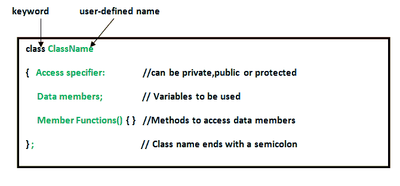

# C++ 中用户定义的数据类型

> 原文: [https://www.geeksforgeeks.org/user-defined-data-types-in-c/](https://www.geeksforgeeks.org/user-defined-data-types-in-c/)

**数据类型**是识别数据类型和处理数据的相关操作的手段。有三种数据类型:

1.  [预定义数据类型](https://www.geeksforgeeks.org/c-data-types/)
2.  [派生数据类型](https://www.geeksforgeeks.org/derived-data-types-in-c/)
3.  用户定义的数据类型

[](https://media.geeksforgeeks.org/wp-content/cdn-uploads/20191113115600/DatatypesInC.png)

在本文中，将解释用户定义的数据类型:

## 用户定义的数据类型

用户定义的数据类型称为派生数据类型或用户定义的派生数据类型。
这些类型包括:

*   [类](https://www.geeksforgeeks.org/c-classes-and-objects/)
*   [结构](https://www.geeksforgeeks.org/structures-c/)
*   [联合](https://www.geeksforgeeks.org/union-c/)
*   [枚举](https://www.geeksforgeeks.org/enumeration-enum-c/)
*   `typedef` 定义的数据类型

以下是以下类型的详细描述:

### 1. Class

[Class](https://www.geeksforgeeks.org/c-classes-and-objects/) 是 C++ 中通向面向对象编程的构建块。它是一个用户定义的数据类型，拥有自己的数据成员和成员函数，可以通过创建该类的实例来访问和使用。类就像是对象的蓝图。

**语法:**


**示例:**

```cpp
// C++ program to demonstrate
// Class

#include <bits/stdc++.h>
using namespace std;

class Geeks {
    // Access specifier
public:
    // Data Members
    string geekname;

    // Member Functions()
    void printname()
    {
        cout << "Geekname is: " << geekname;
    }
};

int main()
{
    // Declare an object of class geeks
    Geeks obj1;

    // accessing data member
    obj1.geekname = "GeeksForGeeks";

    // accessing member function
    obj1.printname();

    return 0;
}
```

**Output:**

```cpp
Geekname is: GeeksForGeeks
```

### 2. Structure

[Structure](https://www.geeksforgeeks.org/structures-c/) 是 C/C++ 中的用户定义数据类型。结构创建了一种数据类型，可用于将可能不同类型的项目分组到单一类型中。

**语法:**

```cpp
struct address {
    char name[50];
    char street[100];
    char city[50];
    char state[20];
    int pin;
};
```

**示例:**

```cpp
// C++ program to demonstrate
// Structures in C++

#include <iostream>
using namespace std;

struct Point {
    int x, y;
};

int main()
{
    // Create an array of structures
    struct Point arr[10];

    // Access array members
    arr[0].x = 10;
    arr[0].y = 20;

    cout << arr[0].x << ", " << arr[0].y;

    return 0;
}
```

**Output:**

```cpp
10, 20
```

### 3. Union

[Union](https://www.geeksforgeeks.org/union-c/) 和[结构](https://www.geeksforgeeks.org/structures-c/)一样，是用户自定义的数据类型。在联合中，所有成员共享相同的内存位置。例如，在下面的 C 程序中，`x` 和 `y` 共享同一个位置。如果我们改变 `x`，我们可以看到变化反映在 `y` 中。

```cpp
#include <iostream>
using namespace std;

// Declaration of union is same as the structures
union test {
    int x, y;
};

int main()
{
    // A union variable t
    union test t;

    // t.y also gets value 2
    t.x = 2;

    cout << "After making x = 2:"
         << endl
         << "x = " << t.x
         << ", y = " << t.y
         << endl;

    // t.x is also updated to 10
    t.y = 10;

    cout << "After making Y = 10:"
         << endl
         << "x = " << t.x
         << ", y = " << t.y
         << endl;

    return 0;
}
```

**输出:**

```cpp
After making x = 2:
x = 2, y = 2
After making Y = 10:
x = 10, y = 10
```

### 4. Enumeration

[Enumeration](https://www.geeksforgeeks.org/enumeration-enum-c/) (或 `enum`) 是 C 中的用户定义数据类型。它主要用于为整型常量赋予名称，这些名称使程序易于阅读和维护。

**语法:**

```cpp
enum State {Working = 1, Failed = 0};
```

**示例:**

```cpp
// Program to demonstrate working
// of enum in C++

#include <iostream>
using namespace std;

enum week { Mon,
            Tue,
            Wed,
            Thur,
            Fri,
            Sat,
            Sun };

int main()
{
    enum week day;

    day = Wed;

    cout << day;

    return 0;
}
```

**Output:**

```cpp
2
```

### 5. Typedef

`typedef` 允许你使用关键字 `typedef` 明确定义新的数据类型名称。使用 `typedef` 并不会实际创建一个新的数据类，而是为现有类型定义一个名称。这可以增加程序的可移植性（程序在不同类型的机器上使用的能力；例如，小型机、大型机、微型机等；无需对代码做太多更改），因为只需更改 `typedef` 语句。使用 `typedef` 还可以通过为标准数据类型提供描述性名称来帮助编写自文档化代码。

**语法:**

```cpp
typedef type name;
```

其中 `type` 为任意 C++ 数据类型，`name` 为该数据类型的新名称。
这为 C++ 的标准 `type` 定义了另一个名称。

**示例:**

```cpp
// C++ program to demonstrate typedef
#include <iostream>
using namespace std;

// After this line BYTE can be used
// in place of unsigned char
typedef unsigned char BYTE;

int main()
{
    BYTE b1, b2;
    b1 = 'c';
    cout << " " << b1;
    return 0;
}
```

**Output:**

```cpp
c
```