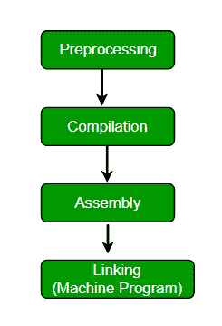

# 如何编写没有 main() 函数的 C 代码？

> 原文：[https://www.geeksforgeeks.org/write-running-c-code-without-main/](https://www.geeksforgeeks.org/write-running-c-code-without-main/)

写一个 C 语言代码打印 **GeeksforGeeks** 而不使用任何 main 函数。

从逻辑上讲，不使用 `main()` 函数编写一个 C 程序似乎是不可能的。因为每个程序必须有一个 `main()` 函数，因为：

*   它是每个 C/C++ 程序的入口点。
*   所有预定义和用户定义的函数都是通过 `main` 直接或间接调用的。

因此，我们将使用预处理器（一个在编译前处理源代码的程序）指令 `#define` 和参数，给人一种程序在没有 `main` 的情况下运行的印象。但实际上，它有一个隐藏的 `main` 函数。让我们看看预处理器是如何工作的。

[](https://media.geeksforgeeks.org/wp-content/uploads/main-1.png)

因此，可以通过以下方式解决：

## 1. 使用宏定义主

```cpp
#include<stdio.h>
#define fun main
int fun(void)
{
    printf("Geeksforgeeks");
    return 0;
}
```

```cpp
Output: Geeksforgeeks
```

## 2. 使用令牌粘贴操作符

上面的解决方案中有“main”字。如果连 `main` 都不允许写，可以用贴令牌运算符（详见[本](https://www.geeksforgeeks.org/interesting-facts-preprocessors-c/)）。

```cpp
#include<stdio.h>
#define fun m##a##i##n
int fun()
{
    printf("Geeksforgeeks");
    return 0;
}
```

```cpp
Output: Geeksforgeeks
```

## 3. 使用论证宏

```cpp
#include<stdio.h>
#define begin(m,a,i,n) m##a##i##n
#define start begin(m,a,i,n)

void start() {
   printf("Geeksforgeeks");
}
```

```cpp
Output: Geeksforgeeks
```

## 4. 在编译期间修改入口点

```cpp
#include<stdio.h>
#include<stdlib.h>

// entry point function
int nomain();

void _start(){
    // calling entry point
    nomain();
    exit(0);
}

int nomain()
{
    puts("Geeksforgeeks");
    return 0;
}
```

```cpp
Output:
Geeksforgeeks
```

**使用以下命令编译：**
`gcc filename.c -nostartfiles`
（`-nostartfiles` 选项告诉编译器避免标准链接）

**解释：**
在正常编译下，`_start()` 的主体将包含对 `main()` 的函数调用（在正常编译期间，这个 `_start()` 会被附加到每个代码中），因此如果 `main()` 的定义不存在，将导致类似 `text+0x20): undefined reference to 'main'` 的错误。
在上面的代码中，我们定义了自己的 `_start()` 并定义了自己的入口点，即 `nomain()`。

*   **此方法由 Aravind Alapati 贡献。**

参见[在场景](https://www.geeksforgeeks.org/executing-main-in-c-behind-the-scene/)后面的 C 中执行 `main()` 获得另一个解决方案。

**参考：**
[宏和预处理程序在 C](https://www.geeksforgeeks.org/interesting-facts-preprocessors-c/)

本文由**阿沛·拉提**供稿，由[舒巴姆·班萨尔](https://www.facebook.com/banalshubham)改进。如果你发现任何不正确的地方，或者你想分享更多关于上面讨论的话题的信息，请写评论。