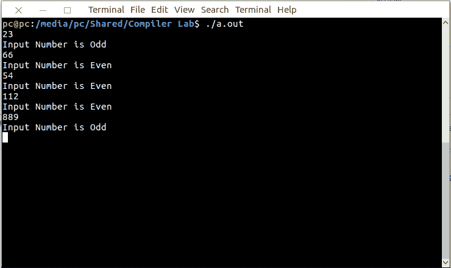

# Lex 程序检查输入数字是奇数还是偶数

> 原文: [https://www.geeksforgeeks.org/lex-program-to-check-whether-input-number-is-odd-or-even/](https://www.geeksforgeeks.org/lex-program-to-check-whether-input-number-is-odd-or-even/)

## Lex 简介

[Lex](https://www.geeksforgeeks.org/flex-fast-lexical-analyzer-generator/) 是一个生成词法分析器的计算机程序。Lex 读取指定词法分析器的输入流，并输出用 C 编程语言实现 lexer 的源代码。

## 执行命令

执行 lex 程序的命令有：

```
lex abc.l (abc is the file name)
gcc lex.yy.c -ll
./a.out
```

## 示例

让我们看看 lex 程序，检查输入的数字是奇数还是偶数。

**示例:**

```
Input :

Output :
Input Number is Even

Input :

Output :
Input Number is odd
```

## 实现代码

下面是实现：

```
/% Lex Program to check whether
      - input number is odd or even. %/

% {
   int i;
% }

%%
[0-9]+ {i = atoi(yytext);

if(i%2==0)
 printf("Input Number is Even");

else
 printf("Input Number is Odd");
};

%%
 int main()
  {
    yylex();
    return 1;
  }
```

## 输出

**输出:**

