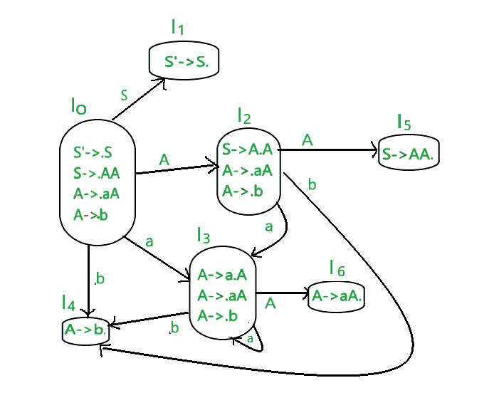
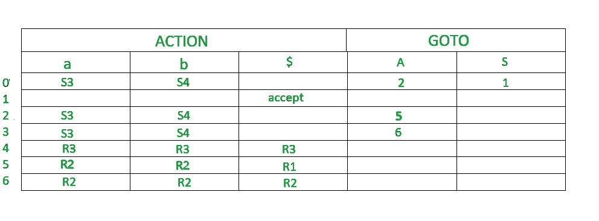

# LR(0)解析器出现问题

> 原文:[https://www.geeksforgeeks.org/problem-on-lr0-parser/](https://www.geeksforgeeks.org/problem-on-lr0-parser/)

**先决条件:** [LR 解析器](https://www.geeksforgeeks.org/lr-parser/)。

LR 解析器是一种有效的自下而上的语法分析技术，可用于大类上下文无关语法。这种技术也被称为 `LR(0)` 解析。
`L` 代表从左到右扫描
`R` 代表反向中最右边的导数
`0` 代表前视的输入符号数。

## 增广语法:
如果 `P` 是一个带有起始符号 `S` 的语法，那么 `G'`（`G` 的增广语法）就是一个带有新的起始符号 `S'` 和产生式 `S' -> S` 的语法。这个新的开始生产的目的是指示解析器何时应该停止解析。`S'` 的左侧 `S` 表示 `S` 的左侧已被编译器读取，并且 `S` 的右侧尚未被编译器读取。

## 构建 LR 解析表的步骤:

1.  写作扩充语法
2.  待查找项目的 `LR(0)` 集合
3.  在解析表中定义 2 个函数: `goto(终端列表)` 和 `action(非终端列表)`。

## 问:为给定的上下文无关语法构建一个 LR 解析表

```
S-->AA
A-->AA | b
```

### 解决方案:
#### 步骤 1- 查找扩充语法

给定语法的扩充语法是:

```
S'--> .S [第 0 次生产]
S--> .AA【第一次生产】
A--> .aA【第二次生产】
A--> .b [第三次生产]
```

#### 步骤 2–查找 LR(0)物品集合
下图为 `LR(0)` 物品集合。我们会一件一件了解一切。



这个语法的终端是 `{a，b}`
这个语法的非终端是 `{S，A}`

**规则–**如果任何非终端有“.”在它之前，我们必须写下它所有的作品并加上“.”在每次生产之前。
**RULE**——从一个州到下一个州，这个“.”向右移动一个位置。

*   在图中，`I0` 由增广语法组成。
*   `I0` 去 `I1` 当 `.` 第 0 次生产的位置移向 `S` (`S'->S`)的右侧。这个状态就是接受状态。`S` 被编译器看到了
*   `I0` 去 `I2` 当 `.` 第一部作品的重心向右移。编译器会看到 `A`
*   `I0` 去 `I3` 当 `.` 第二部作品的主题向右移。编译器会看到 `a`。
*   `I0` 去 `I4` 当 `.` 第三部作品的主题向右移 (`A->b`)。编译器会看到 `b`。
*   `I2` 去 `I5` 当 `.` 第一次生产的重心向右移动 (`S->AA`)。编译器会看到 `A`
*   `I2` 去 `I4` 当 `.` 第三部的作品向右移了 (`A->b`)。编译器会看到 `b`。
*   `I2` 去 `I3` 当 `.` 第二部作品的主题向右移。编译器会看到 `a`。
*   `I3` 去 `I4` 当 `.` 第三部作品的主题向右移 (`A->b`)。编译器会看到 `b`。
*   `I3` 去 `I6` 当 `.` 生产的第二部分向右移动 (`A->aA`)。编译器会看到 `A`
*   `I3` 去 `I3` 当 `.` 第二部作品的重心向右移。编译器会看到 `a`。

#### step 3–定义 2 个函数:转到解析表中的【终端列表】和动作【非终端列表】

*   默认情况下，`$` 是非终端，处于接受状态。
*   `0，1，2，3，4，5，6` 表示 `I0`，`I1`，`I2`，`I3`，`I4`，`I5`，`I6`
*   `I0` 给出 `I2` 中的 `A`，所以 `2` 加到 `A` 列 `0` 行。
*   `I0` 给出 `I1` 的 `S`，所以 `S` 列加 `1`，`1` 行加 `1`。
*   类似地，`5` 写在 `A` 列和第 `2` 行，`6` 写在 `A` 列和第 `3` 行。
*   `I0` 给出一个在 `I3` 到 `a`。所以 `S3`（移位 3）被添加到 `a` 列和 `0` 行。
*   `I0` 在 `I4` 中给出 `b`，所以 `S4`（移位 4）被加到 `b` 列和 `0` 行。
*   类似地，`S3`（移位 3）被添加到列 `a` 和 `2`，`3` 行，`S4`（移位 4）被添加到列 `b` 和 `2`，`3` 行。
*   `I4` 还原状态为“.”就在尽头。`I4` 是 **3** 语法的第三个产物。所以在端子中写 `r3`（减少 3）。
*   `I5` 还原状态为“.”就在尽头。`I5` 是 **1** 语法的第一次产生。所以在端子中写 `r1`（减少 1）。
*   `I6` 还原状态为“.”就在尽头。`I6` 是 **2** 语法的第二个产物。所以在端子中写 `r2`（减 2）。



由于每个单元格中只有 1 个值，因此，给定的语法是 `LR(0)`。