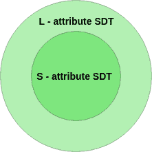

# 句法指导翻译中的 S 属性和 L 属性语义词典

> 原文: [https://www.geeksforgeeks.org/s-attributed-and-l-attributed-sdts-in-syntax-directed-translation/](https://www.geeksforgeeks.org/s-attributed-and-l-attributed-sdts-in-syntax-directed-translation/)

在讨论 `S` 属性和 `L` 属性 `SDT` 之前，这里简单介绍一下合成属性或继承属性。

## 属性类型

属性可能有两种类型–合成或继承。

### 1. 合成属性

`Synthesized attributes` 是产生式左侧非终结符的属性。合成属性代表信息在语法分析树中向上传递。该属性只能从其子节点（产生式右侧的变量）获取值。

比方说，假设 `A -> BC` 是一个语法的产物，`A` 的属性依赖于 `B` 的属性或 `C` 的属性，那么它将是合成属性。

### 2. 继承属性

产生式右侧非终结符的属性称为继承属性。该属性可以从其父级或同级（产生式左侧或右侧的变量）获取值。

例如，假设 `A -> BC` 是一个语法的产物，`B` 的属性依赖于 `A` 的属性或 `C` 的属性，那么它将是继承属性。

## S 属性和 L 属性的 SDT

现在，我们来讨论一下 `S` 属性和 `L` 属性的 `SDT`。

### 1. S 属性 SDT

*   如果一个 `SDT` 只使用合成属性，它被称为 `S` 属性 `SDT`。
*   由于父节点的值依赖于子节点的值，因此 `S` 属性的 `SDT` 在自底向上的解析中进行评估。
*   语义动作放在产生式右侧最右边的位置。

### 2. L 属性 SDT

*   如果一个 `SDT` 同时使用合成属性和继承属性，并限制继承属性只能从左兄弟继承值，它被称为 `L` 属性 `SDT`。
*   `L` 属性 `SDT` 中的属性通过深度优先和从左到右的解析方式进行评估。
*   语义动作可以放在产生式右侧的任何位置。

例如，

```
A -> XYZ {Y.S = A.S, Y.S = X.S, Y.S = Z.S}
```

不是 `L` 属性化语法，因为 `Y.S = A.S` 和 `Y.S = X.S` 是允许的，但是 `Y.S = Z.S` 违反了 `L` 属性化 `SDT` 定义，因为属性化是从其右兄弟继承值。

**注意–** 如果一个定义是 `S` 属性的，那么它也是 `L` 属性的，但是**不是**反之亦然。



## 示例

考虑下面给出的 `SDT`。

```
P1: S -> MN  {S.val= M.val + N.val}
P2: M -> PQ  {M.val = P.val * Q.val  and P.val =Q.val}
```

选择正确的选项。
A. `P1` 和 `P2` 都是 `S` 属性。
B. `P1` 为 `S` 属性，`P2` 为 `L` 属性。
C. `P1` 是 `L` 属性，但 `P2` 不是 `L` 属性。
D. 以上都不是

**解释–**
正确答案是选项 **C**。因为在 `P1` 中，`S` 是合成属性，在 `L` 属性定义中允许合成。所以 `P1` 遵循 `L` 属性定义。但是 `P2` 没有遵循 `L` 属性的定义，因为 `P` 依赖于 `Q`，`Q` 是它的右兄弟。