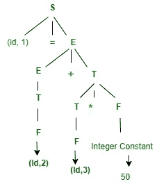
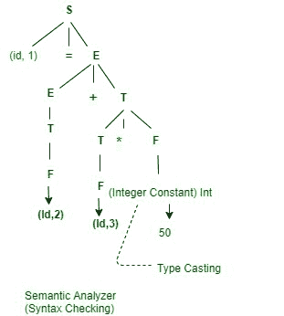

# 编译器阶段的工作示例

> 原文: [https://www.geeksforgeeks.org/working-of-compiler-phases-with-example/](https://www.geeksforgeeks.org/working-of-compiler-phases-with-example/)

在本文中，我们将通过一个例子来概述我们如何让每个编译器阶段独立工作。我们一个一个来讨论。

先决条件 – [编译器阶段介绍](https://www.geeksforgeeks.org/phases-of-a-compiler/)

您将看到编译器阶段，如词法分析器、语法分析器、语义分析器、中间代码生成器、代码优化器和目标代码生成。让我们考虑一个例子。

```
x = a+b*50
```

下面给出了上述示例的符号表。在符号表中明确提到了变量名和变量类型。

| No. | 变量名 | 变量类型 |
| :-- | :----- | :------- |
| 1   | `x`    | `float`  |
| 2   | `a`    | `float`  |
| 3   | `b`    | `float`  |

现在，在这里您将看到如何在每个级别执行编译器阶段，以及它是如何工作的。

## 1. 词法分析器

在这个阶段，您将看到如何标记表达式。

```
x  ->  Identifier-  (id, 1)
=  ->  Operator  -  Assignment
a  ->  Identifier-  (id, 2)
+  ->  Operator  -  Binary Addition
b  ->  Identifier-  (id, 3)
*  ->  Operator  -  Multiplication
50 ->  Constant  -  Integer
```

下面给出了最终的标记化表达式。

```
(id, 1) = (id, 2) + (id, 3) * 50
```

## 2. 语法分析器

在这个阶段，您将看到如何在标记化表达式后检查语法。

```
S -> Id = E
E -> E+T | T
T -> T*F | F
F -> Id | Integer constant
```

下面给出了上述表达式的标准偏差。



## 3. 语义分析器

在这个阶段，您将看到如何检查语法树的类型和语义动作。下图是语义分析器的示意图。



## 4. 中间代码生成器

在这个阶段，输入是修改后的解析树，输出是转换为中间代码后生成的三地址码。下面是上述修改后解析树的表达式。

**三地址码 –**

```
t1 = b * 50.0
t2 = a + t1
x = t2
```

## 5. 代码优化器

在这个阶段，你会看到作为输入会给出三地址码，作为输出，你会看到优化代码。让我们看看它将如何转换。

```
t1 = b * 50.0
x = a + t1
```

## 6. 目标代码生成器

这是最后一个阶段，在这个阶段，您将看到如何将最终表达式转换为汇编代码。这样，对于处理器来说就很容易理解了。

```
Mul
Add
Store
```