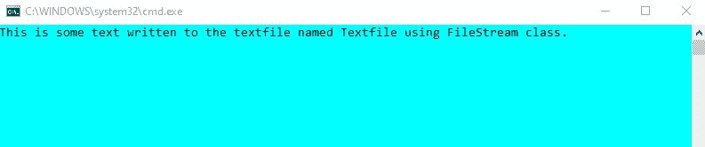

# C# 中文件流的基础知识

> 原文：[https://www.geeksforgeeks.org/basics-of-filestream-in-c-sharp/](https://www.geeksforgeeks.org/basics-of-filestream-in-c-sharp/)

`FileStream` 是一个用于在 C# 中读写文件的类。它是 `System.IO` 命名空间的一部分。要使用 `FileStream` 操作文件，需要创建一个 `FileStream` 类的对象。该对象有四个参数：文件名、文件模式、文件访问和文件共享。

## 语法

声明文件流对象的语法如下：

> `FileStream` 文件对象 = new `FileStream`(文件名/路径，`FileMode`.字段，`FileAccess`.字段，`FileShare`.字段)；

## 参数说明

| 参数 | 描述 | 字段 |
| --- | --- | --- |
| 文件的名称 | 您要使用的文件名及其扩展名或文件的完整路径。 | 例如：`filename.txt`，`@"C:\Users\Username\Documents\filename.txt"` |
| `FileMode` - 文件模式 | 它指定文件必须以哪种模式打开。 | – `Open` – 打开现有文件<br>– `Create` – 创建新文件。如果已经存在相同的文件名，它将被覆盖<br>– `OpenOrCreate` – 打开文件如果存在，否则创建新文件如果不存在<br>– `New` – 专门创建新文件<br>– `Append` – 打开现有文件并在文件末尾追加更多信息。如果文件不存在，将创建一个新文件<br>– `Truncate` – 打开一个现有文件，将其大小截断为零字节 |
| `FileAccess` | 它指定对文件的访问。 | – `Read` – 从文件中读取数据<br>– `Write` – 向文件中写入数据<br>– `ReadWrite` – 向文件中读取和写入数据 |
| `FileShare` | 它指定了其他 `FileStream` 对象对此特定文件的访问权限 | – `None` – 拒绝文件共享。在文件关闭之前，任何访问请求都将失败。<br>– `Read` – 允许后续读取文件。<br>– `Write` – 允许后续写入文件。<br>– `ReadWrite` – 允许文件的后续读写。<br>– `Delete` – 允许后续删除文件。<br>– `Inheritable` – 允许子进程继承文件句柄。 |

## 示例

在下面给出的代码中，我们向文本文件中写入和读取一些文本。要写入文本，首先在 `Create` 模式下创建 `FileStream` 类的对象，并进行 `Write` 访问。将您要编写的文本存储在 `var` 类型的变量中，这是一个用于声明隐式类型的关键字。

接下来，创建一个字节数组，并将文本编码为 `UTF8`，`UTF8` 是一种能够以 Unicode 编码所有 1，112，064 个有效字符代码点的编码标准。然后使用 `Write()` 方法写入文本文件。`Write()` 方法的参数是要写入的字节数组、文本文件的偏移量和文本的长度。最后，使用 `Close()` 关闭 `FileStream` 对象。

为了读取文本文件，我们在 `Open` 模式和 `Read` 访问中创建一个 `FileStream` 对象。声明一个从文本文件中读取的字节数组和一个保持字节计数的整数。使用 `Read()` 方法从文本文件中读取。`Read()` 方法的参数是字节数组、文本文件从哪里开始读取的偏移量以及必须读取的文本长度。最后，使用 `GetString()` 将读取的文本从字节数组写入控制台。

```cs
// C# program to write and read from 
// a text file using FileStream class
using System;
using System.IO;
using System.Text;

namespace FileStreamWriteRead {

class GFG {

static void Main(string[] args)
    {
        // Create a FileStream Object
        // to write to a text file
        // The parameters are complete 
        // path of the text file in the 
        // system, in Create mode, the
        // access to this process is 
        // Write and for other 
        // processes is None
        FileStream fWrite = new FileStream(@"M:\Documents\Textfile.txt",
                     FileMode.Create, FileAccess.Write, FileShare.None);

        // Store the text in the variable text
        var text = "This is some text written to the textfile "+
                       "named Textfile using FileStream class.";

        // Store the text in a byte array with
        // UTF8 encoding (8-bit Unicode 
        // Transformation Format)
        byte[] writeArr = Encoding.UTF8.GetBytes(text);

        // Using the Write method write
        // the encoded byte array to
        // the textfile
        fWrite.Write(writeArr, 0, text.Length);

        // Close the FileStream object
        fWrite.Close();

        // Create a FileStream Object
        // to read from a text file
        // The parameters are complete
        // path of the text file in 
        // the system, in Open mode,
        // the access to this process is
        // Read and for other processes
        // is Read as well
        FileStream fRead = new FileStream(@"M:\Documents\Textfile.txt", 
                       FileMode.Open, FileAccess.Read, FileShare.Read);

        // Create a byte array 
        // to read from the 
        // text file
        byte[] readArr = new byte[text.Length];
        int count;

        // Using the Read method 
        // read until end of file
        while ((count = fRead.Read(readArr, 0, readArr.Length)) > 0) {
            Console.WriteLine(Encoding.UTF8.GetString(readArr, 0, count));
        }

        // Close the FileStream Object
        fRead.Close();
        Console.ReadKey();
    }
}
}
```

## 输出

