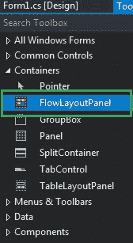
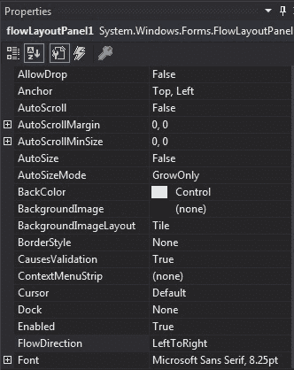
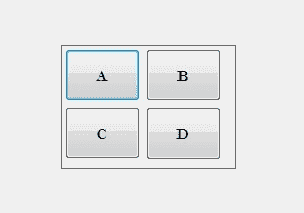
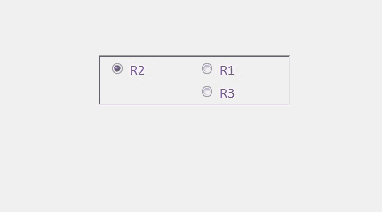

# C# | FlowLayoutPanel 类

> 原文: [https://www.geeksforgeeks.org/c-sharp-flowlayoutpanel-class/](https://www.geeksforgeeks.org/c-sharp-flowlayoutpanel-class/)

在 Windows 窗体中，`FlowLayoutPanel` 控件用于在水平或垂直流动方向上排列其子控件。或者换句话说，`FlowLayoutPanel` 是一个容器，用于在其中水平或垂直组织不同或相同类型的控件。`FlowLayoutPanel` 类用于表示窗口流布局面板，还提供不同类型的属性、方法和事件。在 `System.Windows.Forms` 命名空间下定义。在 C# 中，您可以使用两种不同的方法在 windows 窗体中创建一个 `FlowLayoutPanel`:

## 1. 设计时

创建 `FlowLayoutPanel` 控件的最简单方法如下所示:

*   **第一步:** 创建如下图所示的窗口表单:
    **Visual Studio->File->New->Project->Windows Forms App**
    
*   **步骤 2:** 接下来，将 `FlowLayoutPanel` 控件从工具箱拖放到如下图所示的表单中:
    
*   **步骤 3:** 拖放完成后，转到 `FlowLayoutPanel` 的属性，根据您的需求进行修改。
    

**输出:**
    

## 2. 运行时

比上面的方法稍微复杂一点。在这个方法中，您可以借助 `FlowLayoutPanel` 类提供的语法，以编程方式创建一个 `FlowLayoutPanel`。以下步骤显示了如何动态设置创建 `FlowLayoutPanel`:

*   **步骤 1:** 使用由 `FlowLayoutPanel` 类提供的 `FlowLayoutPanel()` 构造函数创建 `FlowLayoutPanel`。

```cs
// Creating a FlowLayoutPanel
FlowLayoutPanel fl = new FlowLayoutPanel();
```

*   **步骤 2:** 创建完 `FlowLayoutPanel` 后，设置 `FlowLayoutPanel` 类提供的 `FlowLayoutPanel` 的属性。

```cs
// Setting the location of the FlowLayoutPanel
fl.Location = new Point(380, 124);

// Setting the size of the FlowLayoutPanel
fl.Size = new Size(216, 57);

// Setting the name of the FlowLayoutPanel
fl.Name = "Mycontainer";

// Setting the font of the FlowLayoutPanel
fl.Font = new Font("Calibri", 12);

// Setting the flow direction of the FlowLayoutPanel
fl.FlowDirection = FlowDirection.RightToLeft;

// Setting the border style of the FlowLayoutPanel
fl.BorderStyle = BorderStyle.Fixed3D;

// Setting the foreground color of the FlowLayoutPanel
fl.ForeColor = Color.BlueViolet;

// Setting the visibility of the FlowLayoutPanel
fl.Visible = true;
```

*   **步骤 3:** 最后，将此 `FlowLayoutPanel` 控件添加到窗体，并使用以下语句将其他控件添加到 `FlowLayoutPanel` 上:

```cs
// Adding a FlowLayoutPanel control to the form
this.Controls.Add(fl);

// Adding child controls to the FlowLayoutPanel
fl.Controls.Add(f1);
```

**示例:**

```cs
using System;
using System.Collections.Generic;
using System.ComponentModel;
using System.Data;
using System.Drawing;
using System.Linq;
using System.Text;
using System.Threading.Tasks;
using System.Windows.Forms;

namespace WindowsFormsApp50
{
    public partial class Form1 : Form
    {
        public Form1()
        {
            InitializeComponent();
        }

        private void Form1_Load(object sender, EventArgs e)
        {
            // Creating and setting the properties of FlowLayoutPanel
            FlowLayoutPanel fl = new FlowLayoutPanel();
            fl.Location = new Point(380, 124);
            fl.Size = new Size(216, 57);
            fl.Name = "Myflowpanel";
            fl.Font = new Font("Calibri", 12);
            fl.FlowDirection = FlowDirection.RightToLeft;
            fl.BorderStyle = BorderStyle.Fixed3D;
            fl.ForeColor = Color.BlueViolet;
            fl.Visible = true;

            // Adding this control to the form
            this.Controls.Add(fl);

            // Creating and setting the properties of radio buttons
            RadioButton f1 = new RadioButton();
            f1.Location = new Point(3, 3);
            f1.Size = new Size(95, 20);
            f1.Text = "R1";

            // Adding this control to the FlowLayoutPanel
            fl.Controls.Add(f1);

            RadioButton f2 = new RadioButton();
            f2.Location = new Point(94, 3);
            f2.Size = new Size(95, 20);
            f2.Text = "R2";

            // Adding this control to the FlowLayoutPanel
            fl.Controls.Add(f2);

            RadioButton f3 = new RadioButton();
            f3.Location = new Point(3, 26);
            f3.Size = new Size(95, 20);
            f3.Text = "R3";

            // Adding this control to the FlowLayoutPanel
            fl.Controls.Add(f3);
        }
    }
}
```

**输出:**



### 构造函数

| 构造函数 | 描述 |
| :--- | :--- |
| `FlowLayoutPanel()` | 此构造函数用于初始化 `FlowLayoutPanel` 类的新实例。 |

### 属性

| 属性 | 描述 |
| :--- | :--- |
| `AutoScroll` | 此属性用于获取或设置一个值，该值指示容器是否允许用户滚动到位于其可见边界之外的任何控件。 |
| `AutoSize` | 此属性用于获取或设置一个值，该值指示控件是否根据其内容调整大小。 |
| `AutoSizeMode` | 此属性指示控件的自动调整大小行为。 |
| `BackColor` | 此属性用于获取或设置控件的背景色。 |
| `BorderStyle` | 此属性指示控件的边框样式。 |
| `FlowDirection` | 此属性用于获取或设置一个值，该值指示 `FlowLayoutPanel` 控件的流向。 |
| `Font` | 此属性用于获取或设置控件显示的文本的字体。 |
| `ForeColor` | 此属性用于获取或设置控件的前景色。 |
| `Height` | 此属性用于获取或设置控件的高度。 |
| `Location` | 此属性用于获取或设置 `FlowLayoutPanel` 控件左上角相对于其窗体左上角的坐标。 |
| `Name` | 此属性用于获取或设置控件的名称。 |
| `Padding` | 此属性用于获取或设置控件内的填充。 |
| `Size` | 此属性用于获取或设置控件的高度和宽度。 |
| `Visible` | 此属性用于获取或设置一个值，该值指示是否显示控件及其所有子控件。 |
| `Width` | 此属性用于获取或设置控件的宽度。 |
| `WrapContents` | 此属性用于获取或设置一个值，该值指示 `FlowLayoutPanel` 控件应该包装其内容还是让内容被剪辑。 |