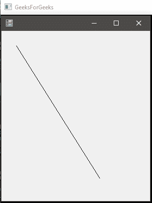

# C# Graphics.DrawLine() 方法 | Set-2

> 原文: [https://www.geeksforgeeks.org/c-sharp-graphics-drawline-method-set-2/](https://www.geeksforgeeks.org/c-sharp-graphics-drawline-method-set-2/)

`Graphics.DrawLine()` 方法用于画一条线，连接坐标对指定的两点。该方法的重载列表中有以下 4 种方法:

*   `DrawLine(Pen, Point, Point)` 方法
*   `DrawLine(Pen, Int32, Int32, Int32, Int32)` 方法
*   `DrawLine(Pen, Single, Single, Single, Single)` 方法
*   `DrawLine(Pen, Point, Point)` 方法

首先，[Set-1](https://www.geeksforgeeks.org/c-sharp-graphics-drawline-method-set-1/) 中已经讨论了两种方法。在这里，我们将讨论最后两种方法。

## DrawLine(Pen, Single, Single, Single, Single) 方法

这种方法用于从指定的一组坐标中画线，给定的形式 x1，y1，x2，y2 全部离散。

### 语法

```cs
public void DrawLine(System.Drawing.Pen pen, float x1, float y1, float x2, float y2);
```

### 参数

*   `pen`: `pen` 决定线条的颜色、宽度和样式。
    *   `x1` : 第一点横坐标。
    *   `y1` : 第一点的纵坐标。
    *   `x2` : 第二点横坐标。
    *   `y2` : 第二点的纵坐标。

### 异常

如果 `pen` 为 `null`，这个方法会给出 `ArgumentNullException`。

### 示例

```cs
// C# program to illustrate the use of
using System;
using System.Drawing;
using System.Drawing.Printing;
using System.Windows.Forms;

namespace GFG {

    class PrintableForm : Form {

        // Main Method
        public static void Main()
        {
            Application.Run(new PrintableForm());
        }

        public PrintableForm()
        {
            ResizeRedraw = true;
        }

        protected override void OnPaint(PaintEventArgs pea)
        {
            // Defines the Pen
            Pen pen = new Pen(ForeColor);

            // x1 = 30
            // y1 = 30
            // x2 = 200
            // y2 = 300

            // using the Method
            pea.Graphics.DrawLine(pen, 30.0F, 30.0F, 200.0f, 300.0f);
        }
    }
}
```

### 输出



## DrawLine(Pen, Point, Point)

此方法用于从指定的一组点到指定的一组点绘制一条线。它需要一个由 (x, y) 点组成的 `Point` 变量。

### 语法

```cs
public void DrawLine(System.Drawing.Pen pen, System.Drawing.Point pt1, System.Drawing.Point pt2);
```

### 参数

*   `pen`: `pen` 决定线条的颜色、宽度和样式。
    *   `pt1` : 将 (x, y) 坐标定义为初始点的 `Point` 变量。
    *   `pt2` : 将 (x, y) 坐标定义为最终点的 `Point` 变量。

### 异常

如果 `pen` 为 `null`，这个方法会给出 `ArgumentNullException`。

### 示例

```cs
// C# program to demonstrate the use of
// DrawLine(Pen, Point, Point) Method
using System;
using System.Drawing;
using System.Drawing.Printing;
using System.Windows.Forms;

namespace GFG {

    class PrintableForm : Form {

        // Main Method
        public static void Main()
        {
            Application.Run(new PrintableForm());
        }

        public PrintableForm()
        {
            ResizeRedraw = true;
        }

        protected override void OnPaint(PaintEventArgs pea)
        {
            // Defines pen
            Pen pen = new Pen(ForeColor);

            // Defines the both points to connect
            // pt1 is (30, 30) which represents (x1, y1)
            Point pt1 = new Point(30, 30);

            // pt2 is (200, 300) which represents (x2, y2)
            Point pt2 = new Point(200, 300);

            // Draws the line
            pea.Graphics.DrawLine(pen, pt1, pt2);
        }
    }
}
```

### 输出

