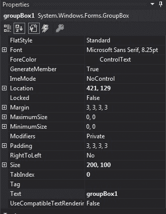
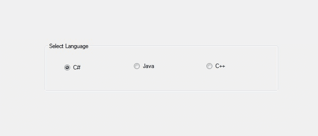
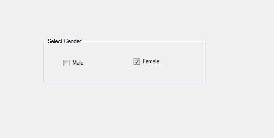

# C# GroupBox 类

> 原文: [https://www.geeksforgeeks.org/c-sharp-groupbox-class/](https://www.geeksforgeeks.org/c-sharp-groupbox-class/)

在 Windows 窗体中，`GroupBox` 是一个包含多个控件的容器，这些控件相互关联。或者换句话说，`GroupBox` 是一组控件周围的框架显示，带有合适的可选标题。或者使用一个组框对一个组中的相关控件进行分类。`GroupBox` 类用于表示 Windows 组框，还提供不同类型的属性、方法和事件。在 `System.Windows.Forms` 命名空间下定义。分组框的主要用途是保存一组逻辑的单选按钮控件。

在 C# 中，您可以使用两种不同的方法在 Windows 窗体中创建一个 `GroupBox`：

## 1. 设计时

创建分组框最简单的方法如下所示：

*   **第一步：** 创建如下图所示的窗口表单：
    **Visual Studio -> File -> New -> Project -> Windows Forms App**
    
*   **第二步：** 接下来，从工具箱中将 `GroupBox` 拖放到窗体上。
    
*   **第三步：** 拖放之后，您可以转到 `GroupBox` 的属性，根据您的需求修改 `GroupBox`。
    

**输出：**


## 2. 运行时

比上面的方法稍微复杂一点。在此方法中，您可以借助 `GroupBox` 类提供的语法以编程方式创建一个 `GroupBox`。以下步骤显示了如何动态设置创建组框：

*   **步骤 1：** 使用 `GroupBox()` 构造函数创建一个 `GroupBox`，该构造函数由 `GroupBox` 类提供。

```cs
// Creating a GroupBox
GroupBox box = new GroupBox();
```

*   **步骤 2：** 创建完 `GroupBox` 后，设置 `GroupBox` 类提供的 `GroupBox` 的属性。

```cs
// Setting the location of the GroupBox
box.Location = new Point(179, 145);

// Setting the size of the GroupBox
box.Size = new Size(329, 94);

// Setting text the GroupBox
box.Text = "Select Gender";

// Setting the name of the GroupBox
box.Name = "MyGroupbox";
```

*   **步骤 3：** 最后，将此 `GroupBox` 控件添加到窗体，并使用以下语句将其他控件添加到 `GroupBox` 上：

```cs
// Adding groupbox in the form
this.Controls.Add(box);

// Adding this control to the GroupBox
box.Controls.Add(b2);
```

**示例：**

```cs
using System;
using System.Collections.Generic;
using System.ComponentModel;
using System.Data;
using System.Drawing;
using System.Linq;
using System.Text;
using System.Threading.Tasks;
using System.Windows.Forms;

namespace WindowsFormsApp45
{
    public partial class Form1 : Form
    {
        public Form1()
        {
            InitializeComponent();
        }

        private void Form1_Load(object sender, EventArgs e)
        {
            // Creating and setting 
            // properties of the GroupBox
            GroupBox box = new GroupBox();
            box.Location = new Point(179, 145);
            box.Size = new Size(329, 94);
            box.Text = "Select Gender";
            box.Name = "MyGroupbox";

            // Adding groupbox in the form
            this.Controls.Add(box);

            // Creating and setting 
            // properties of the CheckBox
            CheckBox b1 = new CheckBox();
            b1.Location = new Point(40, 42);
            b1.Size = new Size(49, 20);
            b1.Text = "Male";

            // Adding this control 
            // to the GroupBox
            box.Controls.Add(b1);

            // Creating and setting 
            // properties of the CheckBox
            CheckBox b2 = new CheckBox();
            b2.Location = new Point(183, 39);
            b2.Size = new Size(69, 20);
            b2.Text = "Female";

            // Adding this control
            // to the GroupBox
            box.Controls.Add(b2);
        }
    }
}
```

**输出：**


## 构造函数

| 构造函数 | 描述 |
| :--- | :--- |
| `GroupBox()` | 此构造函数用于初始化 `GroupBox` 类的新实例。 |

## 属性

| 属性 | 描述 |
| :--- | :--- |
| `AutoSize` | 此属性用于获取或设置一个值，该值指示控件是否根据其内容调整大小。 |
| `AutoSizeMode` | 此属性指示当启用其自动调整属性时，组框的行为。 |
| `BackColor` | 此属性用于获取或设置控件的背景色。 |
| `BorderStyle` | 此属性指示控件的边框样式。 |
| `DisplayRectangle` | 此属性用于获取一个表示 `GroupBox` 维度的矩形。 |
| `Font` | 此属性用于获取或设置控件显示的文本的字体。 |
| `ForeColor` | 此属性用于获取或设置控件的前景色。 |
| `Height` | 此属性用于获取或设置控件的高度。 |
| `Location` | 此属性用于获取或设置 `GroupBox` 控件左上角相对于其窗体左上角的坐标。 |
| `Name` | 此属性用于获取或设置控件的名称。 |
| `TabStop` | 此属性用于获取或设置一个值，该值显示用户是否可以按 `Tab` 键将焦点提供给组框。 |
| `Size` | 此属性用于获取或设置控件的高度和宽度。 |
| `Visible` | 此属性用于获取或设置一个值，该值指示是否显示控件及其所有子控件。 |
| `Width` | 此属性用于获取或设置控件的宽度。 |