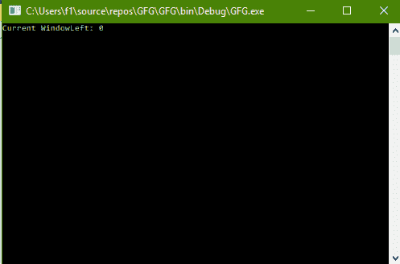
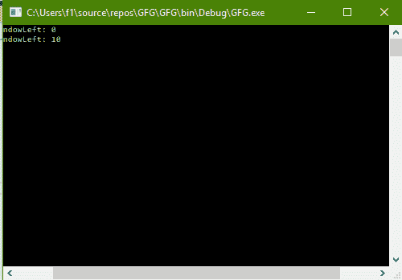

# C# | 如何更改控制台的 WindowLeft 属性

> 原文：[https://www.geeksforgeeks.org/c-sharp-how-to-change-the-windowleft-of-the-console/](https://www.geeksforgeeks.org/c-sharp-how-to-change-the-windowleft-of-the-console/)

给定 C# 中的普通控制台，任务是更改控制台的左窗口位置。

## 方法

这可以使用 C# 中 `System` 命名空间下的 `Console` 类中的 `WindowLeft` 属性来完成。`WindowLeft` 属性获取或设置控制台窗口区域相对于屏幕缓冲区的最左侧位置。

## 程序 1：获取 `WindowLeft` 的值

```cs
// C# program to illustrate the
// Console.WindowLeft Property
using System;
using System.Collections.Generic;
using System.Linq;
using System.Text;
using System.Threading.Tasks;

namespace GFG {

class Program {

static void Main(string[] args)
    {

// Get the WindowLeft
        Console.WriteLine("Current WindowLeft: {0}",
                            Console.WindowLeft);
    }
}
}
```

**输出：**



## 程序 2：设置 `WindowLeft` 的值

```cs
// C# program to illustrate the
// Console.WindowLeft Property
using System;
using System.Collections.Generic;
using System.Linq;
using System.Text;
using System.Threading.Tasks;

namespace GFG {

class Program {

static void Main(string[] args)
    {

// Get the WindowLeft
        Console.WriteLine("Current WindowLeft: {0}",
                            Console.WindowLeft);

// Set the WindowLeft
        Console.BufferWidth = 100;
        Console.WindowLeft = 10;

// Get the WindowLeft again
        Console.Write("Current WindowLeft: {0}",
                        Console.WindowLeft);
    }
}
}
```

**输出：**



**注意：** 在两幅图像中都可以看到窗口底部的水平滚动条。