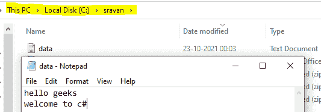

# C# 程序查看文件的访问日期和时间

> 原文：[https://www.geeksforgeeks.org/c-sharp-program-to-view-the-access-date-and-time-of-a-file/](https://www.geeksforgeeks.org/c-sharp-program-to-view-the-access-date-and-time-of-a-file/)

给定一个文件，我们的任务是查看访问文件的日期和时间。为此，我们使用 `FileSystemInfo` 类的以下属性：

**1. `CreationTime`：** 该属性用于获取文件创建的时间。

**语法：**

> `File.CreationTime`

其中 `File` 是文件的路径，它将返回 `DateTime`。`DateTime` 结构设置为指定文件的日期和时间。

**2. `LastAccessTime`：** 该属性用于获取文件最后被使用/访问的时间。

**语法：**

> `File.LastAccessTime`

它将返回一个表示访问当前文件的时间的 `DateTime`。

**3. `LastWriteTime`：** 此属性用于获取文件或目录最后写入/更新的时间。

**语法：**

> `File.LastWriteTime`

它将返回一个 `DateTime`，表示当前文件中最后一次写入的时间。

**方法：**

> 1. 使用文件路径读取文件，即 `C://sravan//data.txt`。
> 2. 使用 `CreationTime` 属性声明用于访问文件时间详细信息的 `DateTime` 变量。
> ```cs
> DateTime createdtime = path.CreationTime;
> ```
> 3. 使用 `LastAccessTime` 属性获取文件的上次访问时间。
> ```cs
> createdtime = path.LastAccessTime;
> ```
> 4. 使用 `LastWriteTime` 属性获取文件最后写入的时间。
> ```cs
> createdtime = path.LastWriteTime;
> ```

**示例：**

在本例中，我们将在 C 驱动器中创建一个包含两行数据的文件，文件名为 `data.txt`，路径如下图所示：



## C#

```cs
// C# Program to display the date 
// and time of access of a file 
using System;
using System.IO;

class GFG{
    static void Main()
    {
        // Choose the file using file path
        FileInfo path = new FileInfo("C://sravan//data.txt");

        // Declare time variable using DateTime function 
        // This variable holds the time of the file in 
        // which it is created
        DateTime createdtime = path.CreationTime;

        // Get the file created time
        Console.WriteLine("File is created at: {0}", createdtime);

        // Get the file lastly accessed time
        createdtime = path.LastAccessTime;
        Console.WriteLine("File is accessed at lastly: {0}", createdtime);

        // Get the file lastly updated/written time
        createdtime = path.LastWriteTime;
        Console.WriteLine("File is lastly written on: {0} ", createdtime);
    }
}
```

**输出：**

```cs
File is created at: 10/23/2021 10:02:10 AM
File is accessed at lastly: 10/23/2021 10:20:00 AM
File is lastly written on: 10/23/2021 10:17:03 AM
```