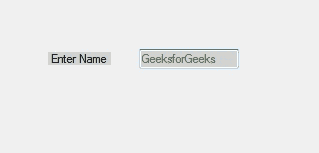

# C# 文本框控件

> 原文：[https://www.geeksforgeeks.org/c-sharp-textbox-controls/](https://www.geeksforgeeks.org/c-sharp-textbox-controls/)

在 Windows 窗体中，文本框扮演着重要的角色。在文本框的帮助下，用户可以在应用程序中输入数据，可以是单行的，也可以是多行的。文本框是一个类，在 `System.Windows.Forms` 命名空间下定义。在 C# 中，可以用两种不同的方式创建文本框：

**1. 设计时：** 创建文本框的最简单方法如下所示：

*   **步骤 1：** 创建一个窗口表单。如下图所示：
    **Visual Studio -> File -> New -> Project -> Windows Form App**
    
*   **步骤 2：** 从工具箱中拖动 `TextBox` 控件，并将其放到窗口窗体上。您可以根据需要将文本框放置在 Windows 窗体上的任何位置。
    
*   **步骤 3：** 拖放后，你会进入到 `TextBox` 控件的属性，根据你的需求修改 `TextBox` 的设计。
    

**2. 运行时：** 比上面的方法稍微复杂一点。在这个方法中，您可以使用 `TextBox` 类创建自己的文本框。

*   **步骤 1：** 使用 `TextBox` 类提供的 `TextBox()` 构造函数创建一个文本框。

```cs
// Creating textbox
TextBox Mytextbox = new TextBox();
```

*   **步骤 2：** 创建文本框后，设置 `TextBox` 类提供的文本框的属性。

```cs
// Set location of the textbox
Mytextbox.Location = new Point(187, 51);

// Set background color of the textbox
Mytextbox.BackColor = Color.LightGray;

// Set the foreground color of the textbox
Mytextbox.ForeColor = Color.DarkOliveGreen;

// Set the size of the textbox
Mytextbox.AutoSize = true;

// Set the name of the textbox
Mytextbox.Name = "text_box1";
```

*   **步骤 3：** 最后使用 `Add()` 方法将此文本框控件添加到窗体。

```cs
// Add this textbox to form
this.Controls.Add(Mytextbox);
```

**示例：**

```cs
using System;
using System.Collections.Generic;
using System.ComponentModel;
using System.Data;
using System.Drawing;
using System.Linq;
using System.Text;
using System.Threading.Tasks;
using System.Windows.Forms;

namespace my {

    public partial class Form1 : Form {

        public Form1()
        {
            InitializeComponent();
        }

        private void Form1_Load(object sender, EventArgs e)
        {
            // Creating and setting the properties of Lable1
            Label Mylablel = new Label();
            Mylablel.Location = new Point(96, 54);
            Mylablel.Text = "Enter Name";
            Mylablel.AutoSize = true;
            Mylablel.BackColor = Color.LightGray;

            // Add this label to form
            this.Controls.Add(Mylablel);

            // Creating and setting the properties of TextBox1
            TextBox Mytextbox = new TextBox();
            Mytextbox.Location = new Point(187, 51);
            Mytextbox.BackColor = Color.LightGray;
            Mytextbox.ForeColor = Color.DarkOliveGreen;
            Mytextbox.AutoSize = true;
            Mytextbox.Name = "text_box1";

            // Add this textbox to form
            this.Controls.Add(Mytextbox);
        }
    }
}
```

**输出：**



## 文本框的重要属性

| 属性 | 描述 |
| --- | --- |
| `AcceptsReturn` | 此属性用于设置一个值，该值显示在多行文本框控件中按回车键是在控件中创建新的文本行，还是激活给定表单的默认按钮。 |
| `AutoSize` | 该属性用于根据内容调整文本框的大小。 |
| `BackColor` | 此属性用于设置文本框的背景色。 |
| `BorderStyle` | 此属性用于调整文本框的边框类型。 |
| `CharacterCasing` | 此属性用于检查文本框控件在键入字符时是否会修改字符的大小写。 |
| `Events` | 此属性用于提供附加到此组件的事件处理程序列表。 |
| `Font` | 此属性用于调整 `TextBox` 控件显示的文本的字体。 |
| `ForeColor` | 此属性用于调整文本框控件的前景色。 |
| `Location` | 此属性用于调整文本框控件左上角相对于其窗体左上角的坐标。 |
| `Margin` | 此属性用于设置两个文本框控件之间的边距。 |
| `MaxLength` | 此属性用于设置用户可以键入或粘贴到文本框控件中的最大字符数。 |
| `Multiline` | 此属性用于设置一个值，该值显示这是否是一个多行文本框控件。 |
| `Name` | 此属性用于为文本框控件提供名称。 |
| `PasswordChar` | 此属性用于设置单行文本框控件中用于屏蔽密码字符的字符。 |
| `ScrollBars` | 此属性用于设置多行文本框控件中应该出现哪些滚动条。 |
| `Text` | 此属性用于设置与此控件关联的文本。 |
| `TextAlign` | 此属性用于调整文本框控件中文本的对齐方式。 |
| `TextLength` | 此属性用于获取文本框控件中文本的长度。 |
| `UseSystemPasswordChar` | 此属性用于设置一个值，该值显示文本框控件中的文本是否应显示为默认密码字符。 |
| `Visible` | 此属性用于获取或设置一个值，该值决定是否显示控件及其所有子控件。 |