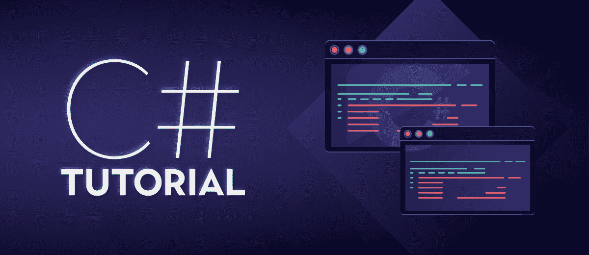

# C# 教程

> 原文:[https://www.geeksforgeeks.org/c-sharp-tutorial/](https://www.geeksforgeeks.org/c-sharp-tutorial/)

C# 是一种面向对象的现代编程语言，由微软创建。它运行在.NET 框架。C# 非常接近 [C](https://www.geeksforgeeks.org/c-programming-language/) / [C++](https://www.geeksforgeeks.org/c-plus-plus/) 和 [Java](https://www.geeksforgeeks.org/java/) 编程语言。它是由安德斯·海尔斯伯格和他的团队在.NET 倡议，由欧洲计算机制造商协会(ECMA)和国际标准组织(国际标准化组织)批准。C# 第一版发布于 2002 年，最新版本为 2019 年 9 月发布的 **8.0** 。在我们开始之前，我们必须了解.NET 框架和 Visual Studio。

**话题:**

## .NET 框架&及其组件

## Visual Studio

## 为什么是 C#？

## 应用程序

## 下载并安装 C#

## 基本面

### 你好世界！程序

### 标识符

### 关键词

### 变量

### 文字

### 数据类型

### 操作员

### 枚举

## 决策声明

## 切换语句

## 循环

### 同时循环

### 边做边循环

回路的

### 前循环

## 跳转语句

### 断开

### 继续

### 转到

### 返回

## 阵列

## 弦

## 访问修饰符

## OOPS 概念

### 类和对象

### 施工人员

### 析构器

### 继承

### 封装

### 多态性

## 方法

### 方法过载

### 方法覆盖

### 方法隐藏

## 收藏

### 阵列列表

### 哈希表

### 堆叠

队列

## 属性

## 索引器

## 界面

## 多线程

## 正则表达式

## 异常处理