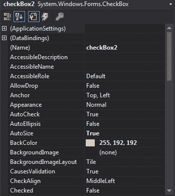
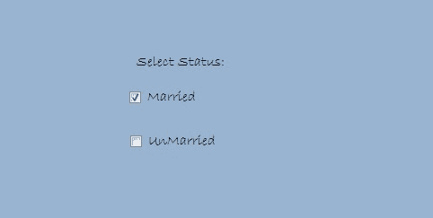

# C# 中的复选框

> 原文: [https://www.geeksforgeeks.org/checkbox-in-c-sharp/](https://www.geeksforgeeks.org/checkbox-in-c-sharp/)

`CheckBox` 控件是 Windows 窗体的一部分，用于接受用户的输入。或者换句话说，`CheckBox` 控件允许我们从给定的列表中选择单个或多个元素，或者它可以为我们提供选项，如是或否、真或假等。它可以显示为图像或文本，或者两者都显示。复选框是一个类，在 `System.Windows.Forms` 命名空间下定义。在 Windows 窗体中，您可以通过两种不同的方式创建 `CheckBox`：

## 设计时

使用以下步骤创建复选框是最简单的方法：

1.  **第一步**：创建如下图所示的窗口表单：
    `Visual Studio->File->New->Project->Windows Form App`

    

2.  **第二步**：从工具箱中拖动 `CheckBox` 控件，并将其放到窗口窗体上。您可以根据需要将 `CheckBox` 放在 Windows 窗体上的任何位置。

    

3.  **第三步**：拖放后，您将进入 `CheckBox` 控件的属性，根据您的要求修改 `CheckBox` 设计。

    

**输出：**


## 运行时

比上面的方法稍微复杂一点。在这种方法中，您可以使用 `CheckBox` 类以编程方式创建自己的 `CheckBox`。

1.  **步骤 1**：使用 `CheckBox` 类提供的 `CheckBox()` 构造函数创建一个 `CheckBox`。

    ```cs
    // Creating checkbox
    CheckBox Mycheckbox = new CheckBox();
    ```

2.  **步骤 2**：创建 `CheckBox` 后，设置 `CheckBox` 类提供的属性。

    ```cs
    // Set height of the checkbox
    Mycheckbox.Height = 50;

    // Set width of the checkbox
    Mycheckbox.Width = 100;

    // Set location of the checkbox
    Mycheckbox.Location = new Point(229, 136);

    // Set text in the checkbox
    Mycheckbox.Text = "Married";

    // Set font of the checkbox
    Mycheckbox.Font = new Font("Bradley Hand ITC", 12);
    ```

3.  **第 3 步**：最后使用 `Add()` 方法将该复选框控件添加到表单中。

    ```cs
    // Add this checkbox to form
    this.Controls.Add(Mycheckbox);
    ```

**示例：**

```cs
using System;
using System.Collections.Generic;
using System.ComponentModel;
using System.Data;
using System.Drawing;
using System.Linq;
using System.Text;
using System.Threading.Tasks;
using System.Windows.Forms;

namespace WindowsFormsApp5 {

    public partial class Form1 : Form {

        public Form1()
        {
            InitializeComponent();
        }

        private void Form1_Load(object sender, EventArgs e)
        {
            // Creating and setting the properties of label
            Label l = new Label();
            l.Text = "Select Status:";
            l.AutoSize = true;
            l.Location = new Point(233, 111);
            l.Font = new Font("Bradley Hand ITC", 12);
            // Adding label to form
            this.Controls.Add(l);

            // Creating and setting the properties of CheckBox
            CheckBox Mycheckbox = new CheckBox();
            Mycheckbox.Height = 50;
            Mycheckbox.Width = 100;
            Mycheckbox.Location = new Point(229, 136);
            Mycheckbox.Text = "Married";
            Mycheckbox.Font = new Font("Bradley Hand ITC", 12);

            // Adding checkbox to form
            this.Controls.Add(Mycheckbox);

            // Creating and setting the properties of CheckBox
            CheckBox Mycheckbox1 = new CheckBox();
            Mycheckbox1.Location = new Point(230, 198);
            Mycheckbox1.Text = "UnMarried";
            Mycheckbox1.AutoSize = true;
            Mycheckbox1.Font = new Font("Bradley Hand ITC", 12);

            // Adding checkbox to form
            this.Controls.Add(Mycheckbox1);
        }
    }
}
```

**输出：**



### 复选框的重要属性

| 属性 | 描述 |
| --- | --- |
| `Appearance` | 此属性用于获取或设置指示 `CheckBox` 控件外观的值。 |
| `AutoCheck` | 此属性用于设置一个值，该值显示当您单击复选框时，“已选中”或“检查状态”值以及复选框的外观是否会自动更改。 |
| `AutoEllipsis` | 此属性用于获取或设置一个值，该值确定省略号(...)是否出现在控件的右边缘，表示控件文本超出了控件的指定长度。 |
| `AutoSize` | 此属性用于获取或设置一个值，该值确定控件是否根据其内容调整大小。 |
| `BackColor` | 此属性用于获取或设置控件的背景色。 |
| `BackgroundImage` | 此属性用于获取或设置控件中显示的背景图像。 |
| `CheckState` | 该属性用于获取或设置复选框的状态。 |
| `CheckAlign` | 此属性用于获取或设置 `CheckBox` 控件上复选标记的水平和垂直对齐方式。 |
| `Checked` | 此属性用于获取或设置一个值，该值决定复选框是否处于选中状态。 |
| `Events` | 此属性用于获取附加到此组件的事件处理程序列表。 |
| `Font` | 此属性用于获取或设置控件显示的文本的字体。 |
| `ForeColor` | 此属性用于获取或设置控件的前景色。 |
| `Image` | 此属性用于获取或设置复选框控件上显示的图像。 |
| `Location` | 此属性用于获取或设置 `CheckBox` 控件左上角相对于其窗体左上角的坐标。 |
| `Margin` | 此属性用于获取或设置控件之间的间距。 |
| `Name` | 此属性用于获取或设置控件的名称。 |
| `Padding` | 此属性用于获取或设置控件内的填充。 |
| `Text` | 此属性用于获取或设置与此控件关联的文本。 |
| `TextAlign` | 此属性用于获取或设置 `CheckBox` 控件上文本的对齐方式。 |
| `Visible` | 此属性用于获取或设置一个值，该值决定是否显示控件及其所有子控件。 |

### 复选框上的重要事件

| 事件 | 描述 |
| --- | --- |
| `CheckedChanged` | 当“已检查”属性的值更改时，会发生此事件。 |
| `CheckStateChanged` | 当 `CheckState` 属性值更改时，会发生此事件。 |
| `Click` | 单击控件时会发生此事件。 |
| `DoubleClick` | 当用户双击 `CheckBox` 控件时，会发生此事件。 |
| `Leave` | 当输入焦点离开控件时，会发生此事件。 |
| `MouseClick` | 当鼠标单击控件时，会发生此事件。 |
| `MouseDoubleClick` | 当用户双击 `CheckBox` 控件时，会发生此事件。 |
| `MouseHover` | 当鼠标指针停留在控件上时，会发生此事件。 |