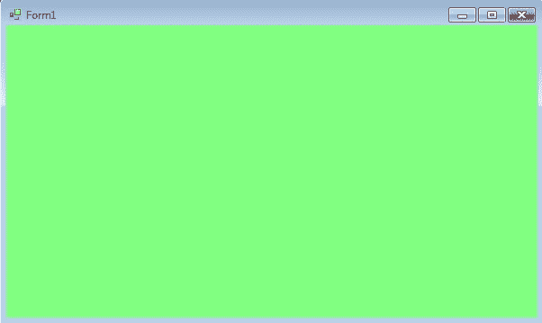
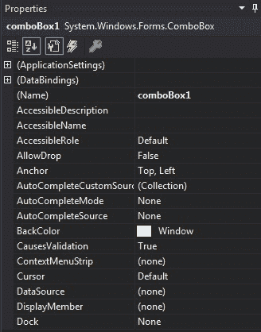
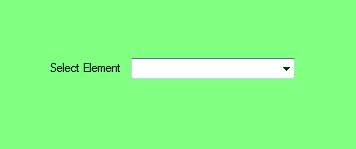
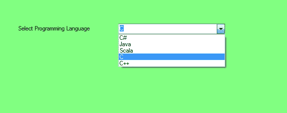

# c# 中的组合框

> 原文:[https://www.geeksforgeeks.org/combobox-in-c-sharp/](https://www.geeksforgeeks.org/combobox-in-c-sharp/)

在 Windows 窗体中，组合框在单个控件中提供了两种不同的功能，这意味着组合框同时作为[文本框](https://www.geeksforgeeks.org/c-sharp-textbox-controls/)和列表框工作。在组合框中，一次只显示一个项目，其余项目出现在下拉菜单中。组合框是 C# 中的一个类，在 `System.Windows.Forms` 命名空间下定义。您可以使用两种不同的方式创建组合框:

## 设计时

使用以下步骤创建组合框控件是最简单的方法:

1.  **第一步:** 创建如下图所示的窗口表单:
    **Visual Studio->File->New->Project->windows form**
    
2.  **第二步:** 从工具箱中拖动组合框控件，并将其放到窗口窗体上。根据您的需要，您可以将组合框控件放在窗口窗体的任何位置。
    
3.  **第三步:** 拖放后，转到 `ComboBox` 控件的属性，根据需要设置组合框的属性。
    

**输出:**


## 运行时

比上面的方法稍微复杂一点。在此方法中，您可以使用 `ComboBox` 类设置创建自己的组合框控件。创建动态组合框的步骤:

1.  **步骤 1:** 使用 `ComboBox` 类提供的 `ComboBox()` 构造函数创建组合框。

```cs
// Creating combobox using ComboBox class
ComboBox mybox = new ComboBox();
```

2.  **步骤 2:** 创建组合框后，设置 `ComboBox` 类提供的 `ComboBox` 属性。

```cs
// Set the location of the ComboBox 
mybox.Location = new Point(327, 77);

// Set the size of the ComboBox
mybox.Size = new Size(216, 26);

// Add items in the ComboBox
mybox.Items.Add("C#");
mybox.Items.Add("Java");
mybox.Items.Add("Scala");
mybox.Items.Add("C");
mybox.Items.Add("C++");
```

3.  **步骤 3:** 最后使用 `Add()` 方法将此 `ComboBox` 控件添加到窗体。

```cs
// Add this ComboBox to the form
this.Controls.Add(mybox);
```

**示例:**

```cs
using System;
using System.Collections.Generic;
using System.ComponentModel;
using System.Data;
using System.Drawing;
using System.Linq;
using System.Text;
using System.Threading.Tasks;
using System.Windows.Forms;

namespace WindowsFormsApp18 {
    public partial class Form1 : Form {
        public Form1() {
            InitializeComponent();
        }

        private void Form1_Load(object sender, EventArgs e) {
            // Creating and setting the properties of label
            Label l = new Label();
            l.Location = new Point(122, 80);
            l.AutoSize = true;
            l.Text = "Select Programming Language";

            // Adding this label to the form
            this.Controls.Add(l);

            // Creating and setting the properties of comboBox
            ComboBox mybox = new ComboBox();
            mybox.Location = new Point(327, 77);
            mybox.Size = new Size(216, 26);
            mybox.Items.Add("C#");
            mybox.Items.Add("Java");
            mybox.Items.Add("Scala");
            mybox.Items.Add("C");
            mybox.Items.Add("C++");

            // Adding this ComboBox to the form
            this.Controls.Add(mybox);
        }
    }
}
```

**输出:**



## 组合框的重要属性

| 属性 | 描述 |
| --- | --- |
| `BackColor` | 此属性用于设置组合框控件的背景颜色。 |
| `DropDownHeight` | 此属性用于设置组合框控件下拉部分的高度(以像素为单位)。 |
| `DropDownStyle` | 此属性用于设置指定组合框控件样式的值。 |
| `DropDownWidth` | 此属性用于设置组合框控件下拉部分的宽度。 |
| `Font` | 此属性用于设置组合框控件显示的文本的字体。 |
| `ForeColor` | 此属性用于设置组合框控件的前景色。 |
| `Height` | 此属性用于设置组合框控件的高度。 |
| `Items` | 此属性用于获取一个对象，该对象表示此组合框控件中包含的项的集合。 |
| `MaxDropDownItems` | 此属性用于设置在组合框控件的下拉部分显示的最大项数。 |
| `MaxLength` | 此属性用于设置用户可以在组合框控件中键入的字符数。 |
| `Name` | 此属性用于设置组合框控件的名称。 |
| `SelectedItem` | 此属性用于设置组合框中当前选定的项目。 |
| `Size` | 此属性用于设置组合框控件的高度和宽度。 |
| `Sorted` | 此属性用于设置一个值，该值指示组合框中的项目是否已排序。 |
| `Text` | 此属性用于设置与此组合框控件关联的文本。 |
| `Visible` | 此属性用于设置一个值，该值指示是否显示控件及其所有子控件。 |

## 重要事件

| 事件 | 描述 |
| --- | --- |
| `Click` | 单击组合框控件时会发生此事件。 |
| `DragDrop` | 当拖放操作完成时，会发生此事件。 |
| `DropDown` | 当显示组合框的下拉部分时，会发生此事件。 |
| `DropDownClosed` | 当组合框的下拉部分不再可见时，会发生此事件。 |
| `DropDownStyleChanged` | `DropDownStyle` 属性更改时会发生此事件。 |
| `Leave` | 当输入焦点离开组合框控件时，会发生此事件。 |
| `MouseClick` | 当鼠标单击组合框控件时，会发生此事件。 |
| `MouseDoubleClick` | 当鼠标双击组合框控件时，会发生此事件。 |
| `MouseDown` | 当鼠标指针位于组合框控件上并按下鼠标按钮时，会发生此事件。 |
| `MouseEnter` | 当鼠标指针进入组合框控件时，会发生此事件。 |
| `MouseHover` | 当鼠标指针停留在组合框控件上时，会发生此事件。 |
| `SelectedIndexChanged` | 当 `SelectedIndex` 属性更改时，会发生此事件。 |