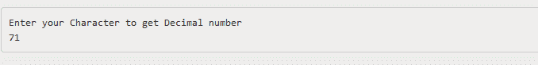
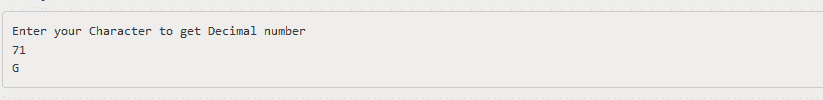

# Console.Read() 方法

> 原文：[https://www.geeksforgeeks.org/console-read-method-in-c-sharp/](https://www.geeksforgeeks.org/console-read-method-in-c-sharp/)

`Console.Read()` 方法用于从标准输入流中读取下一个字符。当用户键入一些输入字符时，该方法基本上会阻塞直到其返回。一旦用户按下回车键，它就终止。

## 方法签名

```csharp
public static int Read();
```

## 参数

此方法不接受任何参数。

## 返回值

返回输入流中的下一个字符，如果当前没有要读取的字符，则返回负数（`-1`）。

## 异常

如果出现输入输出错误，该方法将给出异常。

## 示例

以下程序说明了上述方法的使用：

### 示例 1

```csharp
// C# program to illustrate the use
// of Console.Read Method
using System;

namespace GFG {

class Program {

    static void Main(string[] args)
    {
        int x;
        Console.WriteLine("Enter your Character to get Decimal number");

        // using the method
        x = Console.Read();
        Console.WriteLine(x);
    }
}
}
```

**输出：**



### 示例 2

```csharp
// C# program to illustrate the use
// of Console.Read Method
using System;

namespace GFG {

class Program {

    static void Main(string[] args)
    {
        // Write to console window.
        int x;
        Console.WriteLine("Enter your Character to get Decimal number");
        x = Console.Read();
        Console.WriteLine(x);

        // Converting the decimal into character.
        Console.WriteLine(Convert.ToChar(x));
    }
}
}
```

**输出：**



## 参考

*   [https://docs.microsoft.com/en-us/dotnet/api/system.console.read?view=netframework-4.7.2](https://docs.microsoft.com/en-us/dotnet/api/system.console.read?view=netframework-4.7.2)