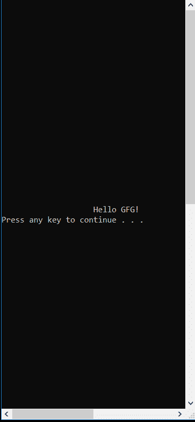

# `Console.SetCursorPosition()` 方法在 C# 中

> 原文：[https://www.geeksforgeeks.org/console-setcursorposition-method-in-c-sharp/](https://www.geeksforgeeks.org/console-setcursorposition-method-in-c-sharp/)

`Console.SetCursorPosition(Int32, Int32)` 方法用于设置光标的位置。基本上，它指定了控制台窗口中下一个写操作的开始位置。如果指定的光标位置在控制台窗口中当前可见的区域之外，窗口原点会自动更改以使光标可见。

## 语法

```csharp
public static void SetCursorPosition(int left, int top);
```

## 参数

- `left`：是光标所在的列位置。列从 0 开始从左到右编号。
- `top`：是光标所在的行位置。行从 0 开始从上到下编号。

## 异常

- `ArgumentOutOfRangeException`：如果 `left` 或 `top` 小于 0，或 `left` 大于等于 `BufferWidth`，或 `top` 大于等于 `BufferHeight`。
- `SecurityException`：如果用户没有执行此操作的权限。

## 示例

```csharp
// C# Program to illustrate 
// Console.SetCursorPosition() method
using System;

class GFG {

    // Main Method
    public static void Main()
    {
        // setting the window size
        Console.SetWindowSize(40, 40);

        // setting buffer size of console
        Console.SetBufferSize(80, 80);

        // using the method
        Console.SetCursorPosition(20, 20);
        Console.WriteLine("Hello GFG!");
        Console.Write("Press any key to continue . . . ");
        Console.ReadKey(true);
    } 
} 
```

## 输出



当未使用 `Console.SetCursorPosition()` 方法时：


## 参考

- [https://docs.microsoft.com/en-us/dotnet/api/system.console.setcursorposition?view=netframework-4.7.2](https://docs.microsoft.com/en-us/dotnet/api/system.console.setcursorposition?view=netframework-4.7.2)