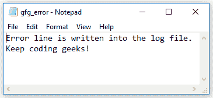

# Console.SetError() 方法 in C#

> 原文：[https://www.geeksforgeeks.org/console-seterror-method-in-c-sharp/](https://www.geeksforgeeks.org/console-seterror-method-in-c-sharp/)

## 方法描述
`Console.SetError(TextWriter)` 方法设置指定 `StreamWriter` 的 `Error` 属性，即它将标准错误流重定向到一个文件。由于控制台是用这个 `StreamWriter` 对象设置的，因此可以调用 `WriteLine()` 方法将错误写入文件。

## 语法
```cs
public static void SetError(System.IO.StreamWriter newError);
```

## 参数
- `newError`：这是一个流，是新的标准错误输出。

## 异常
如果传递的参数为空，该方法将抛出 `ArgumentNullException`。此外，因为它使用 `StreamWriter` 对象，所以也应该注意它的异常。

## 示例
在本例中，`SetError()` 方法用于将 `StreamWriter` 对象设置到控制台，错误消息将从控制台写入日志文件。

```cs
// C# program to demonstrate 
// the SetError() method
using System;
using System.IO;

class GFG {

    // Main Method
    static void Main()
    {
        // Define file to receive error stream.
        string fn = "F:\\gfg_error.log";

        // Define the new error StreamWriter object
        StreamWriter errStream = new StreamWriter(fn);

        // Redirect standard error stream to file.
        Console.SetError(errStream);

        // Write the error message into the Log file
        Console.Error.WriteLine("Error line is written into the log file.");
        Console.Error.WriteLine("Keep coding geeks!");

        // Close redirected error stream.
        Console.Error.Close();
    }
}
```

## 输出
`gfg_error.log` 文件现在将包含错误消息。



## 参考
- [https://docs.microsoft.com/en-us/dotnet/api/system.console.seterror?view=netframework-4.7.2#System_Console_SetError_System_IO_TextWriter_](https://docs.microsoft.com/en-us/dotnet/api/system.console.seterror?view=netframework-4.7.2#System_Console_SetError_System_IO_TextWriter_)