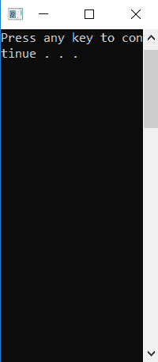
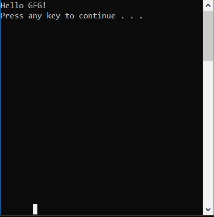

# Console.SetWindowPosition() 方法在 C# 中

> 原文: [https://www.geeksforgeeks.org/console-setwindowposition-method-in-c-sharp/](https://www.geeksforgeeks.org/console-setwindowposition-method-in-c-sharp/)

`Console.SetWindowPosition(Int32, Int32)` 方法在 C# 中用于设置控制台窗口相对于屏幕缓冲区的位置。

## 语法

```cs
public static void SetWindowPosition(int left, int top);
```

## 参数

- `left`: 控制台窗口左上角的列位置。
- `top`: 控制台窗口左上角的行位置。

## 异常

- `ArgumentOutOfRangeException`: 当 `left` 或 `top` 小于 0，或 `left + 窗口宽度` > `BufferWidth`，或 `top + 窗口高度` > `BufferHeight` 时。
- `SecurityException`: 如果用户没有执行此操作的权限。

## 示例

```cs
// C# Program to illustrate the use of 
// Console.WindowPosition() method
using System;
using System.Text;
using System.IO;

class GFG {

    // Main Method
    public static void Main(string[] args)
    {
        Console.SetWindowSize(20, 20);

        // setting buffer size 
        Console.SetBufferSize(80, 80);

        // using the method
        Console.SetWindowPosition(0, 0);
        Console.WriteLine("Hello GFG!");

        Console.Write("Press any key to continue . . . ");
        Console.ReadKey(true);
    }
}
```

## 输出



当不使用 `Console.SetWindowPosition()` 方法时:



## 参考

- [https://docs.microsoft.com/en-us/dotnet/api/system.console.setwindowposition?view=netframework-4.7.2](https://docs.microsoft.com/en-us/dotnet/api/system.console.setwindowposition?view=netframework-4.7.2)