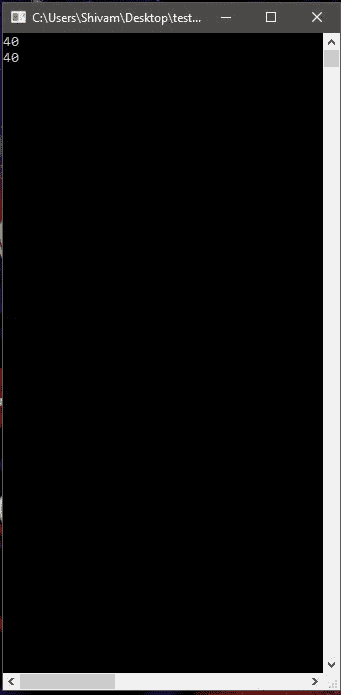

# Console.SetWindowSize() 方法

> 原文：[https://www.geeksforgeeks.org/console-setwindowsize-method-in-c-sharp/](https://www.geeksforgeeks.org/console-setwindowsize-method-in-c-sharp/)

`Console.SetWindowSize(Int32, Int32)` 方法用于将控制台窗口的高度和宽度更改为指定值。

> **语法：**
> `public static void SetWindowSize(int width, int height);`
>
> **参数：**
> - `width`：控制台窗口的宽度，以列为单位测量。
> - `height`：控制台窗口的高度，以行为单位测量。

**异常：**

- `ArgumentOutOfRangeException`：
    - 如果 `width` 或 `height` 小于或等于零。
    - `width` 加窗口左侧或 `height` 加窗口顶部大于或等于最大值。
    - `width` 或 `height` 大于当前屏幕分辨率和控制台字体的最大可能窗口宽度或高度。
- `IOException`：如果出现输入/输出错误。

**示例 1：** 获取窗口的当前尺寸。

```cs
// C# program to get the current
// window width and Height
using System;

namespace GFG {

class Program {

static void Main(string[] args)
    {
        Console.WriteLine(Console.WindowWidth);
        Console.WriteLine(Console.WindowHeight);
    }
}
}
```

**输出：**


**示例 2：** 设置窗口大小的值。

```cs
// C# program to illustrate the
// Console.SetWindowSize Property
using System;

namespace GFG {

class Program {

static void Main(string[] args)
    {
        // Passed 40, 40 to SetWindowSize to
        // change window size to 40 by 40
        Console.SetWindowSize(40, 40);

        // Printing the current dimensions
        Console.WriteLine(Console.WindowWidth);
        Console.WriteLine(Console.WindowHeight);
    }
}
}
```

**输出：**



**注意：** 在两幅图像中都可以看到窗口底部的水平滚动条。

**参考：**

- [https://docs.microsoft.com/en-us/dotnet/api/system.console.setwindowsize?view=netframework-4.7.2](https://docs.microsoft.com/en-us/dotnet/api/system.console.setwindowsize?view=netframework-4.7.2)